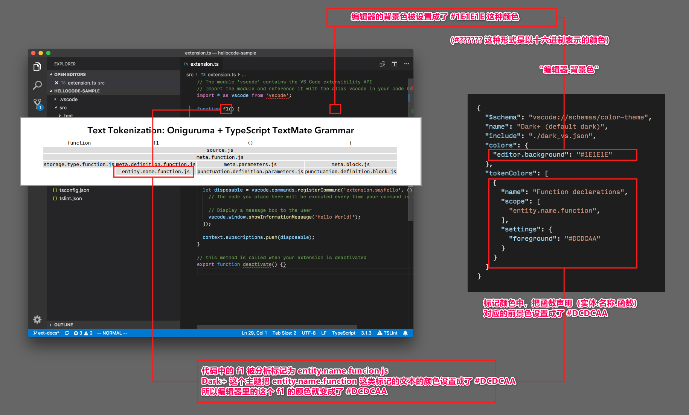
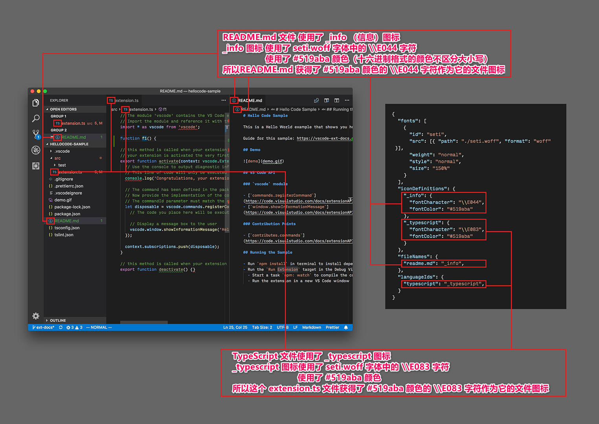

# 主题

[原文链接，戳我前往](https://code.visualstudio.com/api/extension-capabilities/theming)

------

翻译 by [赫雯勒莉特翡翠](https://github.com/HeveraletLaidCenx)

## 术语~的对照表

|中文（常用英文表述）|英文|
|----|----|
|文本标志|text token|
|映射|mapping|
|标签、选项卡|tab|
|产品图标主题|product icon theme|
|图形字符的页面边距部分|Glyph Margin|
|标记化【部分文章译作令牌化】|tokenized|
|语义高亮|semantic highlighting|
|内置的|built-in|
|筛选器|filter|

表中部分：

* 在中文表述中常直接用英文替代的
* 认为直译并不合适的

在中文之后的括号中说明了直接使用对应的英文。

------

## 概述

在 **Visual Studio Code** 中，共有3种类型的主题：

* **颜色主题【或译作配色主题】**：一个从 UI 组件标识符 和 文本标志标识符 ，到 颜色 的映射。颜色主题让你可以把自己喜欢的颜色应用到 **VS Code** UI 组件 和 编辑器中的文本。
* **文件图标主题**：一个从文件类型/文件名 到 图像 的映射。整个 **VS Code** UI 中都有文件图标的身影，比如文件资源管理器、快速打开列表，和编辑器选项卡。
* **产品图标主题**：一组从侧边栏、活动栏、状态栏，到 编辑器的图形字符的页面边距部分，在整个 UI 中都有使用的图标。

## 颜色主题

就像你在上边的图示中看到的那样，颜色主题既可以定义 UI 组件的颜色，也可以定义编辑器中的文本高亮颜色。

* `colors`（颜色）映射控制 UI 组件的颜色。
* `tokenColors`（标记颜色） 映射定义了编辑器中文本高亮的颜色和样式。更多相关信息请参阅 [语法高亮指导](https://code.visualstudio.com/api/language-extensions/syntax-highlight-guide) 的文章。
* `semanticTokenColors`（语义标记颜色） 映射，也就是 `semanticHighlighting`（语义高亮）的设置允许增强编辑器中的高亮表现。关于这部分内容，在 [语义高亮指导](https://code.visualstudio.com/api/language-extensions/semantic-highlight-guide) 中解释了相关的 API 。

关于颜色主题，我们有 [颜色主题指导](https://code.visualstudio.com/api/extension-guides/color-theme) 和 [颜色主题示例](https://github.com/microsoft/vscode-extension-samples/tree/main/theme-sample) 向你展示如何创建一个主题。

## 文件图标主题

文件图标主题让你可以：

* 创建一个从 唯一的文件图标标识符 到 图片或者字体图标 的映射。
* 通过文件扩展名或者语言类型，将文件和这些唯一的文件图标标识符关联起来。

在 [文件图标主题指导](https://code.visualstudio.com/api/extension-guides/file-icon-theme) 中，讨论了如何创建一个文件图标主题。

## 产品图标主题

产品图标主题让你可以：

重新定义工作台中使用的所有内置图标，比如 筛选器操作按钮 和 视图按钮 中的所有图标、状态栏中的图标、编辑器中的 断点 和 折叠图标 。

[产品图标主题](https://code.visualstudio.com/api/extension-guides/product-icon-theme) 文章讨论了如何创建一个产品图标主题。
