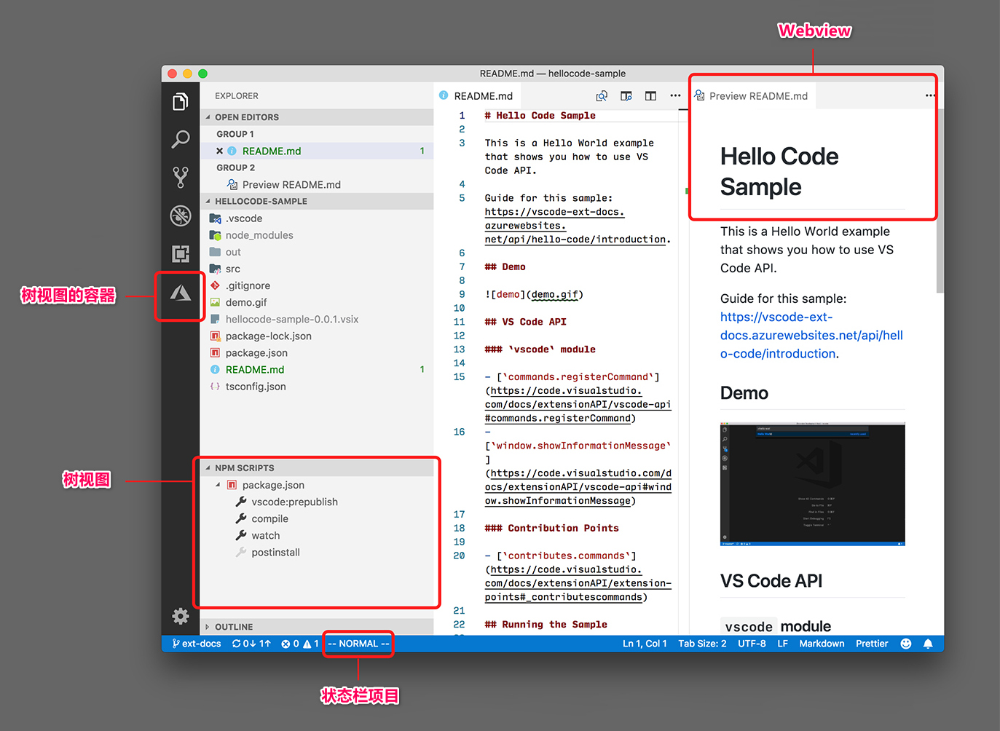

# 扩展工作台

[原文链接，戳我前往](https://code.visualstudio.com/api/extension-capabilities/extending-workbench)

------

翻译 by [赫雯勒莉特翡翠](https://github.com/HeveraletLaidCenx)

## 术语~的对照表

|中文（常用英文表述）|英文|
|----|----|
|面板|panel|

表中部分：

* 在中文表述中常直接用英文替代的
* 认为直译并不合适的

在中文之后的括号中说明了直接使用对应的英文。

------

## 概述

“工作台” 是指围绕下面这些 UI 组件的整个 **Visual Studio Code** UI：

* 标题栏
* 活动栏
* 侧边栏
* 面板
* 编辑器组
* 状态栏

**VS Code** 提供了能让你把自己的组件添加到工作台的各种 API 。比如下面图里展示的这样：

* **活动栏** —— [Azure App 服务扩展](https://marketplace.visualstudio.com/items?itemName=ms-azuretools.vscode-azureappservice) 添加了一个 [视图容器](https://code.visualstudio.com/api/extension-capabilities/extending-workbench#view-container)
* **侧边栏** —— 内置的 [NPM extension](https://github.com/microsoft/vscode/tree/main/extensions/npm) 在 资源管理器视图 里添加了一个 [树视图](https://code.visualstudio.com/api/extension-capabilities/extending-workbench#tree-view)
* **编辑器组** —— 内置的 [Markdown 扩展](https://github.com/microsoft/vscode/tree/main/extensions/markdown-language-features) 在 编辑器组里，其他编辑器的旁边，添加了一个 [Webview](https://code.visualstudio.com/api/extension-capabilities/extending-workbench#webview)
* **状态栏** —— [VSCodeVim 扩展](https://marketplace.visualstudio.com/items?itemName=vscodevim.vim) 在状态栏里添加了一个 [状态栏项目](https://code.visualstudio.com/api/extension-capabilities/extending-workbench#status-bar-item)

## 视图容器

通过 [`contributes.viewsContainers`](https://code.visualstudio.com/api/references/contribution-points#contributes.viewsContainers)（建立作用点.视图容器） 作用点，你可以在 **VS Code** 内置的五个视图容器旁边添加一个新视图容器。

更多内容请阅读 [树视图](https://code.visualstudio.com/api/extension-guides/tree-view) 文章。

## 树视图

通过 [`contributes.views`](https://code.visualstudio.com/api/references/contribution-points#contributes.views)（建立作用点.视图） 作用点，你可以在任意视图容器中添加新的视图。

更多内容请阅读 [树视图](https://code.visualstudio.com/api/extension-guides/tree-view) 文章。

## Webview

Webviews 是基于 HTML/CSS/JavaScript 的拥有高可自定义性的视图。 Webview 会在编辑器组区域中文本编辑器的旁边显示。

关于 Webview 的更多内容请阅读  [Webview 指导](https://code.visualstudio.com/api/extension-guides/webview) 。

## 状态栏项目

扩展可以创建显示在状态栏中的 自定义 [状态栏项目](https://code.visualstudio.com/api/references/vscode-api#StatusBarItem) 。

状态栏项目可以：

* 显示文本和图标
* 在被点击的时候执行命令

关于详细用法，你可以看看这个 [状态栏示例](https://github.com/microsoft/vscode-extension-samples/tree/main/statusbar-sample) 。
