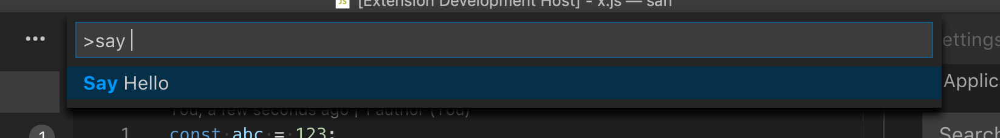

# 命令

[原文链接，戳我前往](https://code.visualstudio.com/api/extension-guides/command)

------

翻译 by [赫雯勒莉特翡翠](https://github.com/HeveraletLaidCenx)

## 术语~的对照表

|中文（常用英文表述）|英文|
|----|----|
|触发|trigger|
|以编程方式|programmatically|
|参数|arguments|
|统一资源标识符（URI）|Uniform Resource Identifier|
|[承诺（Promise）](https://developer.mozilla.org/zh-CN/docs/Web/JavaScript/Reference/Global_Objects/Promise)|Promise|
|方案|scheme|
|筛选整理【本意是“清理”，但是对我而言，可能因为大量管理软件在处理垃圾文件时，都用“清理垃圾”这个词，但是实际是把垃圾文件“清除”掉了，所以为了避免这种潜意识造成对“清理”这个词意思的误读，此处译作筛选整理】|sanitize|
|处理函数|handler function|
|面向用户的|user facing|
|正则表达式|regular expression|

表中部分：

* 在中文表述中常直接用英文替代的
* 认为直译并不合适的

在中文之后的括号中说明了直接使用对应的英文。

------

## 概述

命令负责在 **Visual Studio Code** 中触发动作。如果你曾之前 [配置过键位绑定](https://code.visualstudio.com/docs/getstarted/keybindings) 的话，那么其实你就已经使用过命令了。命令也被扩展用来向用户暴露功能、在 **VS Code** 的 UI 中绑定动作，和实现内部逻辑。

## 使用命令

**VS Code** 有一大堆 [内置命令](https://code.visualstudio.com/api/references/commands) ，可以让你用于 和编辑器交互、控制 UI， 或者执行后台操作。许多扩展也把它们的核心功能暴露为命令，让用户和其他扩展可以利用。

### 以编程方式执行命令

[`vscode.commands.executeCommand`](https://code.visualstudio.com/api/references/vscode-api#commands.executeCommand)（vscode.命令.执行命令） API 会以编程方式来执行命令。这让你可以使用 **VS Code** 的内置功能，并且在扩展（比如 VS Code 内置的 Git 和 Markdown 扩展）的基础上构建。

比如， `editor.action.addCommentLine`（编辑器.动作.添加注释行） 命令，将把活跃的文本编辑器中的已经被选中的行转为注释：

```typescript
import * as vscode from 'vscode';

function commentLine() {
  vscode.commands.executeCommand('editor.action.addCommentLine');
}
```

一些命令用参数来控制它们自身的行为。命令也可能会返回结果。比如 `vscode.executeDefinitionProvider`（vscode.执行定义提供程序） 这样的 类似API的命令，会在文档中查询在给定位置的定义。它用一个 文档URI 和一个 位置 作为参数，返回一个带有定义列表的 Promise ：

```typescript
import * as vscode from 'vscode';

async function printDefinitionsForActiveEditor() {
  const activeEditor = vscode.window.activeTextEditor;
  if (!activeEditor) {
    return;
  }

  const definitions = await vscode.commands.executeCommand<vscode.Location[]>(
    'vscode.executeDefinitionProvider',
    activeEditor.document.uri,
    activeEditor.selection.active
  );

  for (const definition of definitions) {
    console.log(definition);
  }
}
```

要查找可用命令的话，可以通过：

* 浏览 [键盘快捷键](https://code.visualstudio.com/docs/getstarted/keybindings)
* 浏览 [**VS Code** 的内置高级命令API](https://code.visualstudio.com/api/references/commands)

### 命令URI

命令的 URI 是会执行一个给定命令的链接。它们可以在 鼠标悬停文本、自动补全项目详情，或者 Webview 中，被用作可以点击的链接。

命令 URI 使用 `command` 作为方案名（scheme），后边是对应的命令名，整体格式形如 `command:commandName` 。比如， `editor.action.addCommentLine`（编辑器.动作.添加注释行）命令 的 命令URI 是 `command:editor.action.addCommentLine`（命令:编辑器.动作.添加命令行）。下面是一个会在活跃文本编辑器中显示当前行的注释的链接的鼠标悬停提示提供程序：

```typescript
import * as vscode from 'vscode';

export function activate(context: vscode.ExtensionContext) {
  vscode.languages.registerHoverProvider(
    'javascript',
    new (class implements vscode.HoverProvider {
      provideHover(
        _document: vscode.TextDocument,
        _position: vscode.Position,
        _token: vscode.CancellationToken
      ): vscode.ProviderResult<vscode.Hover> {
        const commentCommandUri = vscode.Uri.parse(`command:editor.action.addCommentLine`);
        const contents = new vscode.MarkdownString(`[Add comment](${commentCommandUri})`);

        // 如果要在 Markdown 内容中启用 命令URI ，你必须设置 `isTrusted`（是受信任的）标志。
        // 当创建受信任的 Markdown 字符串时，确保已经对所有的输入内容进行了筛选整理，以便只有预期希望得到的命令URI 才能被执行。
        contents.isTrusted = true;

        return new vscode.Hover(contents);
      }
    })()
  );
}
```

命令的参数列表会被作为一个经过适当的 URI 编码的 JSON 数组来传递，比如下边这个例子，用 `git.stage`（git.暂存区） 命令来创建一个暂存当前文件的 鼠标悬停链接：

```typescript
import * as vscode from 'vscode';

export function activate(context: vscode.ExtensionContext) {
  vscode.languages.registerHoverProvider(
    'javascript',
    new (class implements vscode.HoverProvider {
      provideHover(
        document: vscode.TextDocument,
        _position: vscode.Position,
        _token: vscode.CancellationToken
      ): vscode.ProviderResult<vscode.Hover> {
        const args = [{ resourceUri: document.uri }];
        const stageCommandUri = vscode.Uri.parse(
          `command:git.stage?${encodeURIComponent(JSON.stringify(args))}`
        );
        const contents = new vscode.MarkdownString(`[Stage file](${stageCommandUri})`);
        contents.isTrusted = true;
        return new vscode.Hover(contents);
      }
    })()
  );
}
```

当 Webview 被创建时，可以通过设置 `WebviewOptions`（Webview选项）中的 `enableCommandUris`（启用命令URI）来在 [Webview](https://code.visualstudio.com/api/extension-guides/webview) 中启用 命令URI。

## 创建新命令

### 注册命令

[`vscode.commands.registerCommand`](https://code.visualstudio.com/api/references/vscode-api#commands.registerCommand)（vscode.命令.注册命令） 会在你的扩展中把 命令ID 绑定到 处理函数：

```typescript
import * as vscode from 'vscode';

export function activate(context: vscode.ExtensionContext) {
  const command = 'myExtension.sayHello';

  const commandHandler = (name: string = 'world') => {
    console.log(`Hello ${name}!!!`);
  };

  context.subscriptions.push(vscode.commands.registerCommand(command, commandHandler));
}
```

不管是从 **VS Code** UI，以 `executeCommand`（执行命令）这种编程方式，还是通过快捷键来执行命令，处理函数都会在 `myExtension.sayHello` 命令被执行的时候被调用。

### 创建面向用户的命令

`vscode.commands.registerCommand`（vscode.命令.注册命令）仅仅实现了把 命令ID 绑定到 处理函数。如果想把这个命令暴露到命令面板，让用户可以看到这个命令的话，你还需要在你的扩展的 `package.json` 文件中建立对应的作用点：

```json
{
  "contributes": {
    "commands": [
      {
        "command": "myExtension.sayHello",
        "title": "Say Hello"
      }
    ]
  }
}
```

`commands`（命令）作用点会：

* 告诉 **VS Code** ：你的扩展提供了一个给定的命令
* 让你可以控制在 UI 中命令会如何显示

那么现在我们就可以在命令面板中看到设置的命令啦~：



我们仍然需要调用 `registerCommand`（注册命令） 来把 命令ID 实质性地绑定到 处理函数。这意味着如果用户在我们的扩展没有激活的时候，从命令面板执行了 `myExtension.sayHello` 命令的话，啥也不会发生。为了避免这种情况，扩展必须为所有面向用户的命令注册一个 `onCommand` `activationEvent`（执行命令时触发的激活事件）：

```json
{
  "activationEvents": ["onCommand:myExtension.sayHello"]
}
```

这样一来，当用户首次 从命令面板调用 或者 通过快捷键 来执行 `myExtension.sayHello` 命令时，扩展将被激活，并将用 `registerCommand`（注册命令） 将 `myExtension.sayHello` 绑定到适当的处理函数。

你不需要为内置的命令定义 `onCommand`（当执行命令时触发） 激活事件，但是如果某个命令符合以下任意一种情况，则你必须定义激活事件：

* 可以从命令面板调用
* 可以用快捷键调用
* 可以通过 **VS Code** UI调用，比如通过编辑器的标题栏
* 被作为一个让其他的扩展使用的 API

### 控制命令应该在何时出现在命令面板中

默认情况下，所有面向用户的命令都是通过在 `package.json` 中的 `commands`（命令） 中建立作用点，来实现显示在命令面板中的。但是，很多命令应该只在某些特定的情况下（比如 当处在一个使用某种特定语言的活跃的文本编辑器，或者 当用户设置了某个特定的配置选项的时候）才可用。

[`menus.commandPalette`](https://code.visualstudio.com/api/references/contribution-points#contributes.menus)（菜单.命令面板） 作用点让你可以限制命令应该在什么时候显示在命令面板中。它需要的参数有： 目标命令的ID 和一个 [when 条件判断语句](https://code.visualstudio.com/api/references/when-clause-contexts) 。以此来控制命令应该在什么时候显示：

```json
{
  "contributes": {
    "menus": {
      "commandPalette": [
        {
          "command": "myExtension.sayHello",
          "when": "editorLangId == markdown"
        }
      ]
    }
  }
}
```

现在 `myExtension.sayHello` 命令只有在用户处于 Markdown 文件中时才会出现在命令面板中啦~

### 命令的启用

命令支持通过设置 `enablement`（启用） 属性来管理启用，`enablement`（启用） 的值是一个 [when 条件判断语句](https://code.visualstudio.com/api/references/when-clause-contexts) 。设置后启用属性将被应用到所有菜单和注册了的键位绑定。

> **注**：`enablement`（启用） 和 菜单项的 `when` 条件 存在语义重叠。后者用于防止菜单全是不可用的项目。比如，一个用来分析 JavaScript 正则表达式的扩展，只应该 **when（当）** 文件是 JavaScript 时 才显示，而只有在光标在正则表达式的时候才 **enabled（启用）** 。这里， `when` 条件判断语句通过 但处于其他语言的文件中，不显示命令 来防止了混乱。强烈建议防止菜单变得乱七八糟的。

最后，菜单中显示的命令，像 命令面板 或者 上下文菜单 一样，以不同的方法实现了处理 是否启用命令。编辑器 和 资源管理器 的上下文菜单会在命令面板过滤命令时，对应地渲染菜单项的启用/禁用。

### 使用自定义的 when 条件判断语句上下文

如果你在创作自己的 **VS Code** 扩展，并且需要通过 `when` 条件判断语句上下文来 启用/禁用 命令、菜单，或视图，而现有的键并不适合你的需求，那你可以添加自己的上下文。

下边的：

* 第一个例子，将键 `myExtension.showMyCommand` 设置成了 true（真），让你可以在 命令的启用 或者 `when` 属性中使用。
* 第二个例子则存储了一个值，让你可以用 `when` 条件判断语句来检查 numberOfCoolOpenThings 的值是否大于2。

```typescript
vscode.commands.executeCommand('setContext', 'myExtension.showMyCommand', true);

vscode.commands.executeCommand('setContext', 'myExtension.numberOfCoolOpenThings', 4);
```
