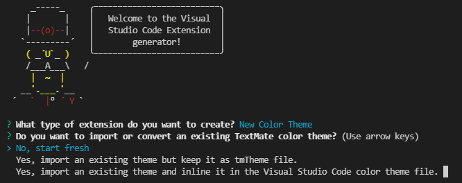
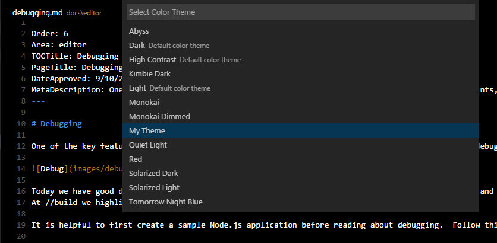

# 颜色主题

[原文链接，戳我前往](https://code.visualstudio.com/api/extension-guides/color-theme)

------

翻译 by [赫雯勒莉特翡翠](https://github.com/HeveraletLaidCenx)

## 术语~的对照表

|中文（常用英文表述）|英文|
|----|----|
|语义的|semantic|
|正则表达式|regular expression|

表中部分：

* 在中文表述中常直接用英文替代的
* 认为直译并不合适的

在中文之后的括号中说明了直接使用对应的英文。

------

## 概述

**Visual Studio Code** 的 UI 中，可见的颜色分两类：

* 工作台颜色：在视图和编辑器中使用，覆盖范围从活动栏到状态栏。
* 在编辑器中，代码语法的颜色和样式：这些颜色的主题是不同的，因为语法着色是基于TextMate 语法和 TextMate 主题以及语义标记的。

本篇指导将向你展示可以用来创建主题的不同的方法。

## 工作台颜色

想要创建一个新的工作台颜色主题的话，最简单的方法是从修改一个现有的颜色主题开始。首先转到你想编辑的颜色主题，然后打开 [设置](https://code.visualstudio.com/docs/getstarted/settings) 并且对 `workbench.colorCustomizations`（工作台.颜色自定义） 设置进行修改。你可以在你的 VS Code 实例上实时看到修改的效果。

比如下边这个例子会更改标题栏的颜色：

```json
{
  "workbench.colorCustomizations": {
    "titleBar.activeBackground": "#ff0000"
  }
}
```

在 [主题颜色参考](https://code.visualstudio.com/api/references/theme-color) 文档中可以找到包含这些颜色的完整的列表。

## 语法颜色

有两种方法可以用来处理语法高亮颜色。你可以从社区参考一个现有的 TextMate 主题 (`.tmTheme` 文件) ，或者你可以创建自己的主题规则。最简单的办法仍然是从一个现有的主题入手并且对它进行修改，和上边工作台颜色那节一样。

首先切换到想修改的颜色主题，然后用 `editor.tokenColorCustomizations`（编辑器.标记颜色自定义） [设置](https://code.visualstudio.com/docs/getstarted/settings) 来修改。同样的，修改的效果是实时的，不需要刷新或者重新加载。

比如，下边这个例子会更改编辑器中注释的颜色：

```json
{
  "editor.tokenColorCustomizations": {
    "comments": "#FF0000"
  }
}
```

这块的设置支持一个带有一套常见的标记类型（比如注释、字符串、数字）的简单模板。如果想要比这更多的颜色标记类型，则你需要直接使用 TextMate 的主题规则，关于这些内容，可以到 [语法高亮指导](https://code.visualstudio.com/api/language-extensions/syntax-highlight-guide) 文章中查看详细的解释。

## 语义颜色

在 **VS Code** 的 1.43 发布版本之后， TypeScript 和 JavaScript 便可以使用语义突出显示了。我们期待这在不久之后可以扩展到其他语言中。

语义高亮丰富了语法高亮，它基于语言服务中的符号信息，对正在处理的项目有更完全的理解。在语言服务器开始运行，并计算出了语义标记后，语义高亮就会生效并显示出不同的颜色。

在每个主题中，是否启用语义高亮是由一个作为主题定义的一部分的特定设置来决定的。而每种语义标记的样式是由主题的样式规则定义的。

用户可以使用 `editor.tokenColorCustomizations`（编辑器.标记颜色自定义）设置来覆写语义高亮功能和着色规则：

为某个特定主题启用语义高亮功能：

```json
"editor.tokenColorCustomizations": {
    "[Material Theme]": {
        "semanticHighlighting": true
    }
},
```

主题可以定义语义标记的主题规则，具体参考 [语法高亮指导](https://code.visualstudio.com/api/language-extensions/syntax-highlight-guide#semantic-theming) 。

## 创建一个新的颜色主题

在尝试了用 `workbench.colorCustomizations`（工作台.颜色自定义） 和 `editor.tokenColorCustomizations`（编辑器.标记颜色自定义）对主题颜色稍作修改之后，现在是时候来创建一个实质上的主题啦~

1. 在 **命令面板** ，使用 **Developer: Generate Color Theme from Current Settings**（开发人员：使用当前设置生成颜色主题） 命令来生成一个主题文件

2. 使用 **VS Code** 的 [Yeoman](https://yeoman.io/) 扩展生成器来生成一个新的主题扩展：

   ```powershell
   # 如果你在之前的章节已经安装过了 Yeoman，就不用执行下边一行的这个安装步骤了
   npm install -g yo generator-code
   
   yo code
   ```

3. 如果你按照上边的描述自定义了主题的话，选择 `No, Start fresh`（不，创建一个新的）。

   

4. 把你从设置中生成的主题文件复制到生成的新扩展中。

你也可以用一个现有的 TextMate 主题，只要告诉扩展生成器，然后导入一个 TextMate 主题文件 (.tmTheme) 就可以，扩展生成器会把它打包成 **VS Code** 能用的样子。或者，如果你已经下载了主题，直接把 `tokenColors` 部分换成一个链接到要用的 `.tmTheme` 文件的链接就行：

```json
{
  "type": "dark",
  "colors": {
    "editor.background": "#1e1e1e",
    "editor.foreground": "#d4d4d4",
    "editorIndentGuide.background": "#404040",
    "editorRuler.foreground": "#333333",
    "activityBarBadge.background": "#007acc",
    "sideBarTitle.foreground": "#bbbbbb"
  },
  "tokenColors": "./Diner.tmTheme"
}
```

> **提示：** 
>
> * 把你的颜色扩展文件名设置成拥有 `-color-theme.json` 后缀的样子，然后就可以在编辑的时候获得 鼠标悬停提示、代码自动补全、颜色装饰器、颜色选择器的功能。
>* [ColorSublime](https://colorsublime.github.io/) 中有数百个现成的 TextMate 主题可供选择。选择你喜欢的主题然后复制它的下载链接，就可以在 Yeoman 扩展生成器 或者 你的扩展 中使用啦。它的格式大概形如： `"https://raw.githubusercontent.com/Colorsublime/Colorsublime-Themes/master/themes/(name).tmTheme"`

## 测试一个新的颜色主题

要测试新主题，按 F5 键来启动一个 `扩展开发宿主` 窗口。

在新打开的窗口中，点击 **File（文件）** > **Preferences（首选项）** > **Color Theme（颜色主题）** 来打开颜色主题选择器，然后你可以在下拉列表中看到你的主题。通过上下箭头按键来动态查看主题预览。



而对主题文件的更改，也会在选择相应的主题之后，在 `扩展开发宿主` 窗口中实时显示出来。

## 把主题发布到扩展市场

如果你想在社区中分享你的新主题的话，你可以把它发布到 [扩展市场](https://code.visualstudio.com/docs/editor/extension-marketplace)。、
使用 [vsce 发布工具](https://code.visualstudio.com/api/working-with-extensions/publishing-extension) 来打包你的扩展并把它发布到 **VS Code** 扩展市场。

> **提示：** 为了让用户能更准确地找到你的主题扩展，请在扩展描述中包含关键词 "theme"（主题），并把 `package.json` 文件中的 `Category`（类别） 设置成 `Themes`（主题） 。

我们还有提供关于 《如何让你的扩展在扩展市场里看上去更可口》 的建议：[把扩展发布到扩展市场的建议](https://code.visualstudio.com/api/references/extension-manifest#marketplace-presentation-tips).

## 添加一个新的 颜色ID

颜色ID也可以由扩展通过 [颜色作用点](https://code.visualstudio.com/api/references/contribution-points#contributes.colors) 来建立。当你在 `workbench.colorCustomizations`（工作台.颜色自定义）设置 和 颜色主题定义文件 中，使用代码自动补全时，这些颜色会出现在代码自动补全的候选中。用户可以在 [扩展作用点](https://code.visualstudio.com/docs/editor/extension-marketplace#_extension-details) 选项卡中看到扩展定义的颜色。

## 跟进一步

不妨看看：

* [CSS 技巧 —— 创建 **VS Code** 主题](https://css-tricks.com/creating-a-vs-code-theme/)