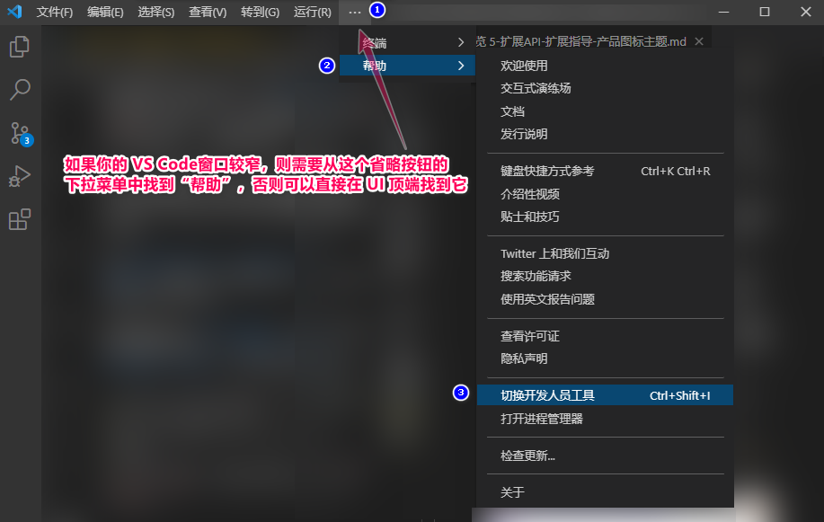
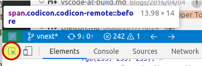

# 产品图标主题

[原文链接，戳我前往](https://code.visualstudio.com/api/extension-guides/product-icon-theme)

------

翻译 by [赫雯勒莉特翡翠](https://github.com/HeveraletLaidCenx)

## 术语~的对照表

|中文（常用英文表述）|英文|
|----|----|
|类|class|
|演练场|playground|

表中部分：

* 在中文表述中常直接用英文替代的
* 认为直译并不合适的

在中文之后的括号中说明了直接使用对应的英文。

------

## 概述

**Visual Studio Code** 包括了一套内置图标，用在 视图 和 编辑器 中，但是它们也可以被鼠标悬停提示、状态栏、设置扩展来引用。比如过滤器操作按钮、视图按钮、状态栏中的图标、断点图标，以及树视图和编辑器中的折叠图标。

产品图标主题允许扩展来重新定义这些图标，来使 **VS Code** 拥有一个自定义的外观。产品图标主题没有涵盖 文件图标（是文件图标主题涵盖的）和 扩展提供的图标。

**VS Code** 要求将此处的图标定义为图标字体中的图形字符，并且（目前）限制其仅由单一颜色构成。图标的颜色具体决定于它所显示的位置，是由活跃的颜色主题定义的。

## 添加一个新的产品图标主题

要定义你自己的产品图标主题的话，从创建一个 **VS Code** 扩展，并在扩展的 `package.json` 中添加 `productIconThemes`（产品图标主题） 作用点 开始。

```json
{
  "contributes": {
    "productIconThemes": [
      {
        "id": "aliensAreBack",
        "label": "Aliens Are Back",
        "path": "./producticons/aliens-product-icon-theme.json"
      }
    ]
  }
}
```

* `id` 是产品图标主题的标识符。它也在设置中作为标识符，所以确保它唯一且具有可读性（有意义、让人能区分出来这是你的主题）。
* `label` 会在产品图标主题选择器的下拉列表中显示。
* `path` 则指向扩展中定义了图标集的文件。如果你的图标集的名称符合 `*product-icon-theme.json` 的命名格式，那么你将在 **VS Code** 中获得 自动补全支持 和鼠标悬停提示。

## 产品图标定义文件

产品图标定义文件是一个 定义了一个或多个 图标字体 和 一套图标定义 的 JSON 文件。

### 字体定义

`fonts` 部分让你可以生命任意数量的你想用的图形字符字体，但是 **至少** 需要定义一个 字体定义。

你可以在之后的 图标定义 中引用这些字体。如果 图标定义 没有特别指明 字体ID ，则第一个声明的字体会被用作其默认值。

把字体文件复制到你的扩展，并且对应地设置其路径。

推荐使用 [WOFF](https://developer.mozilla.org/docs/Web/Guide/WOFF) 字体。

* 把format（格式）设置为 `woff` 。
* weight（字重） 属性的值是在 [这里](https://developer.mozilla.org/docs/Web/CSS/font-weight#Values) 定义的。
* style（样式） 属性的值是在 [这里](https://developer.mozilla.org/docs/Web/CSS/@font-face/font-style#Values) 定义的。

```json
{
  "fonts": [
    {
      "id": "alien-font",
      "src": [
        {
          "path": "./alien.woff",
          "format": "woff"
        }
      ],
      "weight": "normal",
      "style": "normal"
    }
  ]
}
```

### 图标定义

**VS Code** 定义了一个 图标ID 的列表，视图通过这些 ID 来引用图标。产品图标的 `iconDefinitions`（图标定义） 部分会给这些 ID 分配新的图标。

每个定义都用 `fontId` 来引用一个在 `fonts` 部分定义的字体。如果省略 `fontId` ，则会使用字体定义中的第一个字体。

```json
{
  "iconDefinitions": {
    "dialog-close": {
      "fontCharacter": "\\43",
      "fontId": "alien-font"
    }
  }
}
```

可以在 [图标参考](https://code.visualstudio.com/api/references/icons-in-labels#icon-listing) 中，找到一个包含所有图标标识符的列表。

## 开发 和 测试

**VS Code** 拥有内置的对 `package.json` 文件 和 产品图标主题文件 的编辑支持。要使用这个功能，需要确保你的主题文件名以 `product-icon-theme.json` 结尾。这将会启用包括已知的 图标ID 属性的 自动补全、鼠标悬停提示，和对代码的校验。

要测试新的产品图标主题，用 **VS Code** 打开扩展文件夹后，按 `F5` 键来启动一个 `扩展开发宿主` 窗口。这个窗口会启用你的扩展，并自动切换到第一个产品图标主题。

此外，当修改主题文件时，会自动监视更改内容和对图标的更新。当你在调试产品图标主题定义文件时，可以在保存文件时动态地看到对应的更改效果。

使用 **Preferences: Product Icon Theme**（首选项：产品图标主题） 命令来在产品图标主题之间切换。

如果想找出来在 **VS Code** UI 中某个位置使用的是哪个图标，从 **Help > Toggle Developer Tools**（帮助 > 切换到开发人员工具） 打开 开发人员工具



，然后：

* 点击位于 开发人员工具面板 左上角的 检查工具
* 把鼠标移动到想检查的图标上
* 如果图标的 class（类名）是 `codicon.codicon-remote` ，那么图标的 ID 就是 `remote` 。



## 示例

[产品图标主题的例子](https://github.com/microsoft/vscode-extension-samples/tree/main/product-icon-theme-sample) 可以被用作一个演练场。【*：原页面此处链接的文字是“Product Color Theme Sample”，甚至与实际跳转链接不符，疑为笔误，故更正之】
