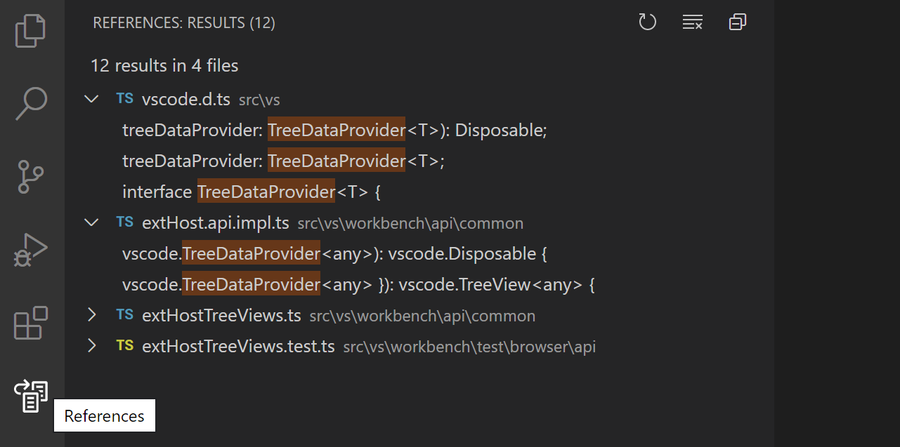
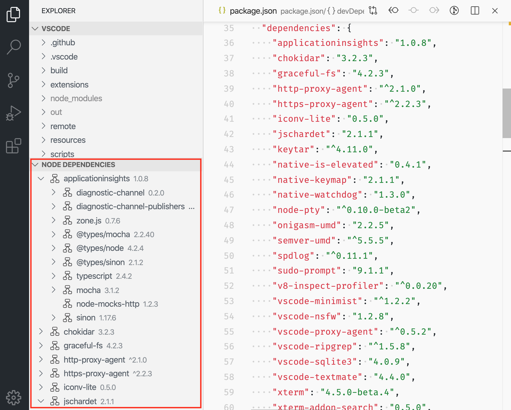
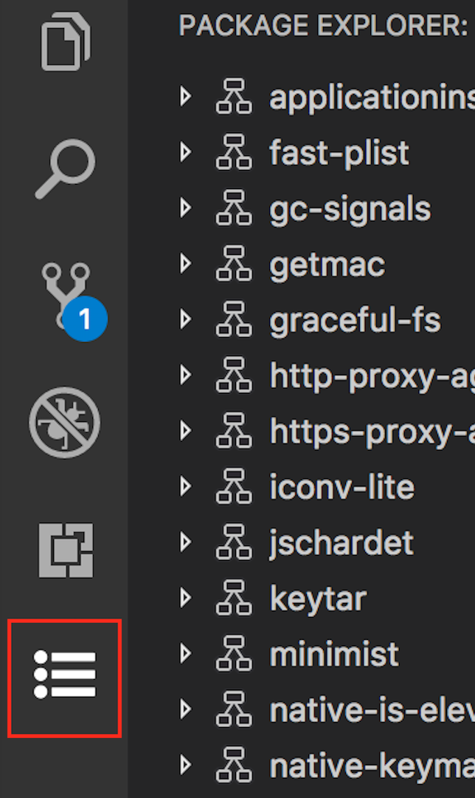
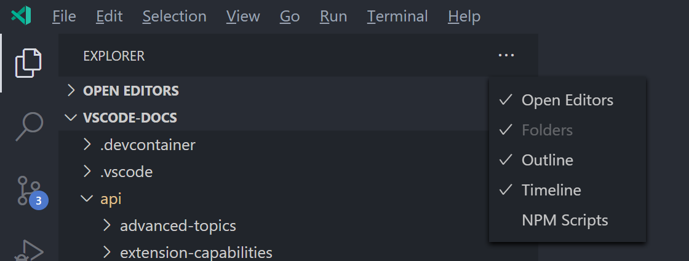
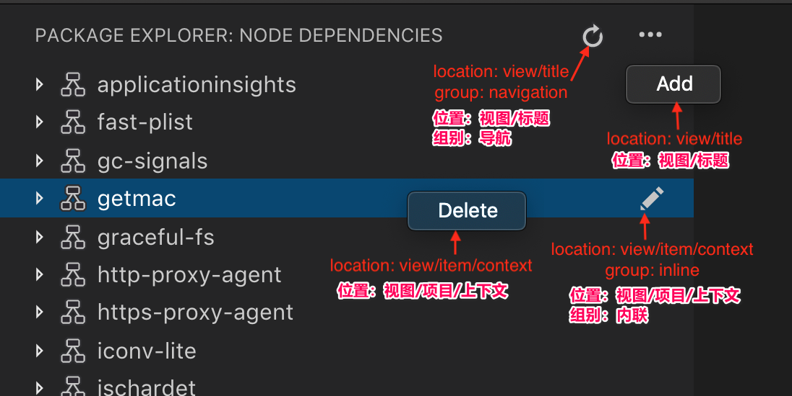

# 树视图API

[原文链接，戳我前往](https://code.visualstudio.com/api/extension-guides/tree-view)

更新版本：截至2021-09-03

------

翻译 by [赫雯勒莉特翡翠](https://github.com/HeveraletLaidCenx)

## 术语~的对照表

|中文（常用英文表述）|英文|
|----|----|
|内联的|inline|
|操作|Actions|

表中部分：

* 在中文表述中常直接用英文替代的
* 认为直译并不合适的

在中文之后的括号中说明了直接使用对应的英文。

------

## 概述

树视图API 允许扩展在 **Visual Studio Code** 的侧边栏中显示内容。内容采用树状结构，符合 **VS Code** 的 [内置视图](https://code.visualstudio.com/docs/getstarted/userinterface#_views) 的样式。

比如，内置的 References Search View（引用搜索视图） 扩展，会将引用搜索的结果显示为一个独立的视图。



**Find All References**（查找所有引用） 的结果被显示在 **References**（引用） 视图容器中的 **References: Results**（引用：结果） 树视图里。

本篇指导将教你如何编写一个 能在 **VS Code** 中建立 树视图 和 视图容器 的扩展。

## 树视图API 基础

为了解释 树视图API ，我们现在要创建一个叫 **Node Dependencies**（**Node** 依赖）的扩展例子。这个扩展会用一个树视图来显示当前文件夹中所有 **Node.js** 的依赖。

添加一个树视图的步骤是：在你的 `package.json` 文件中建立 树视图 的作用点，创建一个 `TreeDataProvider`（树的数据提供程序），并注册它。你可以在 [vscode-extension-samples](https://github.com/microsoft/vscode-extension-samples/tree/main/tree-view-sample/README.md)（**VS Code** 扩展示例） GitHub 仓库中的 `tree-view-sample`（树视图例子） 找到这个扩展例子的完整源代码。

### 在 package.json 中建立作用点

第一步，你要让 **VS Code** 知道你在建立一个视图的作用点。

在 `package.json` 中用 [contributes.views](https://code.visualstudio.com/api/references/contribution-points#contributes.views)（建立作用点.视图） 作用点可以做到这点。

下面这个是我们的第一版扩展的 `package.json` 文件：

```json
{
  "name": "custom-view-samples",
  "displayName": "Custom view Samples",
  "description": "Samples for VS Code's view API",
  "version": "0.0.1",
  "publisher": "alexr00",
  "engines": {
    "vscode": "^1.42.0"
  },
  "activationEvents": ["onView:nodeDependencies"],
  "main": "./out/extension.js",
  "contributes": {
    "views": {
      "explorer": [
        {
          "id": "nodeDependencies",
          "name": "Node Dependencies"
        }
      ]
    }
  },
  "scripts": {
    "vscode:prepublish": "npm run compile",
    "compile": "tsc -p ./",
    "watch": "tsc -watch -p ./"
  },
  "devDependencies": {
    "@types/node": "^10.12.21",
    "@types/vscode": "^1.42.0",
    "typescript": "^3.5.1",
    "tslint": "^5.12.1"
  }
}
```

你必须给视图指定 id（标识符） 和 name（名称），然后你可以在以下位置建立作用点：

* `explorer`（资源管理器） —— 侧边栏中的 资源管理器 视图
* `debug`（Debug） —— 侧边栏中的 运行和Debug 视图
* `scm`（源代码控制管理器） —— 侧边栏中的源代码控制管理视图
* `test`（测试） —— 侧边栏中的测试资源管理器视图
* [自定义的视图容器](https://code.visualstudio.com/api/extension-guides/tree-view#view-container)

### 树的数据提供程序

第二步，向你注册的视图提供数据，让 **VS Code** 能在其中显示这些数据的内容。

要做到这一点，你应该实现 [树的数据提供程序](https://code.visualstudio.com/api/references/vscode-api#TreeDataProvider) 。在这个例子中，它会提供 **Node** 依赖 的数据，但是之后你可以让 数据提供程序 提供其它类型的数据。

在这个 API 中，你需要实现两个必要的方法：

* `getChildren(element?: T): ProviderResult<T[]>` —— 这个方法会实现：返回给定 `element`（元素） 的子项，如果没有传递元素，则返回 root（根） 的子项。
* `getTreeItem(element: T): TreeItem | Thenable<TreeItem>` —— 这个方法会实现：返回被显示在视图里的 UI 表现内容（[树项目](https://code.visualstudio.com/api/references/vscode-api#TreeItem)）。

当用户打开树视图时， `getChildren`（获取子项） 方法会在没有 `element`（元素） 参数的情况下被调用。这时，你的 `TreeDataProvider`（树的数据提供程序） 应该返回你的 顶级树项目。

在我们的这个例子里，顶级树项目的 `collapsibleState`（可折叠状态） 是 `TreeItemCollapsibleState.Collapsed`（树项目可折叠状态.折叠的），意味着 顶级树项目 将显示为折叠状态。而如果把 `collapsibleState`（可折叠状态） 改为 `TreeItemCollapsibleState.Expanded`（树项目可折叠状态.展开的） ，则树项目会以展开的形式显示。

此外，如果我们将 `collapsibleState`（可折叠状态） 保留默认值： `TreeItemCollapsibleState.None`（树项目可折叠状态.无） ，则表示这个树项目没有子项。此时， `getChildren`（获取子项） 方法将不被调用。

下面是 `TreeDataProvider`（树的数据提供程序） 实现提供 **Node** 依赖 数据的例子：

```typescript
import * as vscode from 'vscode';
import * as fs from 'fs';
import * as path from 'path';

export class NodeDependenciesProvider implements vscode.TreeDataProvider<Dependency> {
  constructor(private workspaceRoot: string) {}

  getTreeItem(element: Dependency): vscode.TreeItem {
    return element;
  }

  getChildren(element?: Dependency): Thenable<Dependency[]> {
    if (!this.workspaceRoot) {
      vscode.window.showInformationMessage('No dependency in empty workspace');
      return Promise.resolve([]);
    }

    if (element) {
      return Promise.resolve(
        this.getDepsInPackageJson(
          path.join(this.workspaceRoot, 'node_modules', element.label, 'package.json')
        )
      );
    } else {
      const packageJsonPath = path.join(this.workspaceRoot, 'package.json');
      if (this.pathExists(packageJsonPath)) {
        return Promise.resolve(this.getDepsInPackageJson(packageJsonPath));
      } else {
        vscode.window.showInformationMessage('Workspace has no package.json');
        return Promise.resolve([]);
      }
    }
  }

  // 给出 package.json 的路径，读取它的所有 dependencies（依赖） 和 devDependencies（开发依赖）。
  private getDepsInPackageJson(packageJsonPath: string): Dependency[] {
    if (this.pathExists(packageJsonPath)) {
      const packageJson = JSON.parse(fs.readFileSync(packageJsonPath, 'utf-8'));

      const toDep = (moduleName: string, version: string): Dependency => {
        if (this.pathExists(path.join(this.workspaceRoot, 'node_modules', moduleName))) {
          return new Dependency(
            moduleName,
            version,
            vscode.TreeItemCollapsibleState.Collapsed
          );
        } else {
          return new Dependency(moduleName, version, vscode.TreeItemCollapsibleState.None);
        }
      };

      const deps = packageJson.dependencies
        ? Object.keys(packageJson.dependencies).map(dep =>
            toDep(dep, packageJson.dependencies[dep])
          )
        : [];
      const devDeps = packageJson.devDependencies
        ? Object.keys(packageJson.devDependencies).map(dep =>
            toDep(dep, packageJson.devDependencies[dep])
          )
        : [];
      return deps.concat(devDeps);
    } else {
      return [];
    }
  }

  private pathExists(p: string): boolean {
    try {
      fs.accessSync(p);
    } catch (err) {
      return false;
    }
    return true;
  }
}

class Dependency extends vscode.TreeItem {
  constructor(
    public readonly label: string,
    private version: string,
    public readonly collapsibleState: vscode.TreeItemCollapsibleState
  ) {
    super(label, collapsibleState);
    this.tooltip = `${this.label}-${this.version}`;
    this.description = this.version;
  }

  iconPath = {
    light: path.join(__filename, '..', '..', 'resources', 'light', 'dependency.svg'),
    dark: path.join(__filename, '..', '..', 'resources', 'dark', 'dependency.svg')
  };
}
```


### 注册 树的数据提供程序

第三步，将上边的 数据提供程序 注册到你的视图。

可以通过以下两种方式完成：

* `vscode.window.registerTreeDataProvider`（vscode.窗口.注册树的数据提供程序） —— 通过提供 视图ID 和 上边的数据提供程序，来注册树的数据提供程序。

  ```typescript
  vscode.window.registerTreeDataProvider(
    'nodeDependencies',
    new NodeDependenciesProvider(vscode.workspace.rootPath)
  );
  ```

* `vscode.window.createTreeView`（vscode.窗口.创建树视图） —— 通过提供 已经注册的视图ID 和 上面的数据提供程序，来创建树视图。这种方法会提供到 [树视图](https://code.visualstudio.com/api/references/vscode-api#TreeView) 的访问权限，你可以用它来执行其它视图操作。如果你需要使用 树视图API 的话，请用这个 `createTreeView`（创建树视图） 的方法。

  ```typescript
  vscode.window.createTreeView('nodeDependencies', {
    treeDataProvider: new NodeDependenciesProvider(vscode.workspace.rootPath)
  });
  ```

关于第二种方法，还可以到 `tree-view-sample` 中 的 [ftpExplorer.ts](https://github.com/microsoft/vscode-extension-samples/tree/main/tree-view-sample/src/ftpExplorer.ts) 查看详细实现方法。

下面是该扩展的运行情况：



### 更新树视图的内容

我们的 **Node** 依赖视图 很简单，数据显示之后就不会更新了。但是，如果在视图中有一个刷新按钮，可以让 **Node** 依赖视图 根据当前的 `package.json` 内容更新，不是很棒吗？要实现这点，我们可以用 `onDidChangeTreeData`（当数的数据发生改变时触发） 事件。

* `onDidChangeTreeData?: Event<T | undefined | null | void>` —— 如果你的树的数据是可变的，并且你想让树视图根据其内容更新的话，可以用这个方法实现。

将以下内容添加到你的 `NodeDependenciesProvider`（Node 依赖提供程序）：

```typescript
  private _onDidChangeTreeData: vscode.EventEmitter<Dependency | undefined | null | void> = new vscode.EventEmitter<Dependency | undefined | null | void>();
  readonly onDidChangeTreeData: vscode.Event<Dependency | undefined | null | void> = this._onDidChangeTreeData.event;

  refresh(): void {
    this._onDidChangeTreeData.fire();
  }
```

现在我们有刷新方法啦！但是……没人调用它诶，所以，来加一个调用刷新的命令吧~

在你的 `package.json` 文件里的 `contributes`（建立作用点） 部分，添加：

```json
    "commands": [
            {
                "command": "nodeDependencies.refreshEntry",
                "title": "Refresh",
                "icon": {
                    "light": "resources/light/refresh.svg",
                    "dark": "resources/dark/refresh.svg"
                }
            },
    ]
```

并且在你的扩展中注册这个命令：

```typescript
import * as vscode from 'vscode';
import { NodeDependenciesProvider } from './nodeDependencies';

export function activate(context: vscode.ExtensionContext) {
  const nodeDependenciesProvider = new NodeDependenciesProvider(vscode.workspace.rootPath);
  vscode.window.registerTreeDataProvider('nodeDependencies', nodeDependenciesProvider);
  vscode.commands.registerCommand('nodeDependencies.refreshEntry', () =>
    nodeDependenciesProvider.refresh()
  );
}
```

现在我们有一个会刷新 **Node** 依赖视图的命令啦！但是如果在视图中有个按钮就更好啦。我们已经在命令里添加了一个 `icon`（图标） ，所以在我们把它添加到视图的时候它就会显示出来啦~

还是在你的 `package.json` 文件里的 `contributes`（建立作用点） 部分，添加：

```json
"menus": {
    "view/title": [
        {
            "command": "nodeDependencies.refreshEntry",
            "when": "view == nodeDependencies",
            "group": "navigation"
        },
    ]
}
```

## 激活

有一点很重要：仅当用户需要你的扩展提供的功能的时候，才激活你的扩展。

这种情况下，你应该考虑在用户开始使用视图的时候才激活你的扩展。当用户打开视图的时候，**VS Code** 会发出一个激活事件 [onView:${viewId}](https://code.visualstudio.com/api/references/activation-events#onView) （对于上边咱们这个例子，是 `onView:nodeDependencies` ）。

你可以在 `package.json` 中注册这个激活事件，然后 **VS Code** 会在这个事件中激活你的扩展：

```json
"activationEvents": [
        "onView:nodeDependencies",
],
```

## 视图容器

创建的视图容器会和内置的视图容器一起，显示在活动栏或者面板中，它包括一个视图的列表。

源代码控制管理器 和 资源管理器 就是内置视图容器的例子。



要建立视图容器作用点的话，你应该首先通过`package.json` 中的 [contributes.viewsContainers](https://code.visualstudio.com/api/references/contribution-points#contributes.viewsContainers)（建立作用点.视图容器） 作用点 来注册它。

你需要指定下面这些必填的字段：

|字段名|翻译|字段含义|
|----|----|----|
|`id`|标识符|你正在创建的视图容器的名称。|
|`title`|标题|将在视图容器顶部的名称。|
|`icon`|图标|视图容器在活动栏显示时作为其图标的图像。|

```json
"contributes": {
  "viewsContainers": {
    "activitybar": [
      {
        "id": "package-explorer",
        "title": "Package Explorer",
        "icon": "media/dep.svg"
      }
    ]
  }
}
```

另外，你可以通过把这个视图放在 `panel`（面板） 节点的下面，来建立它到面板的作用点。

```json
"contributes": {
  "viewsContainers": {
    "panel": [
      {
        "id": "package-explorer",
        "title": "Package Explorer",
        "icon": "media/dep.svg"
      }
    ]
  }
}
```

## 建立 视图 到 视图容器 的作用点

在创建了视图容器之后，你就可以在 `package.json` 中使用 [contributes.views](https://code.visualstudio.com/api/references/contribution-points#contributes.views)（建立作用点.视图） 作用点了。

```json
"contributes": {
  "views": {
    "package-explorer": [
      {
        "id": "nodeDependencies",
        "name": "Node Dependencies",
        "icon": "media/dep.svg",
        "contextualTitle": "Package Explorer"
      }
    ]
  }
}
```

视图还有一个可选的属性： `visibility`（可见性） ，它可以设置成 `visible`（可见的） 、`collapsed`（折叠的） 或者 `hidden`（隐藏的） 。对 **VS Code** 来说，这个属性只在第一次用这个视图打开一个工作区的时候生效。在之后，可见性会被设置成用户选择的内容。如果你的视图容器包括很多视图，或者你的视图不是对扩展的所有用户都有用的，那么可以考虑把它设置成 `collapsed`（折叠的） 或者 `hidden`（隐藏的）。`hidden`（隐藏的） 视图将出现在视图容器的 `Views`（视图和更多操作...） 菜单中：



## 查看 的 操作

操作 可以作为内联的图标出现在：你的单个树项目上、树项目的上下文菜单中，以及视图顶部的视图标题中。操作 是你通过在 `package.json` 中建立作用点来设置的，显示在这些位置的命令。

要想在上边这三个位置建立作用点，你可以在你的 `package.json` 中使用下边给出的 菜单作用点：

|字段名|翻译|字段含义|
|----|----|----|
|`view/title`|视图/标题|在视图的标题中显示 操作。主要操作 或者 内联操作 使用 `"group": "navigation"`（组别：导航） ，其它的是次要操作，会显示在 `...` 菜单中。|
|`view/item/context`|视图/项目/上下文|在树项目中显示 操作。内联操作 使用 `"group": "inline"`（组别：内联） ，其它的是次要操作，会显示在 `...` 菜单中。|

你可以用 [when 条件判断语句](https://code.visualstudio.com/api/references/when-clause-contexts) 来控制这些 操作 的可见性。



例子：

```json
"contributes": {
  "commands": [
    {
      "command": "nodeDependencies.refreshEntry",
      "title": "Refresh",
      "icon": {
        "light": "resources/light/refresh.svg",
        "dark": "resources/dark/refresh.svg"
      }
    },
    {
      "command": "nodeDependencies.addEntry",
      "title": "Add"
    },
    {
      "command": "nodeDependencies.editEntry",
      "title": "Edit",
      "icon": {
        "light": "resources/light/edit.svg",
        "dark": "resources/dark/edit.svg"
      }
    },
    {
      "command": "nodeDependencies.deleteEntry",
      "title": "Delete"
    }
  ],
  "menus": {
    "view/title": [
      {
        "command": "nodeDependencies.refreshEntry",
        "when": "view == nodeDependencies",
        "group": "navigation"
      },
      {
        "command": "nodeDependencies.addEntry",
        "when": "view == nodeDependencies"
      }
    ],
    "view/item/context": [
      {
        "command": "nodeDependencies.editEntry",
        "when": "view == nodeDependencies && viewItem == dependency",
        "group": "inline"
      },
      {
        "command": "nodeDependencies.deleteEntry",
        "when": "view == nodeDependencies && viewItem == dependency"
      }
    ]
  }
}
```

**注意：** 如果你想给特定的树项目显示操作的话，你可以通过在 `TreeItem.contextValue`（树项目.上下文值） 来定义树项目的上下文，可以在 `when` 表达式中指明键 `viewItem`（视图项目） 的上下文值。

例子：

```json
"contributes": {
  "menus": {
    "view/item/context": [
      {
        "command": "nodeDependencies.deleteEntry",
        "when": "view == nodeDependencies && viewItem == dependency"
      }
    ]
  }
}
```

## 欢迎内容

如果你的视图可能显示成空的，或者你想添加 欢迎内容到另一个扩展的空白视图，那你可以建立 `viewsWelcome`（视图欢迎） 作用点内容。空视图是有一颗空树并且没有 `message`（信息） 的视图。

```json
"contributes": {
  "viewsWelcome": [
    {
      "view": "nodeDependencies",
      "contents": "No node dependencies found [learn more](https://www.npmjs.com/).\n[Add Dependency](command:nodeDependencies.addEntry)"
    }
  ]
}
```


欢迎内容 中支持 链接。方便起见，一行内容如果只有 一个链接 的话会变成一个 按钮。每个欢迎内容也包括一个 `when` 条件判断语句。想看更多的例子的话，可以到 [内置的 **Git** 扩展](https://github.com/microsoft/vscode/tree/main/extensions/git) 查看。
