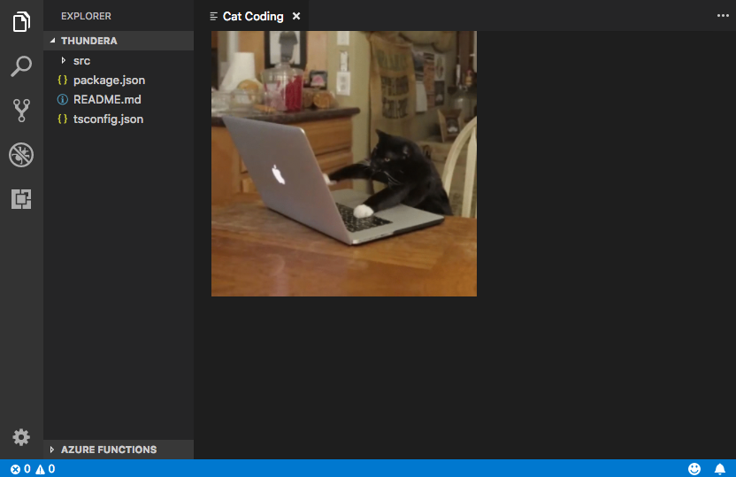
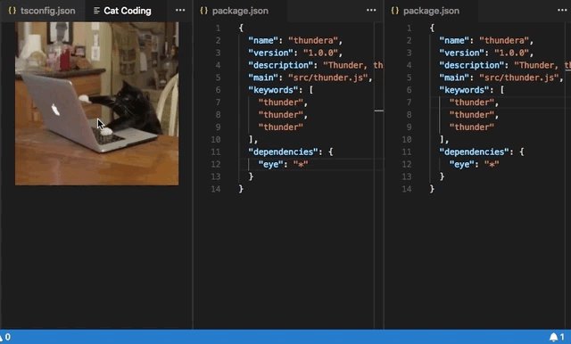
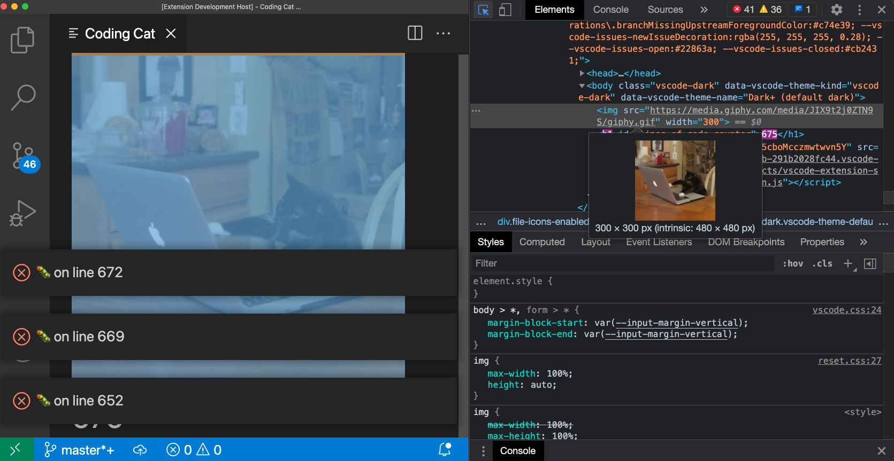
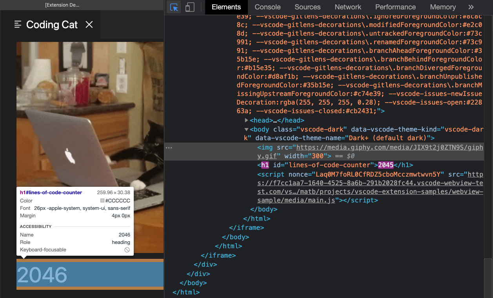
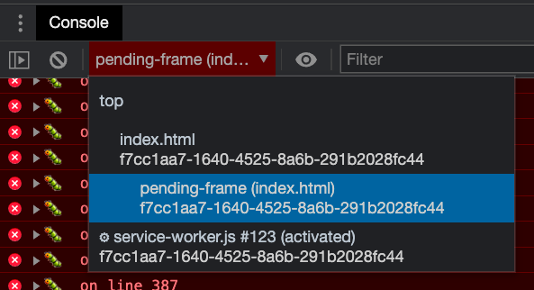
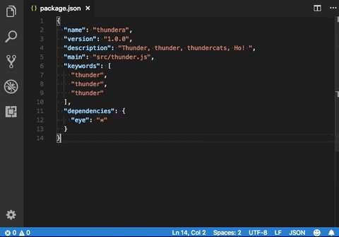

# Webview API

[原文链接，戳我前往](https://code.visualstudio.com/api/extension-guides/webview)

更新版本：截至2021-09-03

------

翻译 by [赫雯勒莉特翡翠](https://github.com/HeveraletLaidCenx)

## 术语~的对照表

|中文（常用英文表述）|英文|
|----|----|
|框架|frame|
|钩子、挂接到|hook|
|计数器|counter|
|列|column|
|意外的|unexpected|
|抛出一个异常|throw an exception|
|检查|Inspect|
|小部件|widgets|
|盘【注：在中文翻译中， disk 常被直接翻译成“磁盘”，但是翡翠认为这其实并不准确，“磁盘”应该是 magnetic disk，而 optical disk 是光盘，光盘并不使用磁存储技术来存储数据，因此 disk 事实上 只是指这种薄片圆盘介质，但是随着存储技术的发展，存储介质显然并不局限于这种形态，如 SSD （一般译作固态硬盘），Solid-State Drive，实际更准确的说是固态驱动器。而在 Windows 系统的中文版本中，可以在 设备管理器 中查看到，对存储介质使用了“磁盘驱动器”这种翻译，而对应的英文原文则是“Disk Drive”，诸如上面这些不太准确的翻译导致对 非易失性存储介质 的翻译和概念也比较混乱，翡翠个人主张直接使用 Drive（驱动器） 或者 Storage Drive（存储驱动器） 这类不涉及具体形态的抽象概念名词来描述大类的存储介质，因此这里不采用原文的 disk 的翻译，改用“存储驱动器”】|disk|
|字体系列|font family|
|重构|refactor|
|私有的|private|
|占位符|placeholder|

表中部分：

* 在中文表述中常直接用英文替代的
* 认为直译并不合适的

在中文之后的括号中说明了直接使用对应的英文。

------

## 概述

Webview API 让扩展可以在 **Visual Studio Code** 中创建可以完全自定义的视图。比如，内置的 Markdown 扩展就使用 Webview 来渲染、预览 Markdown 文档。 Webviews 也能用来构建超出 **VS Code** 原生的扩展API 支持的复杂 UI 。

把 Webview 想成一个在 **VS Code** 中可以被你的扩展控制的 `iframe` 。在这个框架中， Webview 能渲染几乎所有的 HTML 内容，并且通过消息传递来和扩展通信。这种自由性让 Webview 超乎想象的强，为扩展开发带来了全新的可能。

Webview 被用在这些 **VS Code** 扩展API 中：

* 使用 `createWebviewPanel` 创建的 Webview 面板 —— 这种情况下，Webview 在 **VS Code** 显示为分离的编辑器。可以用于显示自定义的 UI 和 可视化内容。
* 作为 [自定义编辑器](https://code.visualstudio.com/api/extension-guides/custom-editors) 的视图 —— 自定义编辑器让扩展可以提供一个可以在工作区中编辑任何文件的自定义 UI 。自定义编辑器 API 还让你的扩展可以挂接到 编辑器事件（比如 撤销 和 重做） 以及 文件事件（比如 保存）。
* 在侧边栏或者面板区域的 [Webview 视图](https://code.visualstudio.com/api/references/vscode-api#WebviewView) 中 —— 更多详细内容请查看 [Webview 视图扩展的例子](https://github.com/microsoft/vscode-extension-samples/tree/main/webview-view-sample) 。

本章重点介绍基础的 Webview 面板API ，这里关于 Webview 的涵盖的几乎所有内容也同样适用于 自定义编辑器 和 Webview 视图。即使你对那俩 API 更感兴趣，但是我们还是建议你先通读本文来熟悉 Webview 的基础知识。

## 相关链接

* [Webview 的例子](https://github.com/microsoft/vscode-extension-samples/blob/main/webview-sample/README.md)
* [自定义编辑器的文档](https://code.visualstudio.com/api/extension-guides/custom-editors)
* [Webview 视图 的例子](https://github.com/microsoft/vscode-extension-samples/tree/main/webview-view-sample)

### 用到的 VS Code 扩展API

* [`window.createWebviewPanel`](https://code.visualstudio.com/api/references/vscode-api#window.createWebviewPanel)（窗口.创建 Webview 面板）
* [`window.registerWebviewPanelSerializer`](https://code.visualstudio.com/api/references/vscode-api#window.registerWebviewPanelSerializer)（窗口.注册 Webview 面板序列化器）

## 我应该用 Webview 嘛？

虽然 Webview 看上去很棒，但是应该谨慎使用它 —— 仅当 **VS Code** 的原生扩展 API 不足以支持实现你对扩展的预想时，才考虑使用 Webview 。 Webview 会占用大量的资源，并且和普通的扩展不在同一个环境下运行。一个设计糟糕的 Webview 也很容易在 **VS Code** 的 UI 中显得格格不入。

在决定使用 Webview 之前，请考虑以下几件事：

* 你想用 Webview 实现的这个功能真的有必要在 **VS Code** 中存在吗？用一个独立的 App 或者 网站来实现它会不会更合适？
* 真的只能用 Webview 来实现这个功能了吗？能用常规的 **VS Code** API 来实现吗？
* 你添加的 Webview 实现的内容，配得上它带来的高资源占用吗？

> 记住：Webview 能做到，并不意味着你应该用它这么做。

但是，如果你确信自己需要使用 Webview 的话，那本文可以提供帮助。让我们开始吧~

## Webview API 基础

为了解释 Webview API，现在我们要创建一个叫 **Cat Coding（猫猫敲代码）** 的简单示例扩展。

这个扩展将用 Webview 来显示 一只敲代码的猫猫（大约是在 **VS Code** 里敲的，笑）的 gif动图 。

我们会在处理 API 的同时，不断向这个扩展添加功能，包括一个 持续跟踪猫猫写了多少行代码的计数器，和一个 当猫猫引入 bug 时，告知用户的通知。

这是第一版 **Cat Coding（猫猫敲代码）** 扩展的 `package.json` 文件。你可以在 [这里](https://github.com/microsoft/vscode-extension-samples/blob/main/webview-sample/README.md) 找到这个示例扩展的完整源代码。

我们的第一版扩展会建立一个叫 `catCoding.start` 的 [命令的作用点](https://code.visualstudio.com/api/references/contribution-points#contributes.commands) 。当用户调用这个命令时，扩展会显示一个 里面有咱的猫猫的 简单的 Webview 。用户可以从 **命令面板** 通过 **Cat Coding: Start new cat coding session（猫猫敲代码: 启动新的猫猫敲代码会话）** 来调用这个命令，或者，如果用户愿意的话，甚至可以给它创建一个键位绑定。

```json
{
  "name": "cat-coding",
  "description": "Cat Coding",
  "version": "0.0.1",
  "publisher": "bierner",
  "engines": {
    "vscode": "^1.23.0"
  },
  "activationEvents": ["onCommand:catCoding.start"],
  "main": "./out/src/extension",
  "contributes": {
    "commands": [
      {
        "command": "catCoding.start",
        "title": "Start new cat coding session",
        "category": "Cat Coding"
      }
    ]
  },
  "scripts": {
    "vscode:prepublish": "tsc -p ./",
    "compile": "tsc -watch -p ./",
    "postinstall": "node ./node_modules/vscode/bin/install"
  },
  "dependencies": {
    "vscode": "*"
  },
  "devDependencies": {
    "@types/node": "^9.4.6",
    "typescript": "^2.8.3"
  }
}
```

现在让我们实现 `catCoding.start`（猫猫敲代码.启动） 命令。

在扩展的主文件中，注册 `catCoding.start`（猫猫敲代码.启动） 命令，用它来显示基础的 Webview：

```typescript
import * as vscode from 'vscode';

export function activate(context: vscode.ExtensionContext) {
  context.subscriptions.push(
    vscode.commands.registerCommand('catCoding.start', () => {
      // 创建并显示一个新的 Webview
      const panel = vscode.window.createWebviewPanel(
        'catCoding', // 用来识别 Webview 的类型，在内部使用
        'Cat Coding', // 展示给用户的，面板的标题
        vscode.ViewColumn.One, // 在编辑器视图列显示新的 Webview 面板
        {} // Webview 选项，稍后会有关于这块的更多内容
      );
    })
  );
}
```

`vscode.window.createWebviewPanel`（vscode.窗口.创建 Webview 面板） 函数会在编辑器里创建并显示一个 Webview 。如果你在当前的状态试着执行 `catCoding.start`（猫猫敲代码.启动） 命令的话，会看到这样的内容：


我们的命令打开了一个带有正确标题的 Webview 面板，但是其中没有内容！要想把我们的猫猫添加到新面板当中的话，我们还需要用 `webview.html` 来给 Webview 设置 HTML 内容：

> 译注：为了防止原 Doc 的图像链接失效，所以在这里把图像转存到了当前 repo 中，把 `` 标签的地址替换成了当前 repo 的永久链接。

```typescript
import * as vscode from 'vscode';

export function activate(context: vscode.ExtensionContext) {
  context.subscriptions.push(
    vscode.commands.registerCommand('catCoding.start', () => {
      // 创建并显示面板
      const panel = vscode.window.createWebviewPanel(
        'catCoding',
        'Cat Coding',
        vscode.ViewColumn.One,
        {}
      );

      // 并且设置它的 HTML 内容
      panel.webview.html = getWebviewContent();
    })
  );
}

function getWebviewContent() {
  return `<!DOCTYPE html>
<html lang="en">
<head>
    <meta charset="UTF-8">
    <meta name="viewport" content="width=device-width, initial-scale=1.0">
    <title>Cat Coding</title>
</head>
<body>
    
</body>
</html>`;
}
```

现在如果你再运行一次命令， Webview 应该是下边这样子：



是肉眼可见的进步呢！）

`webview.html` 应该始终是一个完整的 HTML 文档。仅仅是不完整的 HTML 片段，或者格式错误的 HTML 文档可能会导致意外行为。

### 更新 Webview 内容

`webview.html` 在被创建后还可以更新 Webview 的内容。现在让我们来通过给猫猫引入一个内容交替循环，来把 **Cat Coding** 变得更有动感吧：

```typescript
import * as vscode from 'vscode';

const cats = {
  'Coding Cat': 'https://github.com/HeveraletLaidCenx/VS-Code-extensions-zh-CN/blob/bfabb354540c4186782bc0c76d2827584344bdb0/%E6%96%87%E6%A1%A3/VS%20Code%20%E5%AE%98%E6%96%B9%E6%96%87%E6%A1%A3/4-%E6%89%A9%E5%B1%95%E6%8C%87%E5%AF%BC/src/giphy.gif',
  'Compiling Cat': 'https://github.com/HeveraletLaidCenx/VS-Code-extensions-zh-CN/blob/d49cd84891a6132b7f347e57de7a3a281c4f8ead/%E6%96%87%E6%A1%A3/VS%20Code%20%E5%AE%98%E6%96%B9%E6%96%87%E6%A1%A3/4-%E6%89%A9%E5%B1%95%E6%8C%87%E5%AF%BC/src/giphy2.gif'
};

export function activate(context: vscode.ExtensionContext) {
  context.subscriptions.push(
    vscode.commands.registerCommand('catCoding.start', () => {
      const panel = vscode.window.createWebviewPanel(
        'catCoding',
        'Cat Coding',
        vscode.ViewColumn.One,
        {}
      );

      let iteration = 0;
      const updateWebview = () => {
        const cat = iteration++ % 2 ? 'Compiling Cat' : 'Coding Cat';
        panel.title = cat;
        panel.webview.html = getWebviewContent(cat);
      };

      // 设置初始化内容
      updateWebview();

      // 然后安排内容每秒刷新
      setInterval(updateWebview, 1000);
    })
  );
}

function getWebviewContent(cat: keyof typeof cats) {
  return `<!DOCTYPE html>
<html lang="en">
<head>
    <meta charset="UTF-8">
    <meta name="viewport" content="width=device-width, initial-scale=1.0">
    <title>Cat Coding</title>
</head>
<body>
    
</body>
</html>`;
}
```

现在扩展看起来应该是下面这样：


设置 `webview.html` 会替换整个 Webview 的内容，就像重新加载 iframe 一样。如果你开始在 Webview 中使用脚本，请牢记这一点，因为这意味着 设置 `webview.html` 也会同时 **重置脚本的状态** 。

上边的例子中，还用了 `webview.title` 来更改显示在编辑器中的文档的标题。设置标题不会导致 Webview 重新加载。

### 生命周期

Webview 面板的所有者是创建它的扩展。扩展必须保留 `createWebviewPanel`（创建 Webview 面板）所返回的 Webview。如果你的扩展丢失了这个引用，则扩展将不能在获得对这个 Webview 的访问权限，即使这个 Webview 还会继续显示在 **VS Code** 里。

和文本编辑器一样，用户也可以随时关闭 Webview 。当用户关闭 Webview 面板时， Webview 本身会被销毁。尝试使用一个已经被销毁的 Webview 会抛出一个异常。这意味着上面那个使用 `setInterval`（设置间隔时间触发） 的例子实际上有一个严重的 bug ：如果用户关掉了面板， `setInterval`（设置间隔时间触发） 会继续触发，它会尝试去更新已经被销毁了的 `panel.webview.html`（面板.webview.html），这必然会抛出一个异常。

猫猫讨厌异常，所以，咱来解决这个 bug ！

当一个 Webview 被销毁的时候，`onDidDispose`（当被销毁时触发） 事件会被触发。我们可以用这个事件来取消之后的更新，并清理 Webview 的资源：

```typescript
import * as vscode from 'vscode';

const cats = {
  'Coding Cat': 'https://github.com/HeveraletLaidCenx/VS-Code-extensions-zh-CN/blob/bfabb354540c4186782bc0c76d2827584344bdb0/%E6%96%87%E6%A1%A3/VS%20Code%20%E5%AE%98%E6%96%B9%E6%96%87%E6%A1%A3/4-%E6%89%A9%E5%B1%95%E6%8C%87%E5%AF%BC/src/giphy.gif',
  'Compiling Cat': 'https://github.com/HeveraletLaidCenx/VS-Code-extensions-zh-CN/blob/d49cd84891a6132b7f347e57de7a3a281c4f8ead/%E6%96%87%E6%A1%A3/VS%20Code%20%E5%AE%98%E6%96%B9%E6%96%87%E6%A1%A3/4-%E6%89%A9%E5%B1%95%E6%8C%87%E5%AF%BC/src/giphy2.gif'
};

export function activate(context: vscode.ExtensionContext) {
  context.subscriptions.push(
    vscode.commands.registerCommand('catCoding.start', () => {
      const panel = vscode.window.createWebviewPanel(
        'catCoding',
        'Cat Coding',
        vscode.ViewColumn.One,
        {}
      );

      let iteration = 0;
      const updateWebview = () => {
        const cat = iteration++ % 2 ? 'Compiling Cat' : 'Coding Cat';
        panel.title = cat;
        panel.webview.html = getWebviewContent(cat);
      };

      updateWebview();
      const interval = setInterval(updateWebview, 1000);

      panel.onDidDispose(
        () => {
          // 当面板被关闭，取消之后的任何对 Webview 内容的更新
          clearInterval(interval);
        },
        null,
        context.subscriptions
      );
    })
  );
}
```

扩展还可以通过调用 Webview 面板上的 `dispose()`（销毁） 方法，来以编程方式关掉它们。如果，举个例子，我们想让我们的猫猫的工作时长只有 5 秒钟：

```typescript
export function activate(context: vscode.ExtensionContext) {
  context.subscriptions.push(
    vscode.commands.registerCommand('catCoding.start', () => {
      const panel = vscode.window.createWebviewPanel(
        'catCoding',
        'Cat Coding',
        vscode.ViewColumn.One,
        {}
      );

      panel.webview.html = getWebviewContent(cats['Coding Cat']);

      // 5 秒钟之后，以编程方式关掉 Webview 面板
      const timeout = setTimeout(() => panel.dispose(), 5000);

      panel.onDidDispose(
        () => {
          // 处理在 5 秒之内的用户关闭面板事件
          clearTimeout(timeout);
        },
        null,
        context.subscriptions
      );
    })
  );
}
```

### 可见性 和 移动

当 Webview 面板变成后台选项卡的时候，它会隐藏，但是它并没有被销毁。当面板再次回到前台的时候， **VS Code** 会自动从 `webview.html` 恢复 Webview 的内容：


`.visible` 属性会告诉你当前 Webview 面板是可见的还是隐藏的。

扩展可以通过调用 `reveal()`（显示） 来以编程方式把 Webview 面板调整到前台。这个方法需要一个可选的 编辑器视图列 参数来将 Webview 面板显示在其中。一个 Webview 面板在某一时刻只能显示在单个 编辑器视图列 中。通过调用 `reveal()`（显示） 或者把 Webview 面板拖动到一个新的 编辑器视图列 可以把这个 Webview 移动到 那个新的 编辑器视图列 中。


让我们更新我们的扩展，来实现只能同时显示一个 Webview 。如果 Webview 面板在后台的话， `catCoding.start`（猫猫敲代码.启动） 命令会把它推到前台：

```typescript
export function activate(context: vscode.ExtensionContext) {
  // 跟踪当前的 Webview 面板
  let currentPanel: vscode.WebviewPanel | undefined = undefined;

  context.subscriptions.push(
    vscode.commands.registerCommand('catCoding.start', () => {
      const columnToShowIn = vscode.window.activeTextEditor
        ? vscode.window.activeTextEditor.viewColumn
        : undefined;

      if (currentPanel) {
        // 如果我们已经有一个 Webview 面板了的话，直接把它显示到目标 编辑器视图列 中
        currentPanel.reveal(columnToShowIn);
      } else {
        // 否则，创建一个新 Webview 面板
        currentPanel = vscode.window.createWebviewPanel(
          'catCoding',
          'Cat Coding',
          columnToShowIn,
          {}
        );
        currentPanel.webview.html = getWebviewContent('Coding Cat');

        // 在当前 Webview 面板被关闭的时候重置
        currentPanel.onDidDispose(
          () => {
            currentPanel = undefined;
          },
          null,
          context.subscriptions
        );
      }
    })
  );
}
```

现在的扩展看起来是这样的：


每当 Webview 的可见性发生变化，或者当它移动到一个新的 编辑器视图列 中的时候，都会触发 `onDidChangeViewState`（在视图状态发生改变时触发） 事件。我们的扩展可以用这个事件来更改显示猫猫的 Webview 显示在哪个 编辑器视图列 中：

```typescript
const cats = {
  'Coding Cat': 'https://github.com/HeveraletLaidCenx/VS-Code-extensions-zh-CN/blob/bfabb354540c4186782bc0c76d2827584344bdb0/%E6%96%87%E6%A1%A3/VS%20Code%20%E5%AE%98%E6%96%B9%E6%96%87%E6%A1%A3/4-%E6%89%A9%E5%B1%95%E6%8C%87%E5%AF%BC/src/giphy.gif',
  'Compiling Cat': 'https://github.com/HeveraletLaidCenx/VS-Code-extensions-zh-CN/blob/d49cd84891a6132b7f347e57de7a3a281c4f8ead/%E6%96%87%E6%A1%A3/VS%20Code%20%E5%AE%98%E6%96%B9%E6%96%87%E6%A1%A3/4-%E6%89%A9%E5%B1%95%E6%8C%87%E5%AF%BC/src/giphy2.gif',
  'Testing Cat': 'https://github.com/HeveraletLaidCenx/VS-Code-extensions-zh-CN/blob/a465335bb1a25235e646e387666acbeae497c91e/%E6%96%87%E6%A1%A3/VS%20Code%20%E5%AE%98%E6%96%B9%E6%96%87%E6%A1%A3/4-%E6%89%A9%E5%B1%95%E6%8C%87%E5%AF%BC/src/giphy3.gif'
};

export function activate(context: vscode.ExtensionContext) {
  context.subscriptions.push(
    vscode.commands.registerCommand('catCoding.start', () => {
      const panel = vscode.window.createWebviewPanel(
        'catCoding',
        'Cat Coding',
        vscode.ViewColumn.One,
        {}
      );
      panel.webview.html = getWebviewContent('Coding Cat');

      // 根据视图状态的改变更新内容
      panel.onDidChangeViewState(
        e => {
          const panel = e.webviewPanel;
          switch (panel.viewColumn) {
            case vscode.ViewColumn.One:
              updateWebviewForCat(panel, 'Coding Cat');
              return;

            case vscode.ViewColumn.Two:
              updateWebviewForCat(panel, 'Compiling Cat');
              return;

            case vscode.ViewColumn.Three:
              updateWebviewForCat(panel, 'Testing Cat');
              return;
          }
        },
        null,
        context.subscriptions
      );
    })
  );
}

function updateWebviewForCat(panel: vscode.WebviewPanel, catName: keyof typeof cats) {
  panel.title = catName;
  panel.webview.html = getWebviewContent(catName);
}
```



### 对 Webview 进行 检查 和 Debug

使用 **Developer: Toggle Developer Tools（开发人员: 切换开发人员工具）** 命令来打开可以用于 检查 和 Debug 你的 Webview 的 [开发人员工具](https://developer.chrome.com/docs/devtools/) 窗口。



注意：如果你在用 1.56 版本之前的 **VS Code** ，或者你在试图 Debug 一个设置了 `enableFindWidget`（启用查找小部件） 的 Webview，则你必须使用 **Developer: Open Webview Developer Tools（开发人员: 打开 Webview 开发人员工具）** 命令代替上边提到的那个命令。这个命令会给每个 Webview 单独打开一个 专用的开发者工具窗口 ，而不是像上边的命令一样，使用全部 Webview 共享的，编辑器本身的 开发人员工具窗口。

你可以用位于 开发人员工具窗口 左上角的 检查工具 来检查你的 Webview 的内容：



你也可以在 开发人员工具 的 控制台 中查看所有 错误 和 日志信息：


要想在你的 Webview 环境中评估表达式的话，请确保在 开发人员工具 的 控制台面板 的左上方的 下拉菜单中，选择了 **active frame（活跃的框架）** 环境：



这个 **active frame（活跃的框架）** 环境，是 Webview 自身的脚本执行时所在的环境。

此外， **Developer: Reload Webview（开发人员: 重新加载 Webview 视图）** 命令 会重新加载所有活跃的 Webview 。在你需要：

* 重置某个 Webview 的状态
* 当 Webview 在 存储驱动器 上存储的内容发生了改变，而你想加载新的内容

时，这个命令会很好用。

## 加载本地内容

出于安全原因，Webview 运行在一个隔离的环境中，不能直接访问本地资源。这意味着，要想从你的扩展加载 图像、CSS ，或者其它资源，或者是想从用户的当前工作区中加载任何内容的话，你必须使用 `Webview.asWebviewUri`（Webview.作为 Webview URI） 函数来把一个本地的 `file:` URI 转换成一个 能被 **VS Code** 用来加载本地资源的子集 的 特殊格式 URI 。

想象一下，我们现在要把我们的 猫猫gif 打包到我们的扩展中，而不是像之前一样从网络来获取它们。要做到这点，我们先创建一个 到存储驱动器上的文件的 URI ，然后将这些 URI传递给 `asWebviewUri`（作为Webview URI） 函数：

```typescript
import * as vscode from 'vscode';
import * as path from 'path';

export function activate(context: vscode.ExtensionContext) {
  context.subscriptions.push(
    vscode.commands.registerCommand('catCoding.start', () => {
      const panel = vscode.window.createWebviewPanel(
        'catCoding',
        'Cat Coding',
        vscode.ViewColumn.One,
        {}
      );

      // 获取存储驱动器上的资源的路径
      const onDiskPath = vscode.Uri.file(
        path.join(context.extensionPath, 'media', 'cat.gif')
      );

      // 然后把它们转换成 Webview 能用的特殊 URI
      const catGifSrc = panel.webview.asWebviewUri(onDiskPath);

      panel.webview.html = getWebviewContent(catGifSrc);
    })
  );
}
```

如果我们对这段代码进行 Debug ，我们会发现 `catGifSrc`（猫猫gif资源） 的真实值类似下面这样：

```string
vscode-resource:/Users/toonces/projects/vscode-cat-coding/media/cat.gif
```

**VS Code** 可以理解这种特殊格式的 URI ，并且可以用它来从存储驱动器来加载我们的 猫猫gif ！

默认情况下，Webview 只能访问下列位置的资源：

* 在你的扩展的安装目录中的
* 在用户的当前活跃的工作区中的

用 `WebviewOptions.localResourceRoots`（Webview 选项.本地资源根源） 来允许对其它本地资源的访问。

你也可以一直用 数据 URI 来直接把资源嵌入到 Webview 中。

### 控制对本地资源的访问权限

Webview 可以通过 `localResourceRoots`（本地资源根源） 选项来控制可以加载用户机器上的哪些资源。`localResourceRoots`（本地资源根源） 定义了一组可以从中加载本地内容的 根URI。

我们可以用它来限制 **Cat Coding（猫猫敲代码）** Webview ，让它只能从我们的扩展中的一个 `media`（媒体） 目录加载资源：

```typescript
import * as vscode from 'vscode';
import * as path from 'path';

export function activate(context: vscode.ExtensionContext) {
  context.subscriptions.push(
    vscode.commands.registerCommand('catCoding.start', () => {
      const panel = vscode.window.createWebviewPanel(
        'catCoding',
        'Cat Coding',
        vscode.ViewColumn.One,
        {
          // 让 Webview 只能从我们的扩展中的一个 `media`（媒体） 目录加载资源
          localResourceRoots: [vscode.Uri.file(path.join(context.extensionPath, 'media'))]
        }
      );

      const onDiskPath = vscode.Uri.file(
        path.join(context.extensionPath, 'media', 'cat.gif')
      );
      const catGifSrc = panel.webview.asWebviewUri(onDiskPath);

      panel.webview.html = getWebviewContent(catGifSrc);
    })
  );
}
```

如果要禁用所有的本地资源的话，只要把 `localResourceRoots`（本地资源根源） 设置成 `[]` 。

一般来说， Webview 应该尽可能地限制 加载本地资源。然而，请记住： `localResourceRoots`（本地资源根源） 本身并不能提供完全的安全保护。也请确保你的 Webview Webview 遵循 [安全性的最佳实践](https://code.visualstudio.com/api/extension-guides/webview#security) ，并且添加一个 [内容安全策略](https://code.visualstudio.com/api/extension-guides/webview#content-security-policy) 来进一步限制允许加载什么内容。

### 将 Webview 内容主题化

Webview 可以使用 CSS 来实现基于 **VS Code** 的当前主题来修改 Webview 的外观。 **VS Code** 将主题分成了三类：

* `vscode-light` —— 亮色主题
* `vscode-dark` —— 暗色主题
* `vscode-high-contrast` —— 高对比度主题

，并且在 `body` 元素中添加了一个指示当前主题的特殊的 类。

以下的 CSS 实现了根据用户的当前主题更改 Webview 的文字颜色：

```css
body.vscode-light {
  color: black;
}

body.vscode-dark {
  color: white;
}

body.vscode-high-contrast {
  color: red;
}
```

在开发 Webview App时，请确保它适配了这三种主题。并且请注重测试高对比度主题时的视觉表现，以确保它能适合有视觉障碍的人们使用。

Webview 也可以使用 [CSS 变量](https://developer.mozilla.org/docs/Web/CSS/Using_CSS_variables) 来访问 **VS Code** 主题颜色。这些变量以 `vscode` 为前缀，并且需要用 `-` 替换 `.` 。比如： `editor.foreground`（编辑器.前景色） 需要变为 `var(--vscode-editor-foreground)`（变量(--vscode-编辑器-前景色)）：

```css
code {
  color: var(--vscode-editor-foreground);
}
```

查看 [主题颜色参考](https://code.visualstudio.com/api/references/theme-color) 来获得可用的主题变量。 [这个扩展](https://marketplace.visualstudio.com/items?itemName=connor4312.css-theme-completions) 提供了对颜色主题变量的智能感知提示。

下面这些与字体相关的变量：

* `--vscode-editor-font-family` —— 编辑器的字体系列（可在 `editor.fontFamily`（编辑器.字体系列） 设置中找到。）
* `--vscode-editor-font-weight` —— 编辑器的字重（可以在 `editor.fontWeight`（编辑器.字重） 设置中找到。）
* `--vscode-editor-font-size` —— 编辑器的字体尺寸（可以在 `editor.fontSize`（编辑器.字体尺寸） 设置中找到。）

最后，对于需要针对单个主题编写 CSS 的特殊情况， Webview 的 `body` 元素有一个新的数据属性，叫做 `vscode-theme-name`（vscode-主题-名称） ，它存储了当前活跃的主题的完整名称。这让你可以给 Webview 编写基于特定主题的 CSS：

```css
body[data-vscode-theme-name="One Dark Pro"] {
    background: hotpink;
}
```

## 脚本 和 信息传递

Webview 就像 iframe，这意味着它也可以运行脚本。默认情况下， Webview 是禁用 **JavaScript** 的，但是可以通过很简单的传入 `enableScripts: true`（启用脚本: 真） 选项来重新启用。

让我们用脚本来添加一个跟踪 我们的猫猫敲了多少行代码 的计数器吧~ 运行一个基础的脚本是十分简单的事情，但是注意，这个例子只是为了演示。在实际情况中，你的 Webview 应该始终用一个 [内容安全策略](https://code.visualstudio.com/api/extension-guides/webview#content-security-policy) 来禁用内联脚本：

```typescript
import * as path from 'path';
import * as vscode from 'vscode';

export function activate(context: vscode.ExtensionContext) {
  context.subscriptions.push(
    vscode.commands.registerCommand('catCoding.start', () => {
      const panel = vscode.window.createWebviewPanel(
        'catCoding',
        'Cat Coding',
        vscode.ViewColumn.One,
        {
          // 在 Webview 中启用脚本
          enableScripts: true
        }
      );

      panel.webview.html = getWebviewContent();
    })
  );
}

function getWebviewContent() {
  return `<!DOCTYPE html>
<html lang="en">
<head>
    <meta charset="UTF-8">
    <meta name="viewport" content="width=device-width, initial-scale=1.0">
    <title>Cat Coding</title>
</head>
<body>
    
    <h1 id="lines-of-code-counter">0</h1>

    <script>
        const counter = document.getElementById('lines-of-code-counter');

        let count = 0;
        setInterval(() => {
            counter.textContent = count++;
        }, 100);
    </script>
</body>
</html>`;
}
```


好家伙！这猫猫的工作效率可太强了

Webview 中的脚本 可以做到和 普通网页中的脚本 一样的事情，别忘了 Webview 存在于它们自己的环境里，所以 Webview 中的脚本没有访问 **VS Code** 扩展API 的权限。这就是 消息传递 的用武之地啦！

### 从 扩展 向 Webview 传递消息

扩展可以用 `webview.postMessage()`（Webview.发送消息） 来向它的 Webview 传递数据。这个方法可以把任何 可以被序列化为 JSON 格式的数据发送到 Webview 。消息在 Webview 中通过标准的  `message`（消息） 事件来接收。

为了演示这个功能，让我们来给 **Cat Coding（猫猫敲代码）** 添加一个 让当前敲代码的猫猫重构它的代码（从而减少代码行数） 的新命令。这个新的 `catCoding.doRefactor`（猫猫敲代码.进行重构） 命令使用 `postMessage`（发送消息） 来向当前的 Webview 发送指令， Webview 中的 `window.addEventListener('message', event => { ... })`（窗口.添加事件监听器（消息，事件 => {...}）） 会处理消息：

```typescript
export function activate(context: vscode.ExtensionContext) {
  // 只允许运行一个 敲代码的猫猫
  let currentPanel: vscode.WebviewPanel | undefined = undefined;

  context.subscriptions.push(
    vscode.commands.registerCommand('catCoding.start', () => {
      if (currentPanel) {
        currentPanel.reveal(vscode.ViewColumn.One);
      } else {
        currentPanel = vscode.window.createWebviewPanel(
          'catCoding',
          'Cat Coding',
          vscode.ViewColumn.One,
          {
            enableScripts: true
          }
        );
        currentPanel.webview.html = getWebviewContent();
        currentPanel.onDidDispose(
          () => {
            currentPanel = undefined;
          },
          undefined,
          context.subscriptions
        );
      }
    })
  );

  // 我们的新命令
  context.subscriptions.push(
    vscode.commands.registerCommand('catCoding.doRefactor', () => {
      if (!currentPanel) {
        return;
      }

      // 向咱的 Webview 发送一条消息
      // 可以发送任何 可以被序列化为 JSON 格式的数据
      currentPanel.webview.postMessage({ command: 'refactor' });
    })
  );
}

function getWebviewContent() {
  return `<!DOCTYPE html>
<html lang="en">
<head>
    <meta charset="UTF-8">
    <meta name="viewport" content="width=device-width, initial-scale=1.0">
    <title>Cat Coding</title>
</head>
<body>
    
    <h1 id="lines-of-code-counter">0</h1>

    <script>
        const counter = document.getElementById('lines-of-code-counter');

        let count = 0;
        setInterval(() => {
            counter.textContent = count++;
        }, 100);

        // Handle the message inside the webview
        window.addEventListener('message', event => {

            const message = event.data; // The JSON data our extension sent

            switch (message.command) {
                case 'refactor':
                    count = Math.ceil(count * 0.5);
                    counter.textContent = count;
                    break;
            }
        });
    </script>
</body>
</html>`;
}
```


### 从 Webview 向 扩展 传递消息

Webview 也可以把消息传回它所属的扩展。 这是通过在 Webview 中将 `postMessage`（发送消息） 函数用作一个特殊的 **VS Code** 扩展API 对象 来实现的。要访问 **VS Code** 扩展API 对象的话，在 Webview 中调用 `acquireVsCodeApi`（获取 VS Code 扩展 API） 即可。这个函数在每个会话中只能被调用一次。你必须保留这个方法返回的 **VS Code** 扩展API 实例，并且把它分发给任何需要它的其它函数。

我们可以在我们的 **CatCoding（猫猫敲代码）** Webview 里使用 **VS Code** 扩展API ，并通过 `postMessage`（发送消息） 来在 当我们的猫猫在它的代码里引入一个 bug 时，向扩展发送警告：

```typescript
export function activate(context: vscode.ExtensionContext) {
  context.subscriptions.push(
    vscode.commands.registerCommand('catCoding.start', () => {
      const panel = vscode.window.createWebviewPanel(
        'catCoding',
        'Cat Coding',
        vscode.ViewColumn.One,
        {
          enableScripts: true
        }
      );

      panel.webview.html = getWebviewContent();

      // 处理来自 Webview 的消息
      panel.webview.onDidReceiveMessage(
        message => {
          switch (message.command) {
            case 'alert':
              vscode.window.showErrorMessage(message.text);
              return;
          }
        },
        undefined,
        context.subscriptions
      );
    })
  );
}

function getWebviewContent() {
  return `<!DOCTYPE html>
<html lang="en">
<head>
    <meta charset="UTF-8">
    <meta name="viewport" content="width=device-width, initial-scale=1.0">
    <title>Cat Coding</title>
</head>
<body>
    
    <h1 id="lines-of-code-counter">0</h1>

    <script>
        (function() {
            const vscode = acquireVsCodeApi();
            const counter = document.getElementById('lines-of-code-counter');

            let count = 0;
            setInterval(() => {
                counter.textContent = count++;

                // Alert the extension when our cat introduces a bug
                if (Math.random() < 0.001 * count) {
                    vscode.postMessage({
                        command: 'alert',
                        text: '🐛  on line ' + count
                    })
                }
            }, 100);
        }())
    </script>
</body>
</html>`;
}
```


出于安全原因，你必须保证 **VS Code** 扩展API 对象是 `private` （私有）的，确保它永远不会泄漏到 `global`（全局） 范围中。

## 安全性

和任何网页一样，在创建 Webview 的时候你必须遵循一些基本的安全性的最佳实践。

### 限制功能

Webview 应该只最小程度地保留它所需要的功能。比如，如果你的 Webview 不需要运行脚本，那就不要设置 `enableScripts: true`（启用脚本: 真）。如果你的 Webview 不需要从用户的工作区加载资源，那就把 `localResourceRoots`（本地资源根源） 设置成 `[vscode.Uri.file(extensionContext.extensionPath)]`（vscode.URI.文件（扩展环境.扩展路径）） ，或者甚至设置成 `[]` ，来禁用对所有本地资源的访问权限。

### 内容安全策略

[内容安全策略](https://developers.google.com/web/fundamentals/security/csp/) 进一步限制了可以被加载到 Webview 中的、被 Webview 运行的内容。比如，内容安全策略可以确保只有在 被允许的脚本列表 中的脚本才能在 Webview 中运行，或者甚至告诉 Webview 只能通过 `https` 协议 来加载图像。

要添加内容安全策略的话，在 Webview 的 `<head>` 元素的顶部添加一个 `<meta http-equiv="Content-Security-Policy">` 规则

```typescript
function getWebviewContent() {
  return `<!DOCTYPE html>
<html lang="en">
<head>
    <meta charset="UTF-8">

    <meta http-equiv="Content-Security-Policy" content="default-src 'none';">

    <meta name="viewport" content="width=device-width, initial-scale=1.0">

    <title>Cat Coding</title>
</head>
<body>
    ...
</body>
</html>`;
}
```

`default-src 'none';`（默认-资源 无） 策略禁用了所有内容。然后我们可以重新允许我们的扩展功能需要的最少的内容。下边是一个允许加载本地脚本、CSS ，和 通过 `https` 协议 加载图像 的内容安全策略：

```html
<meta
  http-equiv="Content-Security-Policy"
  content="default-src 'none'; img-src ${webview.cspSource} https:; script-src ${webview.cspSource}; style-src ${webview.cspSource};"
/>
```

`${webview.cspSource}` 是一个为来自 Webview 对象自身的值 而保留的占位符。请查看 [Webview 的例子](https://github.com/microsoft/vscode-extension-samples/blob/main/webview-sample) ，它是一个解释了怎么使用这个值的完整的例子。

这个内容安全策略还隐式地禁用了 内联脚本 和 CSS。加载 脚本 和 CSS的最佳实践是将他们都放在外部文件中，这样话就能在不放松 内容安全策略 的情况下从外部加载它们。

### 仅通过 `https` 协议来加载内容

如果你的 Webview 允许加载外部资源，那强烈推荐你仅允许通过 `https` 协议加载内容，而禁用 `http` 协议。上边的内容安全策略的例子已经这么做了，它仅允许通过 `https:` 协议来加载图像。

### 筛选整理所有 用户输入

和普通网页一样，当构建用于 Webview 的 HTML 时，你也必须对所有用户输入进行筛选整理。没有正确筛选整理输入可能导致内容注入，这可能会造成你的用户的安全风险。

这些示例值必须被筛选整理：

* 文件内容。
* 文件和文件夹路径。
* 用户和工作区的设置。

可以考虑用一个辅助库来构建你的 HTML 字符串，或者至少确保用户工作区中的所有内容都经过了适当的筛选整理。

但是绝对不要只单独依靠筛选整理来保证安全。确保遵循其它安全方面的最佳实践，比如添加 [内容安全策略](https://code.visualstudio.com/api/extension-guides/webview#content-security-policy) 来最小化潜在的内容注入的影响。

## 持续性

在标准的 Webview [生命周期](https://code.visualstudio.com/api/extension-guides/webview#lifecycle) 中，Webview 被 `createWebviewPanel`（创建 Webview 面板） 创建，而在当用户关掉它们时，或者当调用了 `.dispose()`（销毁） 方法时被销毁。然而 Webview 的内容在 Webview 变成可见状态的时候被创建，而在Webview 进入后台的时候被销毁。在 Webview 进入后台选项卡的时候，所有 Webview 中的状态都会丢失。

解决这个问题的最好办法是让你的 Webview “无状态”。用 [消息传递](https://code.visualstudio.com/api/extension-guides/webview#passing-messages-from-a-webview-to-an-extension) 来保存 Webview 的状态并且在 Webview 再次变得可见的时候恢复状态。

### getState（获取状态） 和 setState（设置状态）

在 Webview 中运行的脚本可以用 `getState`（获取状态） 和 `setState`（设置状态） 方法来以 JSON 序列化的状态对象 保存 和 恢复 状态。即使在 Webview 面板隐藏时，Webview 内容本身都被销毁的情况下，这个状态也会持续存在。这个状态会在 Webview 面板整个被销毁的时候跟着一起销毁。

```typescript
// 在一个 Webview 脚本中
const vscode = acquireVsCodeApi();

const counter = document.getElementById('lines-of-code-counter');

// 检查是否有可供恢复用的旧的状态
const previousState = vscode.getState();
let count = previousState ? previousState.count : 0;
counter.textContent = count;

setInterval(() => {
  counter.textContent = count++;
  // 更新保存的状态
  vscode.setState({ count });
}, 100);
```

`getState`（获取状态） 和 `setState`（设置状态） 是保持状态的首选方法，因为它们的性能消耗比 `retainContextWhenHidden`（当隐藏时保持环境） 低得多。

### 序列化

通过实现 `WebviewPanelSerializer`（Webview 面板序列化器），当 **VS Code** 重新启动时，你的 Webview 可以自动恢复。序列化是基于 `getState`（获取状态） 和 `setState`（设置状态），并且只在你的扩展为你的 Webview 注册了 `WebviewPanelSerializer`（Webview 面板序列化器） 时才启用。

要让我们的 敲代码的猫猫 可以在 VS Code 重启时保持状态，首先在扩展的 `package.json` 里添加一个 `onWebviewPanel`（当 Webview 面板时触发） 的激活事件：

```json
"activationEvents": [
    ...,
    "onWebviewPanel:catCoding"
]
```

这个激活事件确保了每当 **VS Code** 需要恢复一个视图类型为 `catCoding` 的 Webview 时，我们的扩展会被激活。

然后，在我们的扩展的 `activate`（激活） 方法中，调用 `registerWebviewPanelSerializer`（注册 Webview 面板序列化器） 来注册一个新的 `WebviewPanelSerializer`（Webview 面板序列化器） 。 `WebviewPanelSerializer`（Webview 面板序列化器） 负责将 Webview 的内容从它的持续状态里恢复。这个状态是用 `setState`（设置状态） 设置的 JSON blob 格式的 Webview 内容。

```typescript
export function activate(context: vscode.ExtensionContext) {
  // 正常的 setup

  // 确保我们给我们的 Webview 类型注册了序列化器
  vscode.window.registerWebviewPanelSerializer('catCoding', new CatCodingSerializer());
}

class CatCodingSerializer implements vscode.WebviewPanelSerializer {
  async deserializeWebviewPanel(webviewPanel: vscode.WebviewPanel, state: any) {
    // `state`（状态） 是在 Webview 中使用 `setState`（设置状态） 设置的持续状态
    console.log(`Got state: ${state}`);

    // 为我们的 Webview 恢复状态
    //
    // 确保我们保留了传递到这里的 `webviewPanel`（Webview 面板） ，并恢复我们需要它用的所有的事件监听器
    webviewPanel.webview.html = getWebviewContent();
  }
}
```

现在如果你重新启动 打开着 猫猫敲代码面板 的 **VS Code** ，面板会在编辑器的同一个位置自动恢复。

### retainContextWhenHidden（当隐藏时保持环境）

对于 UI 或者 状态极端复杂的 Webview 来说，状态可能很难快速保存或恢复，这时候你可以换用 `retainContextWhenHidden`（当隐藏时保持环境） 选项。这个选项会让 Webview 在隐藏状态时保持它的环境状态，哪怕 Webview 不再处于前台。

虽然很难说 **Cat Coding**（猫猫敲代码） 有复杂的状态，但是还是让我们来试试启用 `retainContextWhenHidden`（当隐藏时保持环境） 来看看这个选项是怎么改变 Webview 的行为的：

```typescript
import * as vscode from 'vscode';

export function activate(context: vscode.ExtensionContext) {
  context.subscriptions.push(
    vscode.commands.registerCommand('catCoding.start', () => {
      const panel = vscode.window.createWebviewPanel(
        'catCoding',
        'Cat Coding',
        vscode.ViewColumn.One,
        {
          enableScripts: true,
          retainContextWhenHidden: true
        }
      );
      panel.webview.html = getWebviewContent();
    })
  );
}

function getWebviewContent() {
  return `<!DOCTYPE html>
<html lang="en">
<head>
    <meta charset="UTF-8">
    <meta name="viewport" content="width=device-width, initial-scale=1.0">
    <title>Cat Coding</title>
</head>
<body>
    
    <h1 id="lines-of-code-counter">0</h1>

    <script>
        const counter = document.getElementById('lines-of-code-counter');

        let count = 0;
        setInterval(() => {
            counter.textContent = count++;
        }, 100);
    </script>
</body>
</html>`;
}
```



发现没？当 Webview 被隐藏然后恢复的时候，计数器没有重置，不需要额外的代码！使用 `retainContextWhenHidden`（当隐藏时保持环境） 时，Webview 表现得就像网络浏览器中的后台选项卡。脚本和其它动态内容会暂停，但是当它恢复可见时会立刻继续。但是你不能向一个隐藏的 Webview 发送消息，即使当启用了 `retainContextWhenHidden`（当隐藏时保持环境） 时也不行。

虽然 `retainContextWhenHidden`（当隐藏时保持环境） 可能很吸引人，但是记住这会造成很高的内存消耗，仅应在其它保持状态的方法行不通的时候再考虑。
