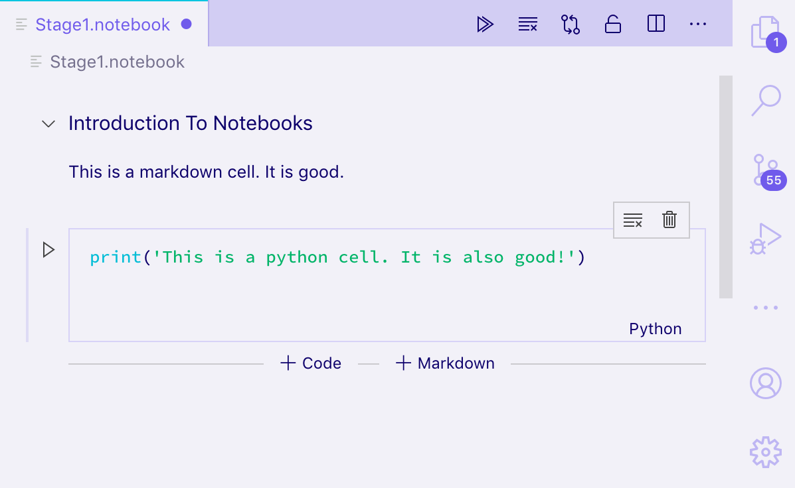
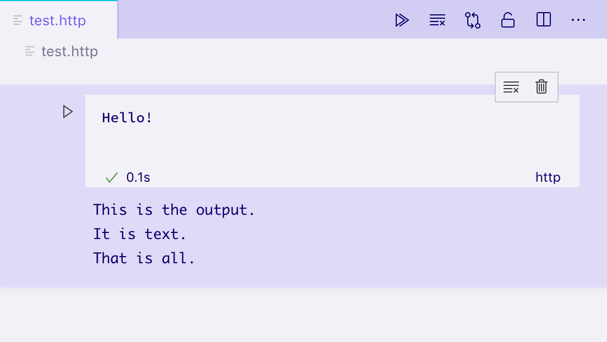

# 笔记本 API

[原文链接，戳我前往](https://code.visualstudio.com/api/extension-guides/notebook)

更新版本：截至2021-09-03

------

翻译 by [赫雯勒莉特翡翠](https://github.com/HeveraletLaidCenx)

## 术语~的对照表

|中文（常用英文表述）|英文|
|----|----|
|单元|cell|
|推送|pushing|
|扩展的订阅|extension subscriptions|
|交互式解释器（REPL）|Read-Eval-Print-Loop|
|媒体类型（MIME类型）|Media types|
|【为 **VS Code** 提供支持的内置编辑器】|Monaco editor|
|样板文件|boilerplate|

表中部分：

* 在中文表述中常直接用英文替代的
* 认为直译并不合适的

在中文之后的括号中说明了直接使用对应的英文。

------

## 概述

笔记本API 让 **Visual Studio Code** 扩展能把文件作为 笔记本 打开，执行其中的代码单元，以丰富的、可交互的格式渲染 笔记本 的输出。

你可能了解比如 Jupyter Notebook 或者 Google Colab 这样的流行的 笔记本界面 ，而 笔记本API 可以在 **Visual Studio Code** 中做到类似的事情。

## 笔记本 的构成

笔记本 由 一系列 单元 和它们的输出构成。

单元可以是 **Markdown 单元** 也可以是 **代码单元** ，由 **VS Code** 的核心进行渲染。

输出可以是很多种格式。有些输出格式由 **VS Code** 的核心进行渲染，比如纯文本、JSON、图像 和 HTML；而其他的，比如一些某些 App 专有的，或者互动式的程序，则是由扩展来进行渲染的。

笔记本 中的 单元 是依靠 `NotebookSerializer`（笔记本序列化器） 来进行对文件系统的读写的，它会处理从文件系统读取到的数据，并把它转化成一个对 单元 的描述，也会把对 笔记本 进行的修改保存回文件系统。而 笔记本 中的 **代码单元** 可以被 `NotebookController`（笔记本控制器）执行，它会获取单元中的内容，根据内容来产生 零个 ~ 多个 输出，输出可以是纯文本、格式化的文档、互动式的程序等。App 专有的输出格式 和 互动式的程序 ，是由 `NotebookRenderer`（笔记本渲染器） 进行渲染的。

用一张图表现以上这些逻辑关系的话，是这样：


## NotebookSerializer（笔记本序列化器）

[NotebookSerializer（笔记本序列化器） 的 API 参考](https://github.com/microsoft/vscode/blob/e1a8566a298dcced016d8e16db95c33c270274b4/src/vs/vscode.d.ts#L11865-L11884)

`NotebookSerializer`（笔记本序列化器） 用于实现 笔记本的序列化字节 和 `NotebookData`（笔记本数据） 之间的转换。 `NotebookData`（笔记本数据） 是含 Markdown 单元 和 代码单元 的列表。

一些例子：

* [JSON 笔记本序列化器](https://github.com/microsoft/notebook-extension-samples/tree/main/notebook-serializer)：一个简单的 笔记本 示例，获取 JSON 输入 ，并在一个自定义的 `NotebookRenderer`（笔记本渲染器） 中输出处理后的 JSON 。
* [Markdown 笔记本序列化器](https://github.com/microsoft/vscode-markdown-notebook)：将 Markdown 文件 作为 笔记本 来 打开 和 编辑。

### 例子

在这个例子中，我们将建立一个简化的 笔记本提供程序扩展，它可以查看 [以 ".notebook" 为文件扩展名的 Jupyter 笔记本格式](https://nbformat.readthedocs.io/en/latest/format_description.html) 的文件。

笔记本序列化器在 `package.json` 文件中的 `contributes.notebooks`（建立作用点.笔记本） 节中进行声明：

```json
{
    ...
    "activationEvents": ["onNotebook:my-notebook-provider"],
    "contributes": {
        ...
        "notebooks": [
            {
                "id": "my-notebook",
                "type": "my-notebook",
                "displayName": "My Notebook",
                "selector": [
                    {
                        "filenamePattern": "*.notebook"
                    }
                ]
            }
        ]
    }
}
```

然后在扩展的激活事件中注册 笔记本序列化器：

```typescript
import * as vscode from 'vscode';

export function activate(context: vscode.ExtensionContext) {
  context.subscriptions.push(
    vscode.workspace.registerNotebookSerializer('my-notebook', new SampleSerializer())
  );
}

interface RawNotebookCell {
  language: string;
  value: string;
  kind: vscode.NotebookCellKind;
}

class SampleSerializer implements vscode.NotebookSerializer {
  async deserializeNotebook(
    content: Uint8Array,
    _token: vscode.CancellationToken
  ): Promise<vscode.NotebookData> {
    var contents = new TextDecoder().decode(content);

    let raw: RawNotebookCell[];
    try {
      raw = <RawNotebookCell[]>JSON.parse(contents);
    } catch {
      raw = [];
    }

    const cells = raw.map(
      item => new vscode.NotebookCellData(item.kind, item.value, item.language)
    );

    return new vscode.NotebookData(cells);
  }

  async serializeNotebook(
    data: vscode.NotebookData,
    _token: vscode.CancellationToken
  ): Promise<Uint8Array> {
    let contents: RawNotebookCell[] = [];

    for (const cell of data.cells) {
      contents.push({
        kind: cell.kind,
        language: cell.languageId,
        value: cell.value
      });
    }

    return new TextEncoder().encode(stringify(contents));
  }
}
```

现在让我们来试试运行你的扩展，并打开一个 文件扩展名为 `.notebook` 的 Jupyter Notebook 文件：



现在你应该可以正常打开 Jupyter Notebook 文件、查看其中的各种格式（比如 纯文本、渲染后的 Markdown ）的 单元 ，并且对 单元 进行编辑啦！

然而，现在的输出并不会被保存到文件系统中，要想保存输出的话，你还需要再用 笔记本序列化器 对 单元 的 `NotebookData`（笔记本数据） 进行 序列化 和 反序列化。

而如果想运行 单元 ，你还需要实现一个 `NotebookController`（笔记本控制器）。

## NotebookController（笔记本控制器）

[NotebookController（笔记本控制器） 的 API 参考](https://github.com/microsoft/vscode/blob/e1a8566a298dcced016d8e16db95c33c270274b4/src/vs/vscode.d.ts#L11941)

`NotebookController`（笔记本控制器） 负责获取 **代码单元** 中的内容，并且运行其中的代码，代码运行可能会有 零个 ~ 多个输出。

笔记本控制器 和：

* 笔记本序列化器
* 一个在 笔记本控制器 创建时，通过设置 `NotebookController#notebookType`（笔记本控制器#笔记本类型） 属性 来定义的 笔记本类型

直接相关。然后在扩展激活时，笔记本控制器 会被推送到 扩展的订阅 上，来实现全局范围的注册。

```typescript
export function activate(context: vscode.ExtensionContext) {
  context.subscriptions.push(new Controller());
}

class Controller {
  readonly controllerId = 'my-notebook-controller-id';
  readonly notebookType = 'my-notebook';
  readonly label = 'My Notebook';
  readonly supportedLanguages = ['python'];

  private readonly _controller: vscode.NotebookController;
  private _executionOrder = 0;

  constructor() {
    this._controller = vscode.notebooks.createNotebookController(
      this.controllerId,
      this.notebookType,
      this.label
    );

    this._controller.supportedLanguages = this.supportedLanguages;
    this._controller.supportsExecutionOrder = true;
    this._controller.executeHandler = this._execute.bind(this);
  }

  private _execute(
    cells: vscode.NotebookCell[],
    _notebook: vscode.NotebookDocument,
    _controller: vscode.NotebookController
  ): void {
    for (let cell of cells) {
      this._doExecution(cell);
    }
  }

  private async _doExecution(cell: vscode.NotebookCell): Promise<void> {
    const execution = this._controller.createNotebookCellExecution(cell);
    execution.executionOrder = ++this._executionOrder;
    execution.start(Date.now()); // 跟踪执行 单元 消耗的时间

    /* 在这里放需要执行的内容，现在暂时没有放 */

    execution.replaceOutput([
      new vscode.NotebookCellOutput([
        vscode.NotebookCellOutputItem.text('Dummy output text!')
      ])
    ]);
    execution.end(true, Date.now());
  }
}
```

一些例子：

* [GitHub Issue 笔记本](https://github.com/microsoft/vscode-github-issue-notebooks/blob/93359d842cd01dfaef0a78b620c5a3b4cf5c2e38/src/extension/notebookProvider.ts#L29)：一个用来执行对 GitHub 的 Issue 进行查询的 笔记本控制器。
* [REST Book](https://github.com/tanhakabir/rest-book/blob/main/src/extension/notebookKernel.ts)：一个用来运行 REST 查询 的 笔记本控制器。
* [Regexper 笔记本](https://github.com/jrieken/vscode-regex-notebook/blob/master/src/extension/extension.ts#L56)：一个用来对正则表达式进行可视化的 笔记本控制器。

## 输出类型

输出必须是以下三种格式之一：

* 文本输出
* 错误输出
* 富文本输出

内核 可能会给 对某个单元的单次执行 提供 多个输出，这种情况时，它们将被显示成一个列表。

简单的输出格式：文本输出、错误输出，和富文本输出的 “简单” 变体（HTML, Markdown, JSON 等） 是由 **VS Code** 核心 进行渲染的。

而某些 App 特定的富文本输出格式，则是由 [NotebookRenderer（笔记本渲染器）](https://code.visualstudio.com/api/extension-guides/notebook#notebook-renderer) 来渲染的。扩展也可以选择自己渲染一些 “简单” 的富文本输出，比如给 Markdown输出 添加对 LaTeX 的支持。


### 文本输出

文本输出 是最简单的输出格式，如果你熟悉一些交互式解释器（REPL）的话，二者的工作方式很像。文本输出 仅仅由一个 `text`（文本） 域构成，这个 文本域 会在 单元 的输出元素中被渲染成纯文本：

```typescript
vscode.NotebookCellOutputItem.text('This is the output...');
```



### 错误输出

错误输出 有助于以一种一致的、可理解的方式来显示 runtime 错误。错误输出 支持标准 `Error`（错误） 对象。

```typescript
try {
  /* 一些代码内容 */
} catch (error) {
  vscode.NotebookCellOutputItem.error(error);
}
```


上图是一个输出了错误的 单元 ，显示了错误名称和消息，并用洋红色标出了堆栈跟踪

### 富文本输出

富文本输出是 单元 输出显示的最高级的形式，允许以 媒体类型 为关键词，将输出数据展示为不同的形式。比如，如果一个 单元 的输出是表示一个 GitHub 的 Issue，那么内核可能会输出一个 在其 `data`（数据） 域 有几条属性的富文本输出：

* `text/html`（文本/HTML） 域 —— 包含对 要表达的 Issue 的 格式化的视图。
* `application/json`（App/JSON） 域 —— 包括一个可供机器读取的视图
* `application/github-issue` 域 —— `NotebookRenderer`（笔记本渲染器） 可以用来创建一个对于 要表达的 Issue 的 完全可交互的视图

这种情况下， `text/html` 和 `application/json` 视图会由  VS Code 原生核心进行渲染，但是对于 `application/github-issue` 视图，如果没有给对应的 媒体类型 注册 `NotebookRenderer`（笔记本渲染器） ，则会显示一条错误信息。

```typescript
execution.replaceOutput([new vscode.NotebookCellOutput([
                            vscode.NotebookCellOutputItem.text('<b>Hello</b> World', 'text/html'),
                            vscode.NotebookCellOutputItem.json({ hello: 'world' }),
                            vscode.NotebookCellOutputItem.json({ custom-data-for-custom-renderer: 'data' }, 'application/custom'),
                        ])]);
```


上图展示了单元的富文本输出，在格式化的 HTML、JSON 编辑器，和一个显示没有笔记本渲染器的错误信息（application/hello-world）之间切换。

默认情况下， **VS Code** 可以渲染以下的媒体类型：

* application/javascript（App/JS）
* text/html（文本/HTML）
* image/svg+xml（图像/SVG+XML）
* text/markdown（文本/Markdown）
* image/png（图像/PNG）
* image/jpeg（图像/JPEG）
* text/plain（文本/纯文本）

而 **VS Code** 会将以下媒体类型渲染成在内置编辑器中的代码：

* application/json（App/JSON）
* text/x-javascript（文本/实验性JS）
* text/x-html（文本/实验性HTML）
* text/x-rust（文本/实验性Rust）
* ... text/x-LANGUAGE_ID（文本/实验性语言ID） 此处的 语言ID 可以是任何其他的内置的或者安装了的语言

下面这个笔记本就用了内置的 Monaco 编辑器来显示一些 Rust 代码：


如果要渲染一种 非以上形式的 媒体类型，则必须要给 `NotebookRenderer`（笔记本渲染器） 注册那种 媒体类型。

## NotebookRenderer（笔记本渲染器）

笔记本渲染器 负责获取特定 媒体类型 的输出数据，然后提供对数据的渲染后视图。被输出 单元 共享的 笔记本渲染器 可以维持这些 单元 之间的全局状态。渲染视图的复杂性可以覆盖从 简单的静态HTML 到 动态的完全可交互的程序。本节，我们将探索用来渲染表现一个 GitHub Issue 的各种技术。

你可以用 **Yeoman** 和 **VS Code** 扩展生成器 的 样板文件 来快速开始，安装请参见前面的章节。

在终端中输入 `yo code` 并运行，等待助手显示选项时，选择 `New Notebook Renderer (TypeScript)`（新的笔记本渲染器（Typescript））。

### 一个简单的、非交互式的渲染器

在扩展的 `package.json` 中的 `contributes.notebookRenderer` （建立作用点.笔记本渲染器）中建立作用点，以此来声明渲染器支持的 媒体类型。这个渲染会处理 `ms-vscode.github-issue-notebook/github-issue` 格式的输入，我们假设有已经安装的 笔记本控制器 能提供该格式。

文件内容如下：

```json
{
  "activationEvents": ["...."],
  "contributes": {
    ...
    "notebookRenderer": [
      {
        "id": "github-issue-renderer",
        "displayName": "GitHub Issue Renderer",
        "entrypoint": "./out/renderer.js",
        "mimeTypes": [
          "ms-vscode.github-issue-notebook/github-issue"
        ]
      }
    ]
  }
}
```

输出的渲染始终处于一个独立于其他 **VS Code** UI 而存在的 `iframe` 中，以此来保证它们不会意外地干扰 **VS Code**、造成性能下降而导致缓慢。作用点 指向一个 `entrypoint`（入口点） 脚本，它在输出被渲染之前加载到笔记本的 `iframe` 中。你的 `entrypoint`（入口点） 脚本 必须是一个单个的文件，你可以自己编写它，也可以借助 Webpack、Rollup、Parcel 等打包程序来创建它。

当它被加载后，在 **VS Code** 准备好渲染你的 笔记本渲染器 时，你的 `entrypoint`（入口点） 脚本 会从 `vscode-notebook-renderer`（vscode-笔记本-渲染器） 导出 `ActivationFunction`（激活函数） 来渲染你的 UI。比如，下边这段代码就会将你所有的 GitHub Issue 数据 作为 JSON 放入 单元 的输出中：

```typescript
import type { ActivationFunction } from 'vscode-notebook-renderer';

export const activate: ActivationFunction = context => ({
  renderOutputItem(data, element) {
    element.innerText = JSON.stringify(data.json());
  }
});
```

你可以在 [这里](https://github.com/DefinitelyTyped/DefinitelyTyped/blob/master/types/vscode-notebook-renderer/index.d.ts) 参考完整的 API 定义。如果你使用的语言是 TypeScript ，你可以安装 `@types/vscode-notebook-renderer` ，然后在你的 `tsconfig.json` 文件中，添加 `vscode-notebook-renderer`（vscode-笔记本-渲染器） 到 `types`（类型） 数组 来让这些类型在你的代码中可用。

要创建更丰富的内容的话，你可以手动创建 DOM 元素，或者用 Preact 等框架，然后将它渲染到输出元素中，比如：

```typescript
import type { ActivationFunction } from 'vscode-notebook-renderer';
import { h, render } from 'preact';

const Issue: FunctionComponent<{ issue: GithubIssue }> = ({ issue }) => (
  <div key={issue.number}>
    <h2>
      {issue.title}
      (<a href={`https://github.com/${issue.repo}/issues/${issue.number}`}>#{issue.number}</a>)
    </h2>
    
    <i>@{issue.user.login}</i> Opened: <div style="margin-top: 10px">{issue.body}</div>
  </div>
);

const GithubIssues: FunctionComponent<{ issues: GithubIssue[]; }> = ({ issues }) => (
  <div>{issues.map(issue => <Issue key={issue.number} issue={issue} />)}</div>
);

export const activate: ActivationFunction = (context) => ({
    renderOutputItem(data, element) {
        render(<GithubIssues issues={data.json()} />, element);
    }
});
```

以 `ms-vscode.github-issue-notebook/github-issue` 数据域来在 输出单元 上运行这个 笔记本渲染器，会显示成下面这样的静态 HTML 视图：


如果你有容器外的元素，或者其他异步的进程，可以使用 `disposeOutputItem`（处理输出项目） 来销毁它们。这个事件会在输出被清除的时候、单元 被删除的时候、现有的单元要渲染新的输出的时候 触发。比如：

```typescript
const intervals = new Map();

export const activate: ActivationFunction = (context) => ({
    renderOutputItem(data, element) {
        render(<GithubIssues issues={data.json()} />, element);

        intervals.set(data.mime, setInterval(() => {
            if(element.querySelector('h2')) {
                element.querySelector('h2')!.style.color = `hsl(${Math.random() * 360}, 100%, 50%)`;
            }
        }, 1000));
    },
    disposeOutputItem(id) {
        clearInterval(intervals.get(id));
        intervals.delete(id);
    }
});
```

请牢记，一个 笔记本 中的所有输出都是： 在同一个 iframe 中，以不同元素进行渲染的。如果你要使用类似 `document.querySelector`（文档.查询选择器）之类的方法，请确保你把它的范围限制在了你想要查找的特定输出上，以此来避免和其他输出的冲突。在本例中，我们使用了 `element.querySelector`（元素.查询选择器） 来避免这个问题。

### 交互式笔记本（和 笔记本控制器 通信）

想一想，我们现在想在渲染的输出里添加一个 点击按钮后查看 Issue 的评论的功能。

假设 笔记本控制器 可以在 `ms-vscode.github-issue-notebook/github-issue-with-comments` 媒体类型中提供 Issue 和它的评论 的数据，我们可能会尝试预先检索所有评论，用下面的方式实现：

```typescript
const Issue: FunctionComponent<{ issue: GithubIssueWithComments }> = ({ issue }) => {
  const [showComments, setShowComments] = useState(false);

  return (
    <div key={issue.number}>
      <h2>
        {issue.title}
        (<a href={`https://github.com/${issue.repo}/issues/${issue.number}`}>#{issue.number}</a>)
      </h2>
      
      <i>@{issue.user.login}</i> Opened: <div style="margin-top: 10px">{issue.body}</div>
      <button onClick={() => setShowComments(true)}>Show Comments</button>
      {showComments && issue.comments.map(comment => <div>{comment.text}</div>)}
    </div>
  );
};
```

上面这种写法应该立刻引起你的警觉：一方面，我们在试图加载所有 Issue 的 所有评论，即使在我们点击按钮之前。另外，我们还要求 笔记本控制器 支持一种完全不同的 媒体类型，尽管我们只是想稍微多显示一点数据。

相反，笔记本控制器 可以通过 包含一个预加载的脚本来给 笔记本渲染器提供格外功能，**VS Code** 也将在 iframe 中加载它。这个脚本可以访问用于和 笔记本控制器 进行通信的 全局函数 `postKernelMessage`（发送内核消息） 和 `onDidReceiveKernelMessage`（当收到内核消息时触发） 。


比如，你可能会编辑你的 笔记本控制器 的 `rendererScripts`（笔记本渲染器脚本） 来引用一个新文件，让你可以在其中创建一个到扩展宿主的连接，然后暴露一个全局的通信脚本来给 笔记本渲染器 使用。

在你的笔记本控制器中：

```typescript
class Controller {
  // ...

  readonly rendererScriptId = 'my-renderer-script';

  constructor() {
    // ...

    this._controller.rendererScripts.push(
      new vscode.NotebookRendererScript(
        vscode.Uri.file(/* 脚本的路径 */),
        rendererScriptId
      )
    );
  }
}
```

在你的 `package.json` 文件中，将你的脚本指定为 笔记本渲染器 的依赖：

```json
{
  "activationEvents": ["...."],
  "contributes": {
    ...
    "notebookRenderer": [
      {
        "id": "github-issue-renderer",
        "displayName": "GitHub Issue Renderer",
        "entrypoint": "./out/renderer.js",
        "mimeTypes": [...],
        "dependencies": [
            "my-renderer-script"
        ]
      }
    ]
  }
}
```

在你的脚本文件中，你可以声明用来和 笔记本控制器 通信的 函数：

```typescript
import 'vscode-notebook-renderer/preload';

globalThis.githubIssueCommentProvider = {
  loadComments(issueId: string, callback: (comments: GithubComment[]) => void) {
    postKernelMessage({ command: 'comments', issueId });

    onDidReceiveKernelMessage(event => {
      if (event.data.type === 'comments' && event.data.issueId === issueId) {
        callback(event.data.comments);
      }
    });
  }
};
```

然后你就可以在 笔记本渲染器 中使用它了。你应该确保检查了 全局暴露的笔记本控制器的笔记本渲染器脚本 是可用的，因为其他开发人员可能会在没有实现 `githubIssueCommentProvider`（Github Issue 评论提供程序） 的笔记本中创建 Github 的 Issue 输出。这种情况下，我们仅仅在全局可用的时候才显示 **Load Comments（加载评论）** 按钮：

```typescript
const canLoadComments = globalThis.githubIssueCommentProvider !== undefined;
const Issue: FunctionComponent<{ issue: GithubIssue }> = ({ issue }) => {
  const [comments, setComments] = useState([]);
  const loadComments = () =>
    globalThis.githubIssueCommentProvider.loadComments(issue.id, setComments);

  return (
    <div key={issue.number}>
      <h2>
        {issue.title}
        (<a href={`https://github.com/${issue.repo}/issues/${issue.number}`}>#{issue.number}</a>)
      </h2>
      
      <i>@{issue.user.login}</i> Opened: <div style="margin-top: 10px">{issue.body}</div>
      {canLoadComments && <button onClick={loadComments}>Load Comments</button>}
      {comments.map(comment => <div>{comment.text}</div>)}
    </div>
  );
};
```

最后，我们来设置到 笔记本控制器 的通信。当 笔记本渲染器 使用全局函数 `postKernelMessage`（发送内核消息） 来发送消息时，会调用 `NotebookController.onDidReceiveMessage`（笔记本控制器.当收到消息时触发） 方法。要实现这个方法，把它附加到 `onDidReceiveMessage`（当收到消息时触发） 来对消息进行监听：

```typescript
class Controller {
  // ...

  constructor() {
    // ...

    this._controller.onDidReceiveMessage(event => {
      if (event.message.command === 'comments') {
        _getCommentsForIssue(event.message.issueId).then(
          comments =>
            this._controller.postMessage({
              type: 'comments',
              issueId: event.message.issueId,
              comments
            }),
          event.editor
        );
      }
    });
  }
}
```

### 交互式笔记本（和 扩展宿主 通信）

想一想，现在我们想添加一个 在独立的编辑器中打开输出项目 的功能。

要实现这个功能， 笔记本渲染器 需要能向 扩展宿主 发送消息，然后通过它来启动编辑器。

这在 笔记本渲染器 和 笔记本控制器 是两个独立的扩展的情况下很有用。

在 笔记本渲染器 的 `package.json` 文件中，将 `requiresMessaging`（请求消息） 的值指定为 `optional`（可选的） ，这会让你的 笔记本渲染器 在无论是否有对 扩展宿主 的访问权限的情况下都可以工作。

```json
{
  "activationEvents": ["...."],
  "contributes": {
    ...
    "notebookRenderer": [
      {
        "id": "output-editor-renderer",
        "displayName": "Output Editor Renderer",
        "entrypoint": "./out/renderer.js",
        "mimeTypes": [...],
        "requiresMessaging": "optional"
      }
    ]
  }
}
```

`requiresMessaging`（请求消息） 可能的取值包括：

|取值|翻译|含义|
|----|----|----|
|`always`|总是|需要消息。只有在 笔记本渲染器 是一个 可以在扩展宿主中运行的扩展的一部分 时才能使用 该笔记本渲染器|
|`optional`|可选的|当 扩展宿主 可用时，笔记本渲染器 能更好地进行消息传递，但它并不强制要求 安装 和 运行 该笔记本渲染器|
|`never`|从不|笔记本渲染器 不要求 消息传递。|

请首先考虑后两个选项，因为它们能保证 扩展 能被移植到 扩展宿主 可能不一定可用的其他环境中。

可以用以下方式来让 笔记本渲染器脚本 设置通信功能：

```typescript
import { ActivationFunction } from 'vscode-notebook-renderer';

export const activate: ActivationFunction = (context) => ({
  renderOutputItem(data, element) {
    // 用输出的 `data`（数据） 来渲染 输出
    ....
    // 消息传递的可用性取决于 `requiresMessaging`（请求消息） 的取值。
    if (!context.postMessage){
      return;
    }

    // 当用户在 输出 中执行某些动作时（比如按了一个按钮），
    // 向 扩展宿主 发送一条消息来请求启动 编辑器。
    document.querySelector('#openEditor').addEventListener('click', () => {
      context.postMessage({
        request: 'showEditor',
        data: '<custom data>'
      })
    });
  }
});
```

然后你就可以在 扩展宿主 中处理这条消息了：

```typescript
const messageChannel = notebooks.createRendererMessaging('output-editor-renderer');
messageChannel.onDidReceiveMessage(e => {
  if (e.message.request === 'showEditor') {
    // 给 ID 为 `e.message.data` 的 输出 启动编辑器
  }
});
```

注意：

* 为了确保你的扩展在消息传递之前在扩展主机中运行，请在你的 `activationEvents`（激活事件） 中添加 `onRenderer:<your renderer id>`（当渲染器:<你的渲染器ID>时触发） ，并在你的扩展的 `activate`（激活） 函数中设置通信。
* 并不能保证所有由 笔记本渲染器扩展 发送到 扩展宿主 的消息都能传达。用户可能会在来自 笔记本渲染器 的消息被传达之前关闭 笔记本。

## 添加对 Debug 的支持

对于一些 笔记本控制器，比如那些实现编程语言的，可能需要允许对 单元 内容的执行进行 Debug，要添加对 Debug 的支持的话，笔记本内核可以实现一个 [Debug 适配器](https://code.visualstudio.com/api/extension-guides/debugger-extension)，或者直接实现 [debug adapter protocol（Debug 适配器协议）](https://microsoft.github.io/debug-adapter-protocol/) (DAP)，再或者通过 委派并将协议转换为一个现有的 笔记本调试器（比如在 'vscode-simple-jupyter-notebook' 例子里实现的那样）。更简单的方法试用一个现有的未进行修改的 Debug 扩展，然后根据笔记本的需要，看情况转换 DAP （就像在 'vscode-nodebook' 中的那样）。

上面提到的例子：

* [vscode-nodebook](https://github.com/microsoft/vscode-nodebook)：Node.js 笔记本，由 **VS Code** 的内置 JavaScript 调试器提供对 Debug 和一些简单的协议转换的支持。
* [vscode-simple-jupyter-notebook](https://github.com/microsoft/vscode-simple-jupyter-notebook): Jupyter 笔记本，由现有的 Xeus 调试器 提供对 Debug 的支持。
