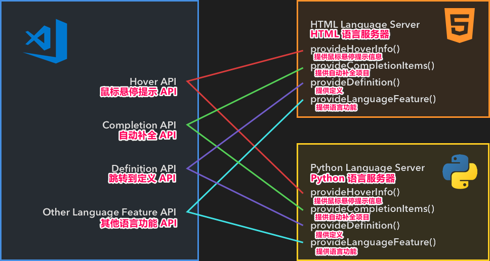

# Language Extensions Overview

[原文链接，戳我前往](https://code.visualstudio.com/api/language-extensions/overview)

------

翻译 by [赫雯勒莉特翡翠](https://github.com/HeveraletLaidCenx)

## 术语~的对照表

|中文（常用英文表述）|英文|
|----|----|
|声明式的|declarative|
|嵌入式的|embedded|

表中部分：

* 在中文表述中常直接用英文替代的
* 认为直译并不合适的

在中文之后的括号中说明了直接使用对应的英文。

------

## 概述

**Visual Studio Code** 通过 语言扩展 来为不同的编程语言提供 智能编辑功能。**VS Code** 并不提供内置的语言支持，但是提供了一组支持丰富的语言功能的 API 。比如，他有一个捆绑的 [HTML](https://github.com/microsoft/vscode/tree/main/extensions/html) 扩展，让 **VS Code** 能为 HTML 文件显示 语法高亮。相似的，当你输入 `console.` 之后，智能感知提示会显示 `log` ，这是 [Typescript 语言功能](https://github.com/microsoft/vscode/tree/main/extensions/typescript-language-features) 扩展在起作用。

语言功能大致可以被分成两类：

## 声明式语言功能

声明式语言功能在 配置文件 中定义。声明式语言功能 的例子包括 **VS Code** 捆绑的 [html](https://github.com/microsoft/vscode/tree/main/extensions/html)、[css](https://github.com/microsoft/vscode/tree/main/extensions/css) 和 [typescript-basic](https://github.com/microsoft/vscode/tree/main/extensions/typescript-basics) 扩展，它们会提供的功能包含在下表中：

|功能英文名|翻译|
|----|----|
|Syntax highlighting|语法高亮|
|Snippet completion|代码片段自动生成|
|Bracket matching|括号匹配|
|Bracket autoclosing|括号自动关闭|
|Bracket autosurrounding|括号自动环绕内容|
|Comment toggling|注释切换|
|Auto indentation|自动缩进|
|Folding (by markers)|折叠代码区域（通过标记）|

对于提供 声明式语法功能 的扩展，我们有三个指导：

* [语法高亮 指导](https://code.visualstudio.com/api/language-extensions/syntax-highlight-guide)：**VS Code** 对于语法高亮使用 TextMate 语法。这篇指导将带你编写一个简单的 TextMate 语法，然后把它转换成一个 **VS Code** 扩展。
* [代码片段自动生成 指导](https://code.visualstudio.com/api/language-extensions/snippet-guide)：这篇指导解释了如何把一套代码片段打包到扩展中。
* [语言配置 指导](https://code.visualstudio.com/api/language-extensions/language-configuration-guide)：**VS Code** 允许扩展为任何编程语言定义一个 **language configuration（语言配置）** 。这个文件控制基础的编辑功能，比如 注释切换、括号匹配/自动环绕内容 以及 代码区域折叠（旧版）。

## 编程语言功能

编程语言功能包括 自动补全、错误检查，以及 跳转到定义。这些功能通常由一个 语言服务器 来提供支持，语言服务器 是一个会分析你的项目来提供动态功能的程序。其中一个例子是 **VS Code** 捆绑的 [TypeScript 语言功能](https://github.com/microsoft/vscode/tree/main/extensions/typescript-language-features) 扩展。它利用 [TypeScript 语言服务](https://github.com/microsoft/TypeScript/wiki/Using-the-Language-Service-API) 来提供编程语言功能，比如：

|功能英文名|翻译|
|----|----|
|Hover information ([`vscode.languages.registerHoverProvider`](https://code.visualstudio.com/api/references/vscode-api#languages.registerHoverProvider))|鼠标悬停提示（vscode.语言.注册鼠标悬停提示提供程序）|
|Auto completion ([`vscode.languages.registerCompletionItemProvider`](https://code.visualstudio.com/api/references/vscode-api#languages.registerCompletionItemProvider))|自动补全（vscode.语言.注册自动补全项目提供程序）|
|Jump to definition ([`vscode.languages.registerDefinitionProvider`](https://code.visualstudio.com/api/references/vscode-api#languages.registerDefinitionProvider))|跳转到定义（vscode.语言.注册定义提供程序）|
|Error checking|错误检查|
|Formatting|格式化代码|
|Refactoring|重构代码|
|Folding|折叠代码区域|

完整的功能列表请查看 [编程语言功能](https://code.visualstudio.com/api/language-extensions/programmatic-language-features) 。

## 语言服务器协议

通过对 语言服务器（一个静态代码分析工具） 和 语言客户端（通常是一个源代码编辑器）之间的通信进行标准化， [语言服务器协议](https://microsoft.github.io/language-server-protocol/) 让扩展的作者可以仅编写一个 代码分析程序，然后把它重用到多个编辑器中。

在 [编程语言功能](https://code.visualstudio.com/api/language-extensions/programmatic-language-features) 列表中，你可以找到所有的 **VS Code** 语言功能，以及它们如何映射到 [语言服务器协议说明](https://microsoft.github.io/language-server-protocol/specification) 。

我们提供了一个 深入的指导，来解释如何在 **VS Code** 中实现一个 语言服务器：

* [语言服务器 扩展指导](https://code.visualstudio.com/api/language-extensions/language-server-extension-guide)

## 特殊情况

### 多-根工作区 支持

当用户打开了一个 [多-根工作区](https://code.visualstudio.com/docs/editor/multi-root-workspaces) 时，你可能需要相应地调整你的语言服务器扩展。这篇文章讨论了让 语言服务器 支持 多-根工作区的多种方法。

### 嵌入式语言

嵌入式语言 在 Web 开发 中很常见。比如， HTML 中的 CSS/JS ，以及 JavaScript/TypeScript 中的 GraphQL 。这篇文章讨论了怎样做才能把语言功能应用到嵌入式语言。
