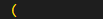
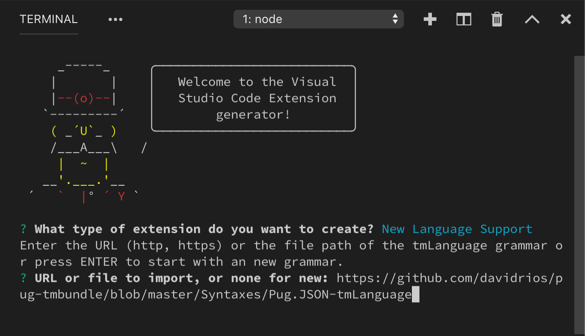

# 语法高亮指导

[原文链接，戳我前往](https://code.visualstudio.com/api/language-extensions/syntax-highlight-guide)

------

翻译 by [赫雯勒莉特翡翠](https://github.com/HeveraletLaidCenx)

## 术语~的对照表

|中文（常用英文表述）|英文|
|----|----|
|标记化|tokenization|
|作用域检查器|scope inspector|
|仅开发依赖项|development only dependency|

表中部分：

* 在中文表述中常直接用英文替代的
* 认为直译并不合适的

在中文之后的括号中说明了直接使用对应的英文。

------

## 概述

语法高亮 决定了 **VS Code** 编辑器中显示的源代码的 颜色 和 样式。

它负责给类似 JavaScript 中的 `if` 或者 `for` 这样的关键词着色，而不是区分 字符串、注释，或者 变量名。

语法高亮 包含两部分：

* [标记化](#标记化)：将 文本内容 分为 标记列表。
* [主题](#主题)：使用 主题 或者 用户的设置 来把 标记 映射成特定的 颜色 和 样式。

在深入研究相关的细节之前，通过 使用 [作用域检查器](#作用域检查器) 工具来浏览源文件中出现的标记，以及它们对应哪些主题规则 来入门是个不错的选择。

要同时查看 语法 和 语义 标记的话，请在 TypeScript 文件中使用一个 内置的主题（比如 `Dark+`）。

## 标记化

所谓的 文本标记化 指的是：将文本分成小段，然后将每小段对应到相应的 标记类型 。

**VS Code** 的标记化引擎 是由 [TextMate 语法](https://macromates.com/manual/en/language_grammars) 提供支持的。TextMate 语法 是用 属性列表（XML） 或者 JSON 文件 存储的 正则表达式的 结构化集合。**VS Code** 扩展可以通过 `grammar`（语法） 作用点 来建立对应的作用点。

TextMate 标记化引擎 和 渲染器 在同一个进程中运行，并且会随着用户的输入更新标记。标记是用来实现 语法高亮 的，但是也用来把源代码分成不同的区域，比如 注释、字符串、正则表达式。

从 1.43 版本开始，**VS Code** 还允许扩展通过 [语义标记提供程序](https://code.visualstudio.com/api/references/vscode-api#DocumentSemanticTokensProvider) 来提供标记化。语义标记提供程序 通常由 语言服务器 实现，可以更深入地理解 代码文件，并可以在整个项目的环境中 解析标记。比如，它可以实现在整个项目环境中对 某个静态变量名 用 静态高亮 进行高亮显示，而不是仅仅局限在声明它的位置。

基于 语义标记 的高亮 可以看成是 基于 TextMate 的语法高亮的 升级版。

语义高亮 在 语法高亮 之上。而由于 语言服务器 可能需要一点时间来完成 加载 和 对项目的分析，所以 语义标记高亮 可能会在短暂的延迟之后才出现，

本文重点介绍基于 TextMate 的标记化。语义标记化 和 主题 的内容会在 [语义高亮指导](3-扩展API-语言扩展-语义高亮指导.md) 中进行介绍。

### TextMate 语法

**VS Code** 使用 [TextMate 语法](https://macromates.com/manual/en/language_grammars) 作为 语法标记化 的引擎。 Textmate 语法 本身只为了 TextMate 编辑器而被创造的，而由于开源社区 创建 并 维护 的大量 语言包，它也被很多其他的 编辑器 和 IDE 所采用。

TextMate 语法 依赖 [Oniguruma 正则表达式](https://macromates.com/manual/en/regular_expressions) 并且通常以 属性列表 或者 JSON 文件的形式编写。

你可以从 [这里](https://www.apeth.com/nonblog/stories/textmatebundle.html) 找到一个不错的对于 Textmate 语法的介绍，也可以通过查看现有的 TextMate 语法 来了解它们是怎么工作的。

### TextMate 标记 和 作用域

标记 是属于同一个 程序元素 的 一个或多个字符。

比如，运算符标记 `+` 和 `*` 、变量名 `myVar` ，或者 字符串 `"my string"` 。

每个 标记 都与 定义这个标记的环境的 作用域 相关联。作用域 是一个 以 `.` 分隔的标识符列表，用来指定当前 标记 所在的环境。比如 JavaScript 中的运算符 `+` ，它的 作用域 就是 `keyword.operator.arithmetic.js`（关键词.运算符.算术运算.JS）。

主题 会将 作用域 映射到 颜色 和 样式 来提供 语法高亮。TextMate 提供了一个适用于很多主题的 [通用作用域列表](https://macromates.com/manual/en/language_grammars) 。为了让你的语法能被尽可能广泛地支持，所以相比于自己定义一个新的 作用域，请试着基于这些已有的 通用作用域 来编写。

作用域 是嵌套的，这样每个 标记 也能和一系列 上层作用域 相关联。下边的例子使用 [作用域检查器](#作用域检查器) 来展示一个简单的 JavaScript 函数中的运算符 `+` 的层次结构：


上层作用域 的信息也被用于主题。当主题 以 作用域 为目标时，所有 上层作用域 的 标记 都会被对应地着色，除非 主题 对于其中的 标记 还提供了更加细化的特定的作用域。

### 建立一个 基础的语法 的 作用点

**VS Code** 支持 JSON 格式的 TextMate 语法。这些语法通过 `grammars`（语法） [作用点](https://code.visualstudio.com/api/references/contribution-points) 建立作用点。

每个 语法作用点 指定了：这种语法对应的 语言 的 ID 、语法的标记的顶级作用域名称、语法文件 的相对路径。下边这个例子展示了一个虚构的 `abc` 语言 的 语法作用点：

```json
{
  "contributes"【作用点】: {
    "languages"【语言】: [
      {
        "id"【语言ID】: "abc",
        "extensions"【语言文件扩展名】: [".abc"]
      }
    ],
    "grammars"【语法】: [
      {
        "language"【语法对哪种语言生效】: "abc",
        "scopeName"【语法的顶级作用域名称】: "source.abc",
        "path"【语法规则文件的相对路径】: "./syntaxes/abc.tmGrammar.json"
      }
    ]
  }
}
```

语法文件 本身包含一个顶级规则。这通常被分成一个 列出程序的顶级元素的 `patterns` 部分，和一个定义了每个元素的 `repository` 部分。语法中的其他规则可以通过使用 `{ "include": "#id" }` 从 `repository` 中引用元素。

例子中的 `abc` 语法，将字母 `a`、`b`、`c` 标记为了关键词，嵌套的括号标记成了表达式：

```json
{
  "scopeName"【语法的顶级作用域名称】: "source.abc",
  "patterns": [{ "include": "#expression" }],
  "repository": {
    "expression"【表达式】: {
      "patterns": [{ "include": "#letter" }, { "include": "#paren-expression" }]
    },
    "letter"【字母】: {
      "match"【匹配规则】: "a|b|c",
      "name"【作用域名称】: "keyword.letter"
    },
    "paren-expression"【括号-表达式】: {
      "begin"【起始匹配规则】: "\\(",
      "end"【结束匹配规则】: "\\)",
      "beginCaptures": {
        "0": { "name": "punctuation.paren.open" }
      },
      "endCaptures": {
        "0": { "name": "punctuation.paren.close" }
      },
      "name"【作用域名称】: "expression.group",
      "patterns": [{ "include": "#expression" }]
    }
  }
}
```

语法引擎会尝试着把这个 `expression` 规则应用到文章中的全部文本。对于一个简单的程序代码来说，比如下边这个：


示例语法会生成以下这些 作用域（范围从左到右依次扩大，也就是从最具体到最不具体）：

|代码|作用域|
|----|----|
||keyword.letter, source.abc|
||punctuation.paren.open, expression.group, source.abc|
||keyword.letter, expression.group, source.abc|
||punctuation.paren.close, expression.group, source.abc|
||source.abc|
||punctuation.paren.open, expression.group, source.abc|
||punctuation.paren.open, expression.group, expression.group, source.abc|
||keyword.letter, expression.group, expression.group, source.abc|
||expression.group, expression.group, source.abc|
||punctuation.paren.close, expression.group, expression.group, source.abc|
||punctuation.paren.close, expression.group, source.abc|
||punctuation.paren.open, expression.group, source.abc|
||keyword.letter, source.abc|

注意，没有匹配语法的任何规则的文本，比如字符串 `xyz`，是包含在当前语法的顶级作用域中的。文件最后的最后一个括号不是 `expression.group` 作用域的一部分，因为 `end` 规则没有匹配。

【译注：这里怀疑上表标注有错误？按翡翠的理解，照这个最后一句的说法，最后一个左括号的作用域，因为不匹配括号的结束规则，应该没有 `expression.group` 呀？】

### 使用嵌入式语言

如果你的语法包含了嵌入到 上层语言中的 嵌入式语言，比如 HTML 中的 CSS 块，那你可以使用 `embeddedLanguages`（嵌入式语言） 作用点来告知 **VS Code** 将 嵌入式语言 和 上层语言 分开对待。

这能确保 括号匹配、注释 以及其他基础的语言功能可以在 嵌入式语言 部分达到理想的效果。

`embeddedLanguages`（嵌入式语言） 作用点会将 嵌入式语言 中的 作用域 映射到 顶层语言 的 作用域。在下边这个例子里，所有在 `meta.embedded.block.javascript`（元数据.嵌入式.块.JavaScript） 作用域中的 标记都将被当成 JavaScript 内容对待：

```json
{
  "contributes": {
    "grammars": [
      {
        "path": "./syntaxes/abc.tmLanguage.json",
        "scopeName": "source.abc",
        "embeddedLanguages": {
          "meta.embedded.block.javascript": "javascript"
        }
      }
    ]
  }
}
```

这样一来，当你试图在被标记为 `meta.embedded.block.javascript`（元数据.嵌入式.块.JavaScript） 的标记中 进行注释 或者 想要触发代码片段自动生成 的时候，就可以得到正确的 JavaScript 风格的 `//` 注释 以及 对应的 代码片段啦~

### 开发一个新的语法扩展

要想快速生成一个新的 语法扩展 的话，可以使用 [**VS Code** 的 Yeoman 模板](../2-入门/1-扩展API-入门-你的第一个扩展.md) ，在终端中运行 `yo code` 然后选择 `New Language Support`（新语言支持） 选项：


Yeoman 会引导你通过回答一些基本的问题，来搭建这个新扩展。大概流程如下：

```powershell
# 【运行生成器】
yo code

# 【↓ 以下为生成器的输出 ↓】
# ? What type of extension do you want to create?【你想创建什么类型的扩展？】
    New Language Support

# ? URL or file to import, or none for new:【输入要导入的 URL 或 文件，或者留空来创建一个新扩展：】
【输入 tmLanguage 语法的 URL （http、https） 或者 文件路径 ，或者留空直接按 Enter 来创建一个新的语法，本次直接留空】
# ? What's the name of your extension?【你的扩展的名字是什么？】
    Abc Lang
# ? What's the identifier of your extension?【你的扩展的 ID 是什么？】
【直接按 Enter，默认会根据你的扩展名称自动生成 ID】
    abc-lang
# ? What's the description of your extension?【你的扩展的描述是什么？】
【输入对你的扩展的描述】

# ? Language id:【语言 ID：】
【ID 格式为 单个的、小写的，比如 'php'、'javascript'】
    abc
# ? Language name:【语言名称：】
【语言名称会被显示在 VS Code 编辑器的模式选择器中】
    Abc
# ? File extensions:【这种语言文件的扩展名：】
【如果语言文件有多种扩展名，用英文逗号来分隔，比如 '.ruby, .rb'】
    .abc
# ? Scope names:【语言的根作用域名城：】
【比如 'source.ruby'】
    source.abc
# ? Initialize a git repository?【是否初始化为 Git 仓库？】
    No

【这之后便会开始构建你的扩展项目，等待加载完成即可】
```

生成器会默认假设你想创建一种新的语言和语法。如果你想创建一个 已有的、**VS Code** 已知的语言的语法，只要把上边这些内容用你需要的那种语言的参数替换就可以啦，要注意的是，你需要删掉 `package.json` 中的 `languages` 作用点。

在完成上述所有问题之后，Yeoman 会创建一个新的语言扩展，文件结构如下：


#### 转换一个现有的 TextMate 语法

`yo code` 也能帮助你把一个现有的 TextMate 语法 转换成 **VS Code** 扩展。还是通过运行 `yo code` 然后选择 `New Language Support` 。当询问你是否要导入文件时，输入你想导入的 `.tmLanguage` 或者 `.json` 格式的 TextMate 语法文件的完整路径即可：



#### 用 YAML 来编写语法

当语法变得越来越复杂的时候，以 JSON 文件来编写它可能会变得难以 理解 和 维护。如果你发现你在 写超复杂的正则表达式 或者 需要给语法加注释来解释的话，不妨考虑换用 YAML 格式来定义语法。

YAML 语法 和 JSON 语法 具有完全相同的结构，但是拥有 语法更简洁、支持 多行字符串 与 多行注释 功能 等优点。


然而，**VS Code** 仅支持加载 JSON 语法，所以 YAML 格式的语法必须得先转换成 JSON 格式。 [js-yaml 包](https://www.npmjs.com/package/js-yaml) 和命令行工具可以轻松做到这点。

```powershell
# 把 js-yaml 作为 你的扩展 中的 仅开发依赖项
$ npm install js-yaml --save-dev

# 使用命令行工具来把 yaml 语法 转成 json 语法
$ npx js-yaml syntaxes/abc.tmLanguage.yaml > syntaxes/abc.tmLanguage.json
```

### 注入语法

注入语法 让你可以 扩展 一种现有的语法。它是注入到一种现有的语法中的 特定作用域 中的 常规的 TextMate 语法。以下是 注入语法 的应用例子：

* 在注释中实现对关键词（比如 `TODO` ）的高亮。
* 给一种现有的语法添加更多的特定的作用域。
* 给 Markdown 中的代码块 添加一种新语言的高亮规则。

#### 创建一个基础的注入语法

注入语法 和 常规语法 一样，也是在 `package.json` 中建立作用点。然而，和指定一种 `language`（语言）不同，注入语法使用 `injectTo`（注入到...） 来指定 注入语法 要注入到的一系列 目标语言的作用域。

现在这个例子中，我们将创建一个简单的注入语法，实现在 JavaScript 的注释中 将 `TODO` 作为关键词进行高亮。要想把我们的注入语法应用到 JavaScript 文件中，我们需要在 `injectTo` 中，以 `source.js` 指明 目标的语言作用域：

```json
{
  "contributes": {
    "grammars": [
      {
        "path": "./syntaxes/injection.json",
        "scopeName": "todo-comment.injection",
        "injectTo": ["source.js"]
      }
    ]
  }
}
```

除了 顶级入口 `injectionSelector`（注入选择器） 之外，语法本身就是个标准的 TextMate 语法。 `injectionSelector`（注入选择器） 是一个用来指定 注入语法应该被应用到的作用域 的 作用与选择器。在我们的例子中，我们想在所有 `//` 注释中都对 `TODO` 这个词进行高亮。这时，我们用 [作用域检查器](#作用域检查器)，发现 JavaScript 中的双斜线注释的作用域是 `comment.line.double-slash`（注释.单行.双斜线），所以我们的注入选择器则是 `L:comment.line.double-slash` ，设置如下：

```json
{
  "scopeName": "todo-comment.injection",
  "injectionSelector": "L:comment.line.double-slash",
  "patterns": [
    {
      "include": "#todo-keyword"
    }
  ],
  "repository": {
    "todo-keyword": {
      "match": "TODO",
      "name": "keyword.todo"
    }
  }
}
```

其中， `L:` 的意思是：将注入的内容添加到现有语法规则的左侧，这基本上意味着我们的注入语法规则会在任何现有的语法规则之前生效。

#### 嵌入式语言

注入语法也能用来向它们的 上层语法 中，建立 嵌入式语言 的作用点。

和普通语法一样，注入语法也可以使用 `embeddedLanguages`（嵌入式语言） 来从 嵌入式语言 中，将作用域映射到 一个 顶级语言作用域。

比如，一个用来 在 JavaScript 字符串中实现对 SQL 查询语句的高亮 的扩展，可能会用 `embeddedLanguages`（嵌入式语言） 来确保字符串中所有被标记为 `meta.embedded.inline.sql`（元数据.嵌入式的.行内.SQL） 的标记都被当做 SQL ，像 括号匹配 和 片段选择 那样的基本语言功能一样对待。

```json
{
  "contributes": {
    "grammars": [
      {
        "path": "./syntaxes/injection.json",
        "scopeName": "sql-string.injection",
        "injectTo": ["source.js"],
        "embeddedLanguages": {
          "meta.embedded.inline.sql": "sql"
        }
      }
    ]
  }
}
```

#### 标记类型 和 嵌入式语言

对于注入语法的嵌入式语言来说，还存在一个额外的难点：默认情况下， **VS Code** 会将 字符串中的所有标记 仍然当做 字符串内容 来处理，同样的，注释中的所有标记 也会仍会被当做 注释内容 来处理。由于在 字符串 和 注释 中， 括号匹配 和 自动关闭括号 都被禁用了，所以如果嵌入式语言出现在了 字符串 或者 注释 中，这些功能也会在 嵌入式语言 中被禁用。

要想解决这个问题，可以通过覆写这个行为来达成。你可以用一个 `meta.embedded.*`（元数据.嵌入式的.*【代表所有内容】） 作用域，来重置 **VS Code** 对于 字符串 和 注释 中标记 的标记。建议始终把 嵌入式语言 包在 `meta.embedded.*` 作用域 的范围内，来确保 **VS Code** 能正常处理 嵌入式语言。

如果你无法给你的语法添加 `meta.embedded.*`（元数据.嵌入式的.*【代表所有内容】） 作用域的话，你也可以选择在语法的作用点里使用 `tokenTypes`（标记类型） 来把 特殊的作用域 映射到 内容模式。下面的 `tokenTypes`（标记类型） 部分 确保了 `my.sql.template.string`（My.SQL.模板.字符串） 作用域 中的任何内容都被当成源代码处理：

```json
{
  "contributes": {
    "grammars": [
      {
        "path": "./syntaxes/injection.json",
        "scopeName": "sql-string.injection",
        "injectTo": ["source.js"],
        "embeddedLanguages": {
          "my.sql.template.string": "sql"
        },
        "tokenTypes": {
          "my.sql.template.string": "other"
        }
      }
    ]
  }
}
```

## 主题

主题用来安排 标记 的 颜色 和 样式。主题的规则是在 颜色主题 中被指定的，但是用户也可以在用户设置里自定义它们。

TextMate 主题规则是在 `tokenColors`（标记颜色） 中定义的，与常规的 TextMate 主题的语法相同。每条规则定义了一个 TextMate 作用域选择器 和一个 对应的 颜色 与 样式。

当对 标记 的 颜色 和 样式 进行评估时，当前标记的作用域 和 规则的选择器 是相匹配的，以此来找到每个 样式属性 的最具体的规则（前景色、粗体、斜体、下划线）。

[颜色主题指导](../4-扩展指导/3-扩展API-扩展指导-颜色主题.md) 描述了如何创建一个颜色主题。而对于 语义标记 的 主题，则在 [语义高亮指导](3-扩展API-语言扩展-语义高亮指导.md) 中进行解释。

## 作用域检查器

**VS Code** 内置的 作用域检查器工具 可以用来帮助 Debug 语法 和 语义 标记。它会显示文档当前位置的 语法 和 语义 标记 的作用域，以及关于 选择的标记 应用了哪些 主题规则 的 元数据。

可以在 命令面板 输入 `Developer: Inspect Editor Tokens and Scopes`（开发人员: 检查编辑器标记和作用域） 命令来触发 作用域检查器，也可以给它 [创建一个键位绑定](https://code.visualstudio.com/docs/getstarted/keybindings) ：

```json
{
  "key": "cmd+alt+shift+i",
  "command": "editor.action.inspectTMScopes"
}
```


作用域检查器可以显示以下信息：

1. 当前标记
2. 关于这个标记和它的计算外观的元数据。如果你在折腾嵌入式语言的话，那么这部分里重要的条目是 `language`（语言） 和 `token type`（标记类型）
3. 当：当前主题支持语义高亮 且 当前语言有语义标记提供程序可用 时，会显示 语义标记 部分。它会显示 当前语义标记的类型 和 语义标记及修饰符所匹配的主题规则
4. TextMate 部分显示了当前 TextMate 标记的作用域的列表，最具体的作用域在最顶端。它也显示了匹配作用域的最具体的主题规则。它只会显示 影响标记的当前状态样式 的 主题规则，而不会显示已经被覆盖的规则。如果出现了 语义标记，那么只有当 主题规则 和 匹配的语义标记规则 不同的时候，主题规则 才会显示
