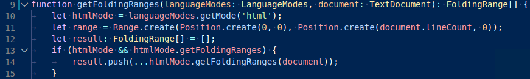

# 语义高亮指导

[原文链接，戳我前往](https://code.visualstudio.com/api/language-extensions/semantic-highlight-guide)

------

翻译 by [赫雯勒莉特翡翠](https://github.com/HeveraletLaidCenx)

## 术语~的对照表

|中文（常用英文表述）|英文|
|----|----|
|子类型|subtype|
|超类|supertype|

表中部分：

* 在中文表述中常直接用英文替代的
* 认为直译并不合适的

在中文之后的括号中说明了直接使用对应的英文。

------

## 概述

语义高亮 是对 [语法高亮指导](./2-扩展API-语言扩展-语法高亮指导.md) 中所描述的 语法高亮 的补充。**Visual Studio Code** 使用 TextMate 语法 作为主要的标记化引擎。 TextMate 语法 以单个文件作为它的输入，将其中的文本内容 根据 正则表达式表示的词法规则 断开。

语义标记化 允许 语言服务器 基于 语言服务器对于在项目环境中解析符号的理解 来提供 额外的 标记 信息。主题可以选用 语义标记 来进一步提升和改善 语法提供的 语法高亮。编辑器将在 语法高亮 的上层应用 语义高亮。

下边是一个展示了 语义高亮 能做到什么额外内容的例子：

> 没有语义高亮的时候：
> 

对比

> 有语义高亮的时候：
> 

注意 基于语言服务符号理解 产生的 颜色差异：

* 第 10 行：`languageModes` 被当成一个 参数 进行着色。
* 第 11 行：`Range` 和 `Position` 被当成 类 进行着色，而 `document` 被当成 参数 着色。
* 第 13 行：`getFoldingRanges` 被当成 函数 进行着色。

## 语义标记提供程序

为了实现语义高亮，语言扩展可以通过 文档的语言 和/或 文件名 来注册一个 `semantic token provider`（语义标记提供程序） 。当需要 语义标记 时，编辑器 会向 提供程序 发出请求。

```typescript
const tokenTypes = ['class', 'interface', 'enum', 'function', 'variable'];
const tokenModifiers = ['declaration', 'documentation'];
const legend = new vscode.SemanticTokensLegend(tokenTypes, tokenModifiers);

const provider: vscode.DocumentSemanticTokensProvider = {
  provideDocumentSemanticTokens(
    document: vscode.TextDocument
  ): vscode.ProviderResult<vscode.SemanticTokens> {
    // 分析文档并返回语义标记

    const tokensBuilder = new vscode.SemanticTokensBuilder(legend);
    // 在 第 1 行，第 1 ~ 5 个字符是 类声明
    tokensBuilder.push(
      new vscode.Range(new vscode.Position(1, 1), new vscode.Position(1, 5)),
      'class',
      ['declaration']
    );
    return tokensBuilder.build();
  }
};

const selector = { language: 'java', scheme: 'file' }; // 从本地文件系统注册所有 Java 文档

vscode.languages.registerDocumentSemanticTokensProvider(selector, provider, legend);
```

为了适应 语言服务器 的功能，语义标记提供程序有两种类型：

* `DocumentSemanticTokensProvider`（文档语义标记提供程序） —— 总是将整个文档作为输入。
  * `provideDocumentSemanticTokens`（提供文档语义标记） —— 提供文档的所有标记。
  * `provideDocumentSemanticTokensEdits` —— 提供文档的所有标记作为先前响应的增量。
* `DocumentRangeSemanticTokensProvider`（文档范围中的语义标记提供程序） —— 仅仅处理文档中的一个范围。
  * `provideDocumentRangeSemanticTokens`（提供文档范围中的语义标记） —— 提供该文档范围中的所有标记。

提供程序 返回 的 每个标记都带有一个 分类，分类内容包含：一个 标记类型、任意数量的 标记修饰符，以及一种 标记语言。

就像在上边的例子中看到的一样，提供程序 会给 将在 `SemanticTokensLegend`（语义标记 legend） 中使用的 类型 和 修饰符 命名。这允许 `provide`（提供） API 返回 标记类型 和 修饰符 作为 到 legend 的 索引。

## 语义标记分类

语义标记提供程序 的输出包含 标记。每个标记都有 一个范围 和 一个标记分类，用来描述 该标记代表哪种类型的 语法元素。此外，当标记是 嵌入式语言 的一部分时，这个分类也可以命名一种语言。

语义标记类型 和 修饰符 是为了描述 语法元素 的类型。这个信息的类型和 [语法高亮指导](./2-扩展API-语言扩展-语法高亮指导.md) 中描述的 Textmate 作用域 类似，不过我们想要比它一个专用切更加清晰的分类系统。

VS Code 带有一组可供所有 语义标记提供程序 使用的 标准语义标记类型 和 修饰符，语义标记提供程序 可以自由的定义新 类型 和 修饰符，也可以创建 标准类型 的 子类型。

### 标准标记类型 和 修饰符

标准类型 和 修饰符 涵盖了许多语言使用的 基本概念。虽然每种语言可能对于一些 类型 和 修饰符 使用不同的术语，但是通过遵循 标准分类，可以使 主题 的作者实现 定义可以跨语言使用的主题规则。

以下这些是 VS Code 预定义的 标准语义标记类型 和 修饰符：

标准标记类型：

|ID|描述|
|----|----|
|`namespace`|声明 或 引用 命名空间、模块、包 的 标识符|
|`class`|声明 或 引用 类类型 的 标识符|
|`enum`|声明 或 引用 枚举类型 的标识符|
|`interface`|声明 或 引用 接口类型 的标识符|
|`struct`|声明 或 引用 结构类型 的标识符|
|`typeParameter`|声明 或 引用 类型参数 的标识符|
|`type`|声明 或 引用 上述类型未涵盖的类型 的标识符|
|`parameter`|声明 或 引用 函数 或 方法 的标识符|
|`variable`|声明 或 引用 局部变量 或 全局变量 的标识符|
|`property`|声明 或 引用 成员属性、成员字段、成员变量 的标识符|
|`enumMember`|声明 枚举属性、常量 或 成员 的标识符|
|`event`|声明 事件属性 的标识符|
|`function`|声明 函数 的标识符|
|`method`|声明 成员函数 或 方法 的标识符|
|`macro`|声明 宏 的标识符|
|`label`|声明 标签 的标识符|
|`comment`|代表 注释 的标记|
|`string`|代表 字符串字面量 的标记|
|`keyword`|代表 语言关键词 的标记|
|`number`|代表 数字字面量 的标记|
|`regexp`|代表 正则表达式字面量 的标记|
|`operator`|代表 运算符 的标记|

标准标记修饰符：

|ID|描述|
|----|----|
|`declaration`|符号声明|
|`definition`|符号定义，比如在头文件中|
|`readonly`|只读变量 和 成员字段（常量）|
|`static`|类成员（静态成员）|
|`deprecated`|不应再使用的 符号|
|`abstract`|抽象的 类型 和 成员函数|
|`async`|被标记为异步的 函数|
|`modification`|对于变量被分配到的 变量引用|
|`documentation`|对于在文档中出现的 符号|
|`defaultLibrary`|对于属于标准库的 符号|

除了这些 标准类型 和 修饰符，**VS Code** 还定义了和 Textmate 作用域 类似的 类型 和 修饰符 的映射。这些内容在 [语义标记作用域映射](#语义标记作用域映射) 这一节中介绍。

### 自定义 标记类型 和 修饰符

如果有必要的话，扩展可以声明新的 类型 和 修饰符，或者通过在扩展中的 `package.json` 中 使用 `semanticTokenTypes`（语义标记类型） 和 `semanticTokenModifiers`（语义标记修饰符） 来创建 现有类型的 子类型：

```json
{
  "contributes": {
    "semanticTokenTypes": [
      {
        "id": "templateType",
        "superType": "type",
        "description": "A template type.（一个模板类型。）"
      }
    ],
    "semanticTokenModifiers": [
      {
        "id": "native",
        "description": "Annotates a symbol that is implemented natively（注释一个原生实现的符号）"
      }
    ]
  }
}
```

在上面的例子中，扩展声明了一个新类型 `templateType` 和一个新修饰符 `native`。通过将 `type` 命名为超类，新的类型将会继承现有的已经为 `type` 定义的 样式规则。

和 自定义标记类型 一样，扩展也可以定义它们如何映射到 TextMate 作用域。这些内容在 [自定义映射](#自定义-textmate-作用域映射) 这一节中描述。

## 启用 语义高亮显示

语义标记 是否 分析和显示 是由设置 `editor.semanticHighlighting.enabled`（编辑器.语义高亮.启用） 决定的。它的取值可以是：`true`（真）、`false`（假）、`configuredByTheme`（由主题进行配置）。

* `true` 和 `false` 会设置所有 主题 是否启用 语义高亮。
* `configuredByTheme` 是这个设置选项的默认值，它会让 主题 决定是否启用 语义高亮。**VS Code** 附带的所有 主题（比如，默认的 `Dark+` 主题）都是默认启用 语义高亮 的。

依赖 语义标记 的 语言扩展 可以在 `package.json` 中覆写对应的语言的默认值：

```json
{
  "configurationDefaults": {
    "[languageId]": {
      "editor.semanticHighlighting.enabled": true
    }
  }
}
```

## 主题

主题 用来给 标记 分配 样式 和 颜色。主题规则 在 颜色主题 文件（JSON 格式的）中指定。用户也可以在用户设置中自定义 主题规则。

### 颜色主题 中的 语义着色

为了支持 基于语义标记的 语义高亮，在 颜色主题 文件格式中添加了两个新属性。

属性 `semanticHighlighting`（语义高亮） 定义了这个主题是否做好了使用 语义标记 进行高亮显示 的准备。它的默认值是 `false`（假），但是我们鼓励所有的主题启用它。这个属性当 **VS Code** 的 `editor.semanticHighlighting.enabled`（编辑器.语义高亮.启用） 设置为 `configuredByTheme`（由主题进行配置） 时生效。

属性 `semanticTokenColors`（语义标记颜色） 允许主题定义 和 由 语义标记提供程序 提供的 语义标记类型 和 修饰符 相匹配的新 颜色规则。

```json
{
  "name": "Red Theme",
  "tokenColors": [
    {
      "scope": "comment",
      "settings": {
        "foreground": "#dd0000",
        "fontStyle": "italic"
      }
    }
  ],
  "semanticHighlighting": true,
  "semanticTokenColors": {
    "variable.readonly:java": "#ff0011"
  }
}
```

其中的 `variable.readonly:java`（变量.只读.Java） 被称作 选择器，它的格式是 `(*|tokenType【标记类型】)(.tokenModifier【标记修饰符】)*(:tokenLanguage【标记语言】)?`

如果规则匹配的话，值会描述样式。它可以是一个 字符串，表示前景色；或者是一个 对象，格式为：`{ foreground: string【前景色: 字符串】, bold: boolean【粗体: 布尔值】, italic: boolean【斜体: 布尔值】, underline: boolean【下划线: 布尔值】 }` 或者 `{ foreground: string【前景色: 字符串】, fontStyle: string【字体样式: 字符串】 }` ，用于 `tokenColors`（标记颜色） 中的 Textmate 主题规则。

前景色需要遵循在 [颜色格式](https://code.visualstudio.com/api/references/theme-color#color-formats) 中描述的颜色格式要求。不支持透明度。

以下是一些 选择器 和 样式 的其他示例：

* `"*.declaration": { "bold": true } // all declarations are bold`
* `"class:java": { "foreground": "#0f0", "italic": true } // classes in java`

如果没有任何规则匹配，或者主题不包含 `semanticTokenColors`（语义标记颜色） 节（但启用了 `semanticHighlighting`（语义高亮）） ，则 **VS Code** 使用 [语义标记作用域映射](#语义标记作用域映射) TextMate 作用域。该 作用域 和  `tokenColors`（标记颜色） 中的 Textmate 主题规则相匹配。

## 语义标记作用域映射

为了让 没有定义任何特定语义规则的主题 也支持语义高亮，以及作为自定义 标记类型 和 修饰符 的备选方案，**VS Code** 提供了一个从语义标记选择器 到 TextMate 作用域 的映射。

如果主题启用了语义高亮，但是不包含给定语义标记的规则，这些 TextMate 作用域将用于找一个用来替代的 TextMate 主题规则。

### 预定义的 TextMate 作用域映射

以下表格列出了当前预定义的映射。

|语义标记选择器|←翻译|备选 Textmate 作用域|←翻译|
|----|----|----|----|
|`namespace`|命名空间|`entity.name.namespace`|实体.名称.命名空间|
|`type`|类型|`entity.name.type`|实体.名称.类型|
|`type.defaultLibrary`|类型.默认库|`support.type`|支持.类型|
|`struct`|结构|`storage.type.struct`|存储.类型.结构|
|`class`|类|`entity.name.type.class`|实体.名称.类型.类|
|`class.defaultLibrary`|类.默认库|`support.class`|支持.类|
|`interface`|界面|`entity.name.type.interface`|实体.名称.类型.界面|
|`enum`|枚举|`entity.name.type.enum`|实体.名称.类型.枚举|
|`function`|函数|`entity.name.function`|实体.名称.函数|
|`function.defaultLibrary`|函数.默认库|`support.function`|支持.函数|
|`method`|方法|`entity.name.function.member`|实体.名称.函数.成员|
|`macro`|宏|`entity.name.function.macro`|实体.名称.函数.宏|
|`variable`|变量|`variable.other.readwrite` , `entity.name.variable`|变量.其他.读写、实体.名称.变量|
|`variable.readonly`|变量.只读|`variable.other.constant`|变量.其他.静态|
|`variable.readonly.defaultLibrary`|变量.只读.默认库|`support.constant`|支持.静态|
|`parameter`|参数|`variable.parameter`|变量.参数|
|`property`|属性|`variable.other.property`|变量.其他.属性|
|`property.readonly`|属性.只读|`variable.other.constant.property`|变量.其他.静态.属性|
|`enumMember`|枚举成员|`variable.other.enummember`|变量.其他.枚举成员|
|`event`|事件|`variable.other.event`|变量.其他.事件|

### 自定义 TextMate 作用域映射

这个映射可以通过 `package.json` 中的 `semanticTokenScopes` 作用点进行扩展。

要这样做的话，这里有两个用例：

* 当 主题 没有定义添加的 标记类型 或 修饰符 的主题规则时，扩展定义了 自定义标记类型 和 标记修饰符，提供一个作为备选方案的 TextMate 作用域：

  ```json
  {
    "contributes": {
      "semanticTokenScopes": [
        {
          "scopes": {
            "templateType": ["entity.name.type.template"]
          }
        }
      ]
    }
  }
  ```

* TextMate 语法的提供程序 可以描述特定于某种语言的 作用域。这有助于 包含特定语言主题规则的主题。

  ```json
  {
    "contributes": {
      "semanticTokenScopes": [
        {
          "language": "typescript",
          "scopes": {
            "property.readonly": ["variable.other.constant.property.ts"]
          }
        }
      ]
    }
  }
  ```

## 试试看吧~

我们有一个 [语义标记的例子](https://github.com/microsoft/vscode-extension-samples/tree/main/semantic-tokens-sample) ，展示了如何创建一个 语义标记提供程序。

使用 [作用域检查器](./2-扩展API-语言扩展-语法高亮指导.md) 工具让你可以探索：在一个代码文件中出现了哪些 语义标记 ，以及它们对应哪些主题规则。要查看语义标记的话，可以用内置主题（比如 `Dark+`）来打开一个 TypeScript 文件。