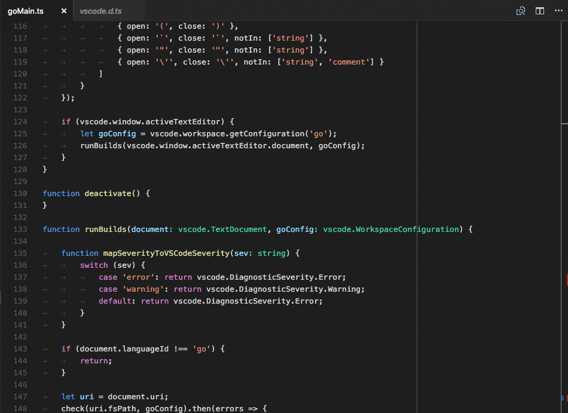
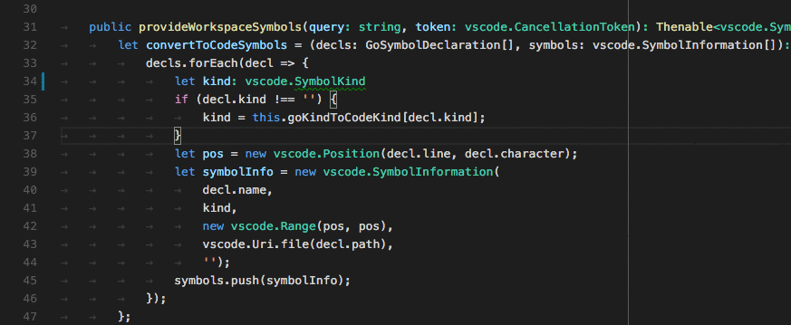
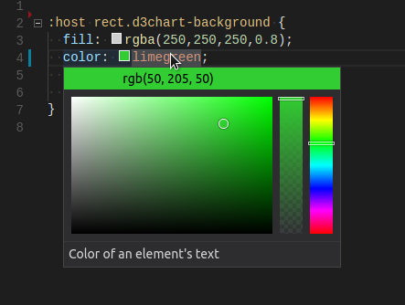
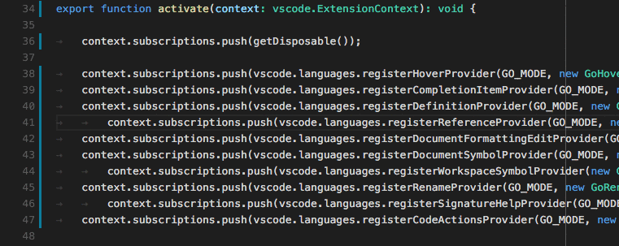
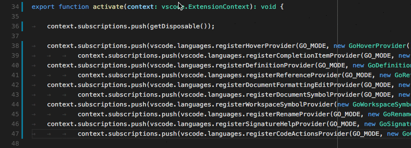
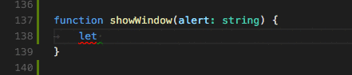

# 编程型语言功能

[原文链接，戳我前往](https://code.visualstudio.com/api/language-extensions/programmatic-language-features)

------

翻译 by [赫雯勒莉特翡翠](https://github.com/HeveraletLaidCenx)

## 术语~的对照表

|中文（常用英文表述）|英文|
|----|----|
|颜色装饰器|color decorator|

表中部分：

* 在中文表述中常直接用英文替代的
* 认为直译并不合适的

在中文之后的括号中说明了直接使用对应的英文。

------

## 概述

编程型语言功能 是一组由 [`vscode.languages.*`（vscode.语言.*）](https://code.visualstudio.com/api/references/vscode-api#languages) API 提供支持的智能编辑功能。通常有两种方法可以在 **Visual Studio Code** 中提供动态语言功能。让我们以 [鼠标悬停提示](#显示鼠标悬停提示) 作为例子：

```typescript
vscode.languages.registerHoverProvider('javascript', {
  provideHover(document, position, token) {
    return {
      contents: ['Hover Content']
    };
  }
});
```

就像上边展示的这样，[`vscode.languages.registerHoverProvider`（vscode.语言.注册鼠标悬停提示）](https://code.visualstudio.com/api/references/vscode-api#languages.registerHoverProvider) API 为给 JavaScript 文件提供鼠标悬停提示内容 提供了一种简单的方法。当这个扩展被激活时，每当你的鼠标悬停在 JavaScript 代码上方时，**VS Code** 会查询所有 JavaScript 的 [`HoverProvider`（鼠标悬停提示提供程序）](https://code.visualstudio.com/api/references/vscode-api#HoverProvider) ，并在 悬停小部件 中显示结果。下面的 [语言功能列表](#语言功能列表) 和 gif动态图示 给你提供了一个找到自己扩展想要使用的 **VS Code** API / LSP 方法的快捷途径。

还有一种实现途径是通过实现一个遵循 [LSP（语言服务器协议）](https://microsoft.github.io/language-server-protocol/) 的 语言服务器。它的工作方式是：

* 由扩展提供一个 语言客户端 和一个用于 JavaScript 的 语言服务器。
* 语言客户端 和其它的 **VS Code** 扩展一样，运行在一个 Node.js 扩展宿主环境中。当它被激活的时候，会在另外一个进程中生成 语言服务器，并且和它通过 [LSP（语言服务器协议）](https://microsoft.github.io/language-server-protocol/) 进行通信。
* 当你在 **VS Code** 中将鼠标悬停于一段 JavaScript 代码上时
* **VS Code** 通知 语言客户端 鼠标悬停事件
* 语言客户端 从 语言服务器 查询悬停的结果，并将它发送回 **VS Code**
* **VS Code** 在 悬停小部件 中显示 悬停结果

这个过程看上去更加复杂，但是它提供了两个主要的好处：

* 语言服务器 可以由任意语言编写
* 语言服务器可以被多重编辑器重用，用来提供智能编辑功能

要想获得更加深入的指导，请查阅 [语言服务器扩展指导](7-扩展API-语言扩展-语言服务器扩展指导.md) 。

------

## 语言功能列表

这个列表包括了每种语言功能的以下项目：

* **VS Code** 中语言功能的说明
* 相关的 **VS Code** API
* 相关的 LSP（语言服务器协议） 方法

|**VS Code** API|←翻译|LSP（语言服务器协议） 方法|←翻译|
|----|----|----|----|
|[`createDiagnosticCollection`](https://code.visualstudio.com/api/references/vscode-api#languages.createDiagnosticCollection)|创建诊断集合|[PublishDiagnostics](https://microsoft.github.io/language-server-protocol/specification#textDocument_publishDiagnostics)|发布诊断|
|[`registerCompletionItemProvider`](https://code.visualstudio.com/api/references/vscode-api#languages.registerCompletionItemProvider)|注册自动补全项目提供程序|[Completion](https://microsoft.github.io/language-server-protocol/specification#textDocument_completion) 、 [Completion Resolve](https://microsoft.github.io/language-server-protocol/specification#completionItem_resolve)|自动补全、自动补全解析|
|[`registerHoverProvider`](https://code.visualstudio.com/api/references/vscode-api#languages.registerHoverProvider)|注册鼠标悬停提示提供程序|[Hover](https://microsoft.github.io/language-server-protocol/specification#textDocument_hover)|鼠标悬停提示|
|[`registerSignatureHelpProvider`](https://code.visualstudio.com/api/references/vscode-api#languages.registerSignatureHelpProvider)|注册签名帮助提供程序|[SignatureHelp](https://microsoft.github.io/language-server-protocol/specification#textDocument_signatureHelp)|签名帮助|
|[`registerDefinitionProvider`](https://code.visualstudio.com/api/references/vscode-api#languages.registerDefinitionProvider)|注册定义提供程序|[Definition](https://microsoft.github.io/language-server-protocol/specification#textDocument_definition)|定义|
|[`registerTypeDefinitionProvider`](https://code.visualstudio.com/api/references/vscode-api#languages.registerTypeDefinitionProvider)|注册类型定义提供程序|[TypeDefinition](https://microsoft.github.io/language-server-protocol/specification#textDocument_typeDefinition)|类型定义|
|[`registerImplementationProvider`](https://code.visualstudio.com/api/references/vscode-api#languages.registerImplementationProvider)|注册实现提供程序|[Implementation](https://microsoft.github.io/language-server-protocol/specification#textDocument_implementation)|实现|
|[`registerReferenceProvider`](https://code.visualstudio.com/api/references/vscode-api#languages.registerReferenceProvider)|注册引用提供程序|[References](https://microsoft.github.io/language-server-protocol/specification#textDocument_references)|引用|
|[`registerDocumentHighlightProvider`](https://code.visualstudio.com/api/references/vscode-api#languages.registerDocumentHighlightProvider)|注册文档高亮提供程序|[DocumentHighlight](https://microsoft.github.io/language-server-protocol/specification#textDocument_documentHighlight)|文档高亮|
|[`registerDocumentSymbolProvider`](https://code.visualstudio.com/api/references/vscode-api#languages.registerDocumentSymbolProvider)|注册文档符号提供程序|[DocumentSymbol](https://microsoft.github.io/language-server-protocol/specification#textDocument_documentSymbol)|文档符号|
|[`registerCodeActionsProvider`](https://code.visualstudio.com/api/references/vscode-api#languages.registerCodeActionsProvider)|注册代码操作提供程序|[CodeAction](https://microsoft.github.io/language-server-protocol/specification#textDocument_codeAction)|代码操作|
|[`registerCodeLensProvider`](https://code.visualstudio.com/api/references/vscode-api#languages.registerCodeLensProvider)|注册 CodeLens 提供程序|[CodeLens](https://microsoft.github.io/language-server-protocol/specification#textDocument_codeLens) 、 [CodeLens Resolve](https://microsoft.github.io/language-server-protocol/specification#codeLens_resolve)| CodeLens、CodeLens 解析|
|[`registerDocumentLinkProvider`](https://code.visualstudio.com/api/references/vscode-api#languages.registerDocumentLinkProvider)|注册文档链接提供程序|[DocumentLink](https://microsoft.github.io/language-server-protocol/specification#textDocument_documentLink) 、 [DocumentLink Resolve](https://microsoft.github.io/language-server-protocol/specification#documentLink_resolve)|文档链接、文档链接解析|
|[`registerColorProvider`](https://code.visualstudio.com/api/references/vscode-api#languages.registerColorProvider)|注册颜色提供程序|[DocumentColor](https://microsoft.github.io/language-server-protocol/specification#textDocument_documentColor) 、 [Color Presentation](https://microsoft.github.io/language-server-protocol/specification#textDocument_colorPresentation)|文档颜色、颜色表示|
|[`registerDocumentFormattingEditProvider`](https://code.visualstudio.com/api/references/vscode-api#languages.registerDocumentFormattingEditProvider)|注册文档格式化编辑提供程序|[Formatting](https://microsoft.github.io/language-server-protocol/specification#textDocument_formatting)|格式化|
|[`registerDocumentRangeFormattingEditProvider`](https://code.visualstudio.com/api/references/vscode-api#languages.registerDocumentRangeFormattingEditProvider)|注册文档范围格式化编辑提供程序|[RangeFormatting](https://microsoft.github.io/language-server-protocol/specification#textDocument_rangeFormatting)|范围格式化|
|[`registerOnTypeFormattingEditProvider`](https://code.visualstudio.com/api/references/vscode-api#languages.registerOnTypeFormattingEditProvider)|注册输入时格式化编辑提供程序|[OnTypeFormatting](https://microsoft.github.io/language-server-protocol/specification#textDocument_onTypeFormatting)|输入时格式化|
|[`registerRenameProvider`](https://code.visualstudio.com/api/references/vscode-api#languages.registerRenameProvider)|注册重命名提供程序|[Rename](https://microsoft.github.io/language-server-protocol/specification#textDocument_rename) 、 [Prepare Rename](https://microsoft.github.io/language-server-protocol/specification#textDocument_prepareRename)|重命名、准备重命名|
|[`registerFoldingRangeProvider`](https://code.visualstudio.com/api/references/vscode-api#languages.registerFoldingRangeProvider)|注册折叠范围提供程序|[FoldingRange](https://microsoft.github.io/language-server-protocol/specification#textDocument_foldingRange)|折叠范围|

------

## 提供诊断

诊断 是一种指示代码中的问题的方法


### LSP（Language Server Protocol，语言服务器协议）

你的 语言服务器 发送 `textDocument/publishDiagnostics`（文本文档/发布诊断） 消息 给 语言客户端。消息包括一个 对于 资源URI 的 诊断项目 的数组。

**注意**：客户端 不会向 服务器 请求诊断信息。是 服务器 主动将诊断信息推送给 客户端。

### 直接实现

```typescript
let diagnosticCollection: vscode.DiagnosticCollection;

export function activate(ctx: vscode.ExtensionContext): void {
  ...
  ctx.subscriptions.push(getDisposable());
  diagnosticCollection = vscode.languages.createDiagnosticCollection('go');
  ctx.subscriptions.push(diagnosticCollection);
  ...
}

function onChange() {
  let uri = document.uri;
  check(uri.fsPath, goConfig).then(errors => {
    diagnosticCollection.clear();
    let diagnosticMap: Map<string, vscode.Diagnostic[]> = new Map();
    errors.forEach(error => {
      let canonicalFile = vscode.Uri.file(error.file).toString();
      let range = new vscode.Range(error.line-1, error.startColumn, error.line-1, error.endColumn);
      let diagnostics = diagnosticMap.get(canonicalFile);
      if (!diagnostics) { diagnostics = []; }
      diagnostics.push(new vscode.Diagnostic(range, error.msg, error.severity));
      diagnosticMap.set(canonicalFile, diagnostics);
    });
    diagnosticMap.forEach((diags, file) => {
      diagnosticCollection.set(vscode.Uri.parse(file), diags);
    });
  })
}
```

> **基础**
>
> 为 打开的编辑器 报告诊断。最少，这需要在每次 保存 时发生。如果要更好一些的话，诊断应该根据 编辑器中未保存的内容 来计算。

> **高级**
>
> 不仅为 打开的编辑器，还为 打开的文件夹中所有的资源 报告诊断，无论它们是否在编辑器中打开过。

## 显示代码补全建议

代码自动补全 为用户提供了一个 上下文敏感的建议。


### LSP（Language Server Protocol，语言服务器协议）

在对 `initialize`（初始化） 方法的响应中，你的 语言服务器 需要声明它提供了 自动补全，以及 它是否支持 `completionItem\resolve`（自动补全项目\解析） 方法 来提供对于自动补全项目的额外信息。

```typescript
{
    ...
    "capabilities" : {
        "completionProvider" : {
            "resolveProvider": "true",
            "triggerCharacters": [ '.' ]
        }
        ...
    }
}
```

#### 直接实现

```typescript
class GoCompletionItemProvider implements vscode.CompletionItemProvider {
    public provideCompletionItems(
        document: vscode.TextDocument, position: vscode.Position, token: vscode.CancellationToken):
        Thenable<vscode.CompletionItem[]> {
    ...
    }
}

export function activate(ctx: vscode.ExtensionContext): void {
    ...
    ctx.subscriptions.push(getDisposable());
    ctx.subscriptions.push(
        vscode.languages.registerCompletionItemProvider(
            GO_MODE, new GoCompletionItemProvider(), '.', '\"'));
    ...
}
```

> **基础**
>
> 你不需要支持 解析提供程序。

> **高级**
>
> 你支持 解析提供程序，它将用来计算 用户选中内容 的 自动补全建议。这个信息将被显示在被选中项目的旁边。

## 显示鼠标悬停提示

鼠标悬停提示 展示了鼠标所处位置的 符号/对象 的信息。这个信息通常是 符号 的 类型 或者 描述。


#### LSP（Language Server Protocol，语言服务器协议）

在对 `initialize`（初始化） 方法的响应中，你的 语言服务器 需要声明它提供了 鼠标悬停提示。

```typescript
{
    ...
    "capabilities" : {
        "hoverProvider" : "true",
        ...
    }
}
```

此外，你的 语言服务器 需要响应 `textDocument/hover`（文本文档/鼠标悬停提示） 请求。

#### 直接实现

```typescript
class GoHoverProvider implements HoverProvider {
    public provideHover(
        document: TextDocument, position: Position, token: CancellationToken):
        Thenable<Hover> {
    ...
    }
}

export function activate(ctx: vscode.ExtensionContext): void {
    ...
    ctx.subscriptions.push(
        vscode.languages.registerHoverProvider(
            GO_MODE, new GoHoverProvider()));
    ...
}
```

> **基础**
>
> 如果可用的话，显示 类型信息 和 iclude 文档。

> **高级**
>
> 将 方法签名 用 和你给代码着色的相同样式 着色。

## 函数 和 方法签名 的帮助

当用户输入一个 函数 或者 方法 时，显示关于这个被调用的 函数/方法 的相关信息。


#### LSP（Language Server Protocol，语言服务器协议）

在对 `initialize`（初始化） 方法的响应中，你的 语言服务器 需要声明它提供了 签名帮助。

```
{
    ...
    "capabilities" : {
        "signatureHelpProvider" : {
            "triggerCharacters": [ '(' ]
        }
        ...
    }
}
```

此外，你的 语言服务器 需要响应 `textDocument/signatureHelp`（文本文档/签名帮助） 请求。

#### 直接实现

```typescript
class GoSignatureHelpProvider implements SignatureHelpProvider {
    public provideSignatureHelp(
        document: TextDocument, position: Position, token: CancellationToken):
        Promise<SignatureHelp> {
    ...
    }
}

export function activate(ctx: vscode.ExtensionContext): void {
    ...
    ctx.subscriptions.push(
        vscode.languages.registerSignatureHelpProvider(
            GO_MODE, new GoSignatureHelpProvider(), '(', ','));
    ...
}
```

> **基础**
>
> 确保 签名帮助 包含 该 函数/方法 的参数的文档。

> **高级**
>
> 没啥高级的了。

## 显示某个符号的定义

让用户可以在使用 变量/函数/方法 的地方查看它们的定义。


#### LSP（Language Server Protocol，语言服务器协议）

在对 `initialize`（初始化） 方法的响应中，你的 语言服务器 需要声明它提供了 转到定义的位置。

```typescript
{
    ...
    "capabilities" : {
        "definitionProvider" : "true"
        ...
    }
}
```

此外，你的 语言服务器 需要响应 `textDocument/definition`（文本文档/定义） 的请求。

#### 直接实现

```typescript
class GoDefinitionProvider implements vscode.DefinitionProvider {
    public provideDefinition(
        document: vscode.TextDocument, position: vscode.Position, token: vscode.CancellationToken):
        Thenable<vscode.Location> {
    ...
    }
}

export function activate(ctx: vscode.ExtensionContext): void {
    ...
    ctx.subscriptions.push(
        vscode.languages.registerDefinitionProvider(
            GO_MODE, new GoDefinitionProvider()));
    ...
}
```

> **基础**
>
> 如果 某个符号 是 有歧义的，你可以显示多个定义。

> **高级**
>
> 没啥高级的了。

## 查找对某个符号的所有引用

让用户可以查看使用了 某个变量/函数/方法 的所有源代码位置。


#### LSP（Language Server Protocol，语言服务器协议）

在对 `initialize`（初始化） 方法的响应中，你的 语言服务器 需要声明它提供了 符号引用定位。

```typescript
{
    ...
    "capabilities" : {
        "referencesProvider" : "true"
        ...
    }
}
```

此外，你的 语言服务器 需要响应 `textDocument/references`（文本文档/引用） 的请求。

#### 直接实现

```typescript
class GoReferenceProvider implements vscode.ReferenceProvider {
    public provideReferences(
        document: vscode.TextDocument, position: vscode.Position,
        options: { includeDeclaration: boolean }, token: vscode.CancellationToken):
        Thenable<vscode.Location[]> {
    ...
    }
}

export function activate(ctx: vscode.ExtensionContext): void {
    ...
    ctx.subscriptions.push(
        vscode.languages.registerReferenceProvider(
            GO_MODE, new GoReferenceProvider()));
    ...
}
```

> **基础**
>
> 返回所有引用的位置（资源URI 和 范围）。

> **高级**
>
> 没啥高级的了。

## 高亮显示某个符号在文档中所有出现的位置

让用户可以查看在打开的编辑器中，某个符号的所有出现位置。


#### LSP（Language Server Protocol，语言服务器协议）

在对 `initialize`（初始化） 方法的响应中，你的 语言服务器 需要声明它提供了 符号文档定位。

```typescript
{
    ...
    "capabilities" : {
        "documentHighlightProvider" : "true"
        ...
    }
}
```

此外，你的 语言服务器 需要响应 `textDocument/documentHighlight`（文本文档/文档高亮） 的请求。

#### 直接实现

```typescript
class GoDocumentHighlightProvider implements vscode.DocumentHighlightProvider {
    public provideDocumentHighlights(
        document: vscode.TextDocument, position: vscode.Position, token: vscode.CancellationToken):
        vscode.DocumentHighlight[]|Thenable<vscode.DocumentHighlight[]>;
    ...
    }
}

export function activate(ctx: vscode.ExtensionContext): void {
    ...
    ctx.subscriptions.push(
        vscode.languages.registerDocumentHighlightProvider(
            GO_MODE, new GoDocumentHighlightProvider()));
    ...
}
```

> **基础**
>
> 你返回编辑器的文档中找到引用的的范围

> **高级**
>
> 没啥高级的了。

## 显示文档中的所有 符号定义

让用户可以在打开的编辑器中快速定位到任何符号定义。

用 `@` 来定位文档中的：



#### LSP（Language Server Protocol，语言服务器协议）

在对 `initialize`（初始化） 方法的响应中，你的 语言服务器 需要声明它提供了 符号文档定位。

```typescript
{
    ...
    "capabilities" : {
        "documentSymbolProvider" : "true"
        ...
    }
}
```

此外，你的 语言服务器 需要响应 `textDocument/documentSymbol`（文本文档/文档符号） 的请求。

#### 直接实现

```typescript
class GoDocumentSymbolProvider implements vscode.DocumentSymbolProvider {
    public provideDocumentSymbols(
        document: vscode.TextDocument, token: vscode.CancellationToken):
        Thenable<vscode.SymbolInformation[]> {
    ...
    }
}

export function activate(ctx: vscode.ExtensionContext): void {
    ...
    ctx.subscriptions.push(
        vscode.languages.registerDocumentSymbolProvider(
            GO_MODE, new GoDocumentSymbolProvider()));
    ...
}
```

> **基础**
>
> 返回文档中的所有符号。定义符号的种类，比如 变量、函数、类、方法 等。

> **高级**
>
> 没啥高级的了。

## 显示文件夹中的所有符号定义

让用户可以在 **VS Code** 中打开的 文件夹（工作区）中的任意位置快速定位到符号定义。

用 `#` 来定位工作区中的：


#### LSP（Language Server Protocol，语言服务器协议）

在对 `initialize`（初始化） 方法的响应中，你的 语言服务器 需要声明它提供了 全局符号定位。

```typescript
{
    ...
    "capabilities" : {
        "workspaceSymbolProvider" : "true"
        ...
    }
}
```

此外，你的 语言服务器 需要响应 `workspace/symbol`（工作区/符号） 的请求。

#### 直接实现

```typescript
class GoWorkspaceSymbolProvider implements vscode.WorkspaceSymbolProvider {
    public provideWorkspaceSymbols(
        query: string, token: vscode.CancellationToken):
        Thenable<vscode.SymbolInformation[]> {
    ...
    }
}

export function activate(ctx: vscode.ExtensionContext): void {
    ...
    ctx.subscriptions.push(
        vscode.languages.registerWorkspaceSymbolProvider(
            new GoWorkspaceSymbolProvider()));
    ...
}
```

> **基础**
>
> 返回打开的文件夹中的所有符号。定义符号的种类，比如 变量、函数、类、方法 等。

> **高级**
>
> 没啥高级的了。

## 对 错误 或 警告 可能采取的操作

在 错误 或 警告 旁边向用户提供可能的修正操作。如果操作可用，会在 错误 或 警告 旁边显示一个 电灯泡。当用户点击这个电灯泡的时候，会显示一个包含可能采用的修正代码操作的列表。



#### LSP（Language Server Protocol，语言服务器协议）

在对 `initialize`（初始化） 方法的响应中，你的 语言服务器 需要声明它提供了 代码操作。

```typescript
{
    ...
    "capabilities" : {
        "codeActionProvider" : "true"
        ...
    }
}
```

此外，你的 语言服务器 需要响应 `textDocument/codeAction`（文本文档/代码操作） 的请求。

#### 直接实现

```typescript
class GoCodeActionProvider implements vscode.CodeActionProvider {
    public provideCodeActions(
        document: vscode.TextDocument, range: vscode.Range,
        context: vscode.CodeActionContext, token: vscode.CancellationToken):
        Thenable<vscode.Command[]> {
    ...
    }
}

export function activate(ctx: vscode.ExtensionContext): void {
    ...
    ctx.subscriptions.push(
        vscode.languages.registerCodeActionsProvider(
            GO_MODE, new GoCodeActionProvider()));
    ...
}
```

> **基础**
>
> 为 错误/警告 提供 修正代码的操作。

> **高级**
>
> 此外，提供重构等源代码操作，比如，**Extract Method**（提取方法）。

## CodeLens —— 在源代码中显示可操作的上下文信息

向用户提供在源代码中分散显示的、可操作的上下文信息。


#### LSP（Language Server Protocol，语言服务器协议）

在对 `initialize`（初始化） 方法的响应中，你的 语言服务器 需要声明它提供了 CodeLens 结果，以及它是否支持 `codeLens\resolve`（CodeLens\解析） 方法 来将 CodeLens 绑定到它的命令。

```typescript
{
    ...
    "capabilities" : {
        "codeLensProvider" : {
            "resolveProvider": "true"
        }
        ...
    }
}
```

此外，你的 语言服务器 需要响应 `textDocument/codeLens`（文本文档/CodeLens） 的请求。

#### 直接实现

```typescript
class GoCodeLensProvider implements vscode.CodeLensProvider {
    public provideCodeLenses(document: TextDocument, token: CancellationToken):
        CodeLens[]|Thenable<CodeLens[]> {
    ...
    }

    public resolveCodeLens?(codeLens: CodeLens, token: CancellationToken):
         CodeLens|Thenable<CodeLens> {
    ...
    }
}

export function activate(ctx: vscode.ExtensionContext): void {
    ...
    ctx.subscriptions.push(
        vscode.languages.registerCodeLensProvider(
            GO_MODE, new GoCodeLensProvider()));
    ...
}
```

> **基础**
>
> 定义可用于文档的 CodeLens 结果。

> **高级**
>
> 将 CodeLens 结果绑定到响应 `codeLens/resolve`（CodeLens/解析） 的命令。

## 显示 颜色装饰器

允许用户在文档中 预览 和 修改 颜色。



#### LSP（Language Server Protocol，语言服务器协议）

在对 `initialize`（初始化） 方法的响应中，你的 语言服务器 需要声明它提供了 颜色信息。

```typescript
{
    ...
    "capabilities" : {
        "colorProvider" : "true"
        ...
    }
}
```

此外，你的 语言服务器 需要响应 `textDocument/documentColor`（文本文档/文档颜色） 和 `textDocument/colorPresentation`（文本文档/颜色显示） 请求。

#### 直接实现

```typescript
class GoColorProvider implements vscode.DocumentColorProvider {
    public provideDocumentColors(
        document: vscode.TextDocument, token: vscode.CancellationToken):
        Thenable<vscode.ColorInformation[]> {
    ...
    }
    public provideColorPresentations(
        color: Color, context: { document: TextDocument, range: Range }, token: vscode.CancellationToken):
        Thenable<vscode.ColorPresentation[]> {
    ...
    }
}

export function activate(ctx: vscode.ExtensionContext): void {
    ...
    ctx.subscriptions.push(
        vscode.languages.registerColorProvider(
            GO_MODE, new GoColorProvider()));
    ...
}
```

> **基础**
>
> 返回文档中的所有 颜色引用。为支持的 颜色格式（比如 `rgb()`、`hsl()`）提供颜色显示。

> **高级**
>
> 没啥高级的了。

## 格式化编辑器中的源代码

向用户提供对整个文档的格式化。



#### LSP（Language Server Protocol，语言服务器协议）

在对 `initialize`（初始化） 方法的响应中，你的 语言服务器 需要声明它提供了 文档格式化。

```typescript
{
    ...
    "capabilities" : {
        "documentFormattingProvider" : "true"
        ...
    }
}
```

此外，你的 语言服务器 需要响应 `textDocument/formatting`（文本文档/格式化） 的请求。

#### 直接实现

```typescript
class GoDocumentFormatter implements vscode.DocumentFormattingEditProvider {
    public formatDocument(document: vscode.TextDocument):
        Thenable<vscode.TextEdit[]> {
    ...
    }
}

export function activate(ctx: vscode.ExtensionContext): void {
    ...
    ctx.subscriptions.push(
        vscode.languages.registerDocumentFormattingEditProvider(
            GO_MODE, new GoDocumentFormatter()));
    ...
}
```

> **基础**
>
> 不提供格式化支持。

> **高级**
>
> 你应该总是源代码中的结果被格式化的最小可能文本内容。这对于 确保 诊断结果 等标记被正确调节并且不丢失 来说至关重要。

## 格式化编辑器中选定的行

向用户提供对于文档中选定范围进行格式化的支持。



#### LSP（Language Server Protocol，语言服务器协议）

在对 `initialize`（初始化） 方法的响应中，你的 语言服务器 需要声明它提供了 对于行范围的格式化支持。

```typescript
{
    ...
    "capabilities" : {
        "documentRangeFormattingProvider" : "true"
        ...
    }
}
```

此外，你的 语言服务器 需要响应 `textDocument/rangeFormatting`（文本文档/范围格式化） 的请求。

#### 直接实现

```typescript
class GoDocumentRangeFormatter implements vscode.DocumentRangeFormattingEditProvider{
    public provideDocumentRangeFormattingEdits(
        document: vscode.TextDocument, range: vscode.Range,
        options: vscode.FormattingOptions, token: vscode.CancellationToken):
        Thenable<vscode.TextEdit[]>;
    ...
    }
}

export function activate(ctx: vscode.ExtensionContext): void {
    ...
    ctx.subscriptions.push(
        vscode.languages.registerDocumentRangeFormattingEditProvider(
            GO_MODE, new GoDocumentRangeFormatter()));
    ...
}
```

> **基础**
>
> 不提供格式化支持。

> **高级**
>
> 你应该总是源代码中的结果被格式化的最小可能文本内容。这对于 确保 诊断结果 等标记被正确调节并且不丢失 来说至关重要。

## 当用户输入时增量格式化代码

在用户输入时向用户提供格式化文本支持。

**注意**：用户 [设置](https://code.visualstudio.com/docs/getstarted/settings) `editor.formatOnType`（编辑器.输入时的格式） 控制在用户输入时代码是否被格式化。



#### LSP（Language Server Protocol，语言服务器协议）

在对 `initialize`（初始化） 方法的响应中，你的 语言服务器 需要声明它提供了 当用户输入时格式化。还需要告知 客户端 应该 触发 哪些字符格式。`moreTriggerCharacters`（更多触发字符） 是可选的。

```typescript
{
    ...
    "capabilities" : {
        "documentOnTypeFormattingProvider" : {
            "firstTriggerCharacter": "}",
            "moreTriggerCharacter": [";", ","]
        }
        ...
    }
}
```

此外，你的 语言服务器 需要响应 `textDocument/onTypeFormatting`（文本文档/输入时格式化） 的请求。

#### 直接实现

```typescript
class GoOnTypingFormatter implements vscode.OnTypeFormattingEditProvider{
    public provideOnTypeFormattingEdits(
        document: vscode.TextDocument, position: vscode.Position,
        ch: string, options: vscode.FormattingOptions, token: vscode.CancellationToken):
        Thenable<vscode.TextEdit[]>;
    ...
    }
}

export function activate(ctx: vscode.ExtensionContext): void {
    ...
    ctx.subscriptions.push(
        vscode.languages.registerOnTypeFormattingEditProvider(
            GO_MODE, new GoOnTypingFormatter()));
    ...
}
```

> **基础**
>
> 不提供格式化支持。

> **高级**
>
> 你应该总是源代码中的结果被格式化的最小可能文本内容。这对于 确保 诊断结果 等标记被正确调节并且不丢失 来说至关重要。

## 重命名符号

允许用户重命名符号，并将所有对该符号的引用同步更新。


#### LSP（Language Server Protocol，语言服务器协议）

在对 `initialize`（初始化） 方法的响应中，你的 语言服务器 需要声明它提供了 重命名的支持。

```typescript
{
    ...
    "capabilities" : {
        "renameProvider" : "true"
        ...
    }
}
```

此外，你的 语言服务器 需要响应 `textDocument/rename`（文本文档/重命名） 的请求。

#### 直接实现

```typescript
class GoRenameProvider implements vscode.RenameProvider {
    public provideRenameEdits(
        document: vscode.TextDocument, position: vscode.Position,
        newName: string, token: vscode.CancellationToken):
        Thenable<vscode.WorkspaceEdit> {
    ...
    }
}

export function activate(ctx: vscode.ExtensionContext): void {
    ...
    ctx.subscriptions.push(
        vscode.languages.registerRenameProvider(
            GO_MODE, new GoRenameProvider()));
    ...
}
```

> **基础**
>
> 不提供重命名支持。

> **高级**
>
> 返回需要被更改的工作区内容的列表，比如所有包含对该符号引用的文件的列表。
