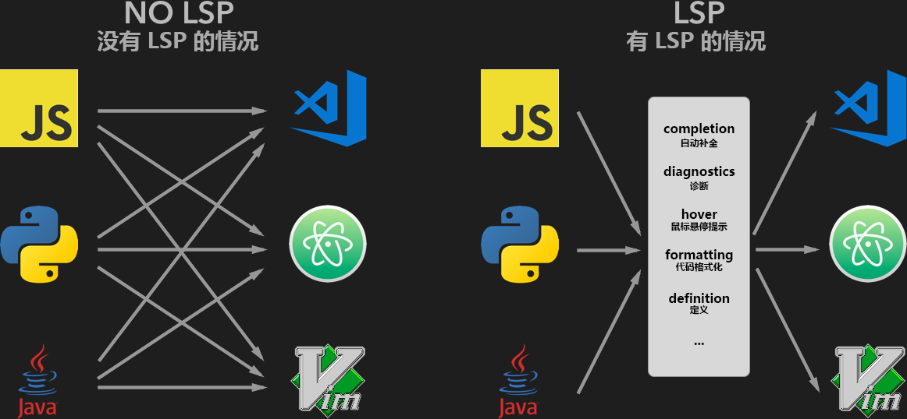
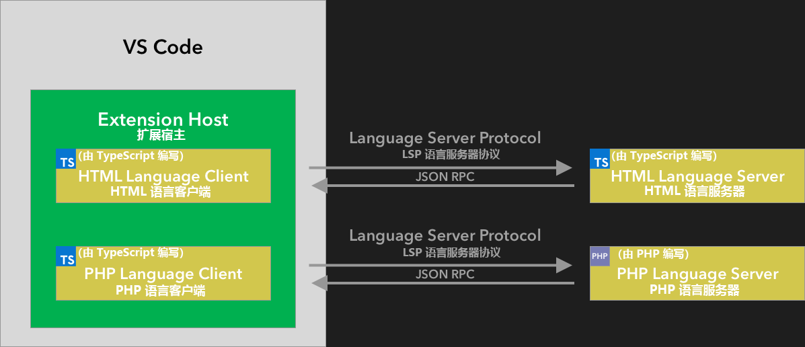
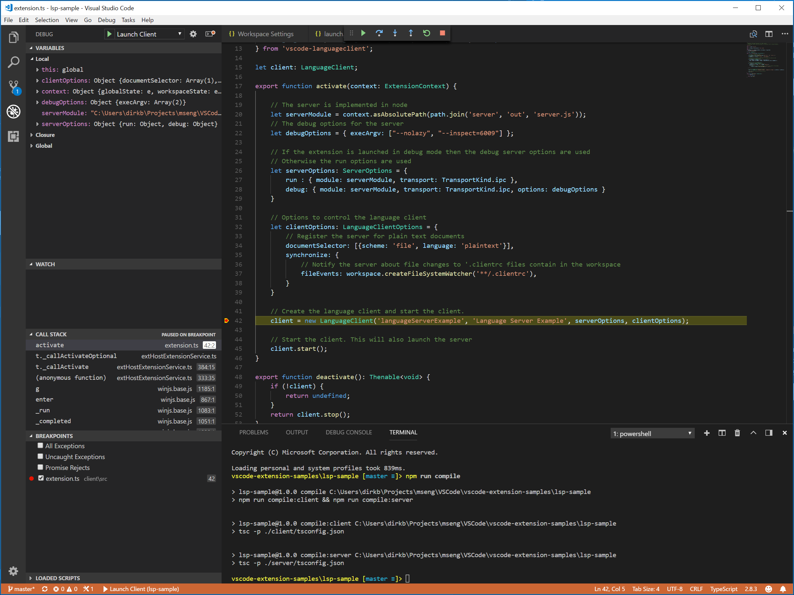
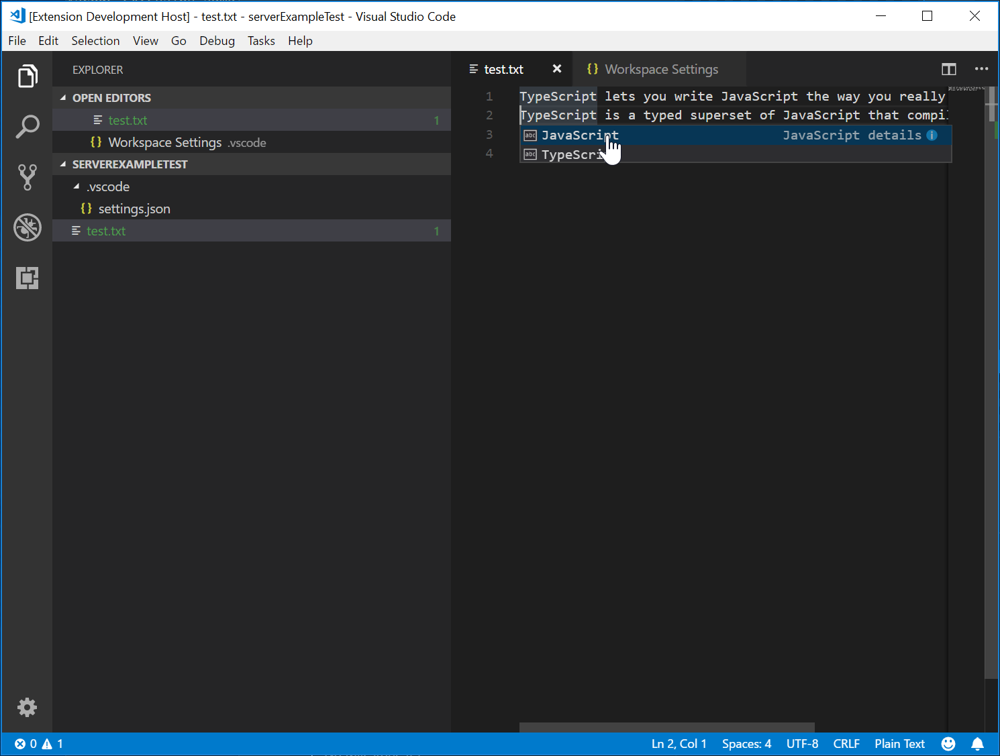

# 语言服务器扩展指导

[原文链接，戳我前往](https://code.visualstudio.com/api/language-extensions/language-server-extension-guide)

------

翻译 by [赫雯勒莉特翡翠](https://github.com/HeveraletLaidCenx)

## 术语~的对照表

|中文（常用英文表述）|英文|
|----|----|
|资源密集型|resource intensive|
|克隆【已经成为习惯的音译】|Clone|
|套件|suite|
|单元测试|Unit Test|
|断言|assert|

表中部分：

* 在中文表述中常直接用英文替代的
* 认为直译并不合适的

在中文之后的括号中说明了直接使用对应的英文。

------

## 概述

就像你在上一节： [编程型语言功能](6-扩展API-语言扩展-编程型语言功能.md) 文章中看到的那样，可以选择直接使用 `languages.*`（语言.*） API 来直接实现语言功能。

但——是——，语言服务器 也能做得到哟~

本文中包括：

* 解释了语言服务器扩展的优点。
* 带你用 [`Microsoft/vscode-languageserver-node`（Microsoft/vscode-语言服务器-node）](https://github.com/microsoft/vscode-languageserver-node) 库来构建一个语言服务器。你也可以直接转到 [LSP（语言服务器协议）的例子](https://github.com/microsoft/vscode-extension-samples/tree/main/lsp-sample) 来看看代码。

## 为啥要用 语言服务器？

语言服务器 是一类特殊的 **Visual Studio Code** 扩展，为许多编程语言提供编辑体验。

用语言服务器，可以实现：代码自动补全、错误检查（诊断）、转到定义，以及许多其它的 **VS Code** 支持的 [语言功能](6-扩展API-语言扩展-编程型语言功能.md) 。

然而，在 **VS Code** 中实现对语言功能的支持时，我们发现了 **三个常见的问题** ：

一，语言服务器通常是用他们的本地编程语言实现的，这给我们将它移植到 **VS Code** 中带来了挑战，**VS Code** 使用 Node.js runtime。

二，语言功能 可能是 资源密集型的。比如，为了正确地验证一个文件，语言服务器 需要 解析 大量文件，为它们建立 抽象语法树，并执行静态程序分析。这些操作可能会导致大量 CPU 和 内存占用，而我们需要确保 **VS Code** 的性能不受影响。

三，集成多种 代码编辑器 的 语言工具 需要付出巨大的努力。从 语言工具 的角度来看，它们需要适配具有不同 API 的 代码编辑器。而从 代码编辑器 的角度看，它们不能指望从 语言工具 获得任何统一的 API。这造成了要想在 `N` 编辑器中实现 `M` 语言支持，可能需要付出 `M * N` 倍的工作量。

为了解决这些问题，Microsoft ~~决定成为偶像~~ ，指定了 [LSP，Language Server Protocol，语言服务器协议](https://microsoft.github.io/language-server-protocol)。

LSP（语言服务器协议） 语言工具 和 编辑器 之间的通信进行了标准化。用这种方式，语言服务器 可以 以任何语言实现，并且运行在它们自己的进程中，避免干扰 VS Code 的性能表现。

此外，只要大家都遵循 LSP（语言服务器协议），那么任何 语言工具 都可以集成到 任何 代码编辑器 中，反之，任何 代码编辑器 也可以选择 任何 语言工具。

LSP（语言服务器协议）是一个 语言工具提供程序 和 代码编辑器供应者 的双赢！岂不美哉？



在本篇指导中，我们将：

* 解释如何用提供的 [Node SDK](https://github.com/microsoft/vscode-languageserver-node) 来在 **VS Code** 中构建一个 语言服务器扩展。
* 解释如何 运行、Debug、记录日志 和 测试 语言服务器扩展。
* 提供一些 语言服务器 相关的 高级文章。

## 实现语言服务器

在 **VS Code** 中，语言服务器由两部分组成：

* 语言客户端：一个用 JavaScript 或者 TypeScript 编写的普通 **VS Code** 扩展。这个扩展可以访问所有 [**VS Code** 命名空间 API](https://code.visualstudio.com/api/references/vscode-api) 。
* 语言服务器：一个在独立进程中运行的语言分析工具。

就像之前提到的一样，将 语言服务器 放在独立进程中运行有两个好处：

* 分析工具 可以以 任意语言实现，只要它可以遵循 LSP（语言服务器协议） ，能和 语言客户端 通信就行。
* 由于 语言分析工具 经常会占用大量 CPU 和 内存，所以将它们放在不同的进程中可以避免对性能的消耗。

以下是一个 **VS Code** 运行两个 语言服务器扩展 的图示。HTML 语言客户端 和 PHP 语言客户端 是由 TypeScript 编写的普通 **VS Code** 扩展。二者都实例化了一个对应的 语言服务器，并且通过 LSP（语言服务器协议） 与之通信。虽然 PHP 语言服务器 使用 PHP 语言编写的，但是它还是可以通过 LSP（语言服务器协议） 来和 语言客户端 沟通。



本篇指导会教你如何 用我们的 [Node SDK](https://github.com/microsoft/vscode-languageserver-node) 构建一个 语言服务器/客户端。之后的内容假设你已经熟悉了 **VS Code** 的 [扩展 API](https://code.visualstudio.com/api).

### LSP（语言服务器协议） 的例子 —— 一个用于纯文本文件的简单 语言服务器

让我们建立一个简单的 语言服务器 扩展，实现对 纯文本文件 的 自动补全 和 诊断。我们也会涵盖 客户端/服务器 之间的配置同步 的内容。

如果你打算直接查看本节内容的源代码的话，可以从以下链接跳转：

* **[LSP（语言服务器协议） 的例子](https://github.com/microsoft/vscode-extension-samples/tree/main/lsp-sample)** ：本篇指导的详细源代码。
* **[多服务器 LSP（语言服务器协议） 的例子](https://github.com/microsoft/vscode-extension-samples/tree/main/lsp-multi-server-sample)** ：详细的，前一个例子的升级版。它会为每个 工作区文件夹 启动不同的 语言服务器 实例，来支持 **VS Code** 的 [多根源工作区](https://code.visualstudio.com/docs/editor/multi-root-workspaces) 功能。

`Clone`（克隆） [Microsoft/vscode-extension-samples（Microsoft/VS Code 扩展示例）](https://github.com/microsoft/vscode-extension-samples) 仓库，然后打开例子：

```powershell
> git clone https://github.com/microsoft/vscode-extension-samples.git
> cd vscode-extension-samples/lsp-sample
> npm install
> npm run compile
> code .
```

以上代码安装了所有需要的 依赖，并打开了 包含 客户端 和 服务器 的 **lsp-sample**（LSP（语言服务器协议） 的例子） 工作区。以下是一个对这个工作区文件结构的粗略概述：

```json
.
├─ client // 语言客户端
│   ├─ src
│   │   ├─ test // 语言客户端/语言服务器 的 端到端 的测试
│   │   └─ extension.ts // 语言客户端 的 入口点
├─ package.json // 扩展的清单
└─ server // 语言服务器
    └─ src
        └─ server.ts // 语言服务器 的 入口点
```

### 解释 “语言客户端”

让我们首先看一眼 `/package.json` 这个文件，它描述了 语言客户端 的功能。这其中有三个有趣的部分：

首先来看 [`activationEvents`（激活事件）](https://code.visualstudio.com/api/references/activation-events):

```json
"activationEvents": [
    "onLanguage:plaintext"
]
```

这一节内容告诉了 **VS Code** ，一旦打开了 纯文本文件（比如扩展名是 `.txt` 的文件） 就激活 扩展。

然后看 [`configuration`（配置）](https://code.visualstudio.com/api/references/contribution-points#contributes.configuration) 这一节：

```json
"configuration": {
    "type": "object",
    "title": "Example configuration",
    "properties": {
        "languageServerExample.maxNumberOfProblems": {
            "scope": "resource",
            "type": "number",
            "default": 100,
            "description": "Controls the maximum number of problems produced by the server."
        }
    }
}
```

这一节建立了 `configuration`（配置） 作用点设置 到  **VS Code**。例子将会解释这些设置是如何 在 启动 和 每次更改设置时 被发送到 语言服务器 的。

实际的 语言客户端 源代码和对应的 `package.json` 文件在 `/client` 文件夹下。`/client/package.json` 文件中有趣的部分是：它通过 `engines`（引擎） 字段引用了 `vscode` 扩展宿主 API，并且添加了一个对 `vscode-languageclient`（vscode-语言客户端） 库 的 依赖：

```json
"engines": {
    "vscode": "^1.52.0"
},
"dependencies": {
    "vscode-languageclient": "^7.0.0"
}
```

就像前文提及的那样，语言客户端 是以一个普通的 **VS Code** 扩展实现的，并且拥有对所有 **VS Code** 命名空间 API 的访问权限。

下面是对应的 `extension.ts` 文件 的内容，也是 **lsp-sample**（LSP（语言服务器协议） 的例子） 扩展的入口点：

```typescript
import * as path from 'path';
import { workspace, ExtensionContext } from 'vscode';

import {
  LanguageClient,
  LanguageClientOptions,
  ServerOptions,
  TransportKind
} from 'vscode-languageclient/node';

let client: LanguageClient;

export function activate(context: ExtensionContext) {
  // 服务器 在 node 中实现
  let serverModule = context.asAbsolutePath(path.join('server', 'out', 'server.js'));
  // 服务器 的 Debug 选项
  // --inspect=6009：服务器 将运行在 Node 的检查器模式下，这样 VS Code 就能连接到 服务器 来 Debug 啦
  let debugOptions = { execArgv: ['--nolazy', '--inspect=6009'] };

  // 如果 扩展 以 Debug模式 运行，那么 Debug服务器选项 将会被使用
  // 除此之外将使用 运行选项
  let serverOptions: ServerOptions = {
    run: { module: serverModule, transport: TransportKind.ipc },
    debug: {
      module: serverModule,
      transport: TransportKind.ipc,
      options: debugOptions
    }
  };

  // 用来控制 语言客户端 的选项
  let clientOptions: LanguageClientOptions = {
    // 注册 用于纯文本文档的服务器
    documentSelector: [{ scheme: 'file', language: 'plaintext' }],
    synchronize: {
      // 将工作区中包含的 .clientrc 扩展名的文件 的 文件变化 告知 服务器
      fileEvents: workspace.createFileSystemWatcher('**/.clientrc')
    }
  };

  // 创建 语言客户端 并启动它
  client = new LanguageClient(
    'languageServerExample',
    'Language Server Example',
    serverOptions,
    clientOptions
  );

  // 启动 客户端。这也会同时启动 服务器
  client.start();
}

export function deactivate(): Thenable<void> | undefined {
  if (!client) {
    return undefined;
  }
  return client.stop();
}
```

### 解释 “语言服务器”

> **注意：** 从 GitHub `Clone`（克隆） 的 服务器的实现，是最终版实现。要想跟随之后的教程一步一步来的话，你可以创建一个新的 `server.ts` ，或者修改 `Clone`（克隆）的版本的内容。

在这个例子中，服务器 也是使用 TypeScript 语言实现的，并且使用 Node.js 来执行。因为 **VS Code** 已经内置了一个 Node.js runtime，所以就不用你自己再来提供一个啦，除非你对 runtime 有特殊的要求。

语言服务器 的源代码在 `/server` 文件夹中。服务器的 `package.json` 文件中，有趣的部分是：

```json
"dependencies": {
    "vscode-languageserver": "^7.0.0",
    "vscode-languageserver-textdocument": "^1.0.1"
}
```

这会拉取 `vscode-languageserver`（vscode-语言服务器） 库。

下面是一个 服务器 的实现，它会使用提供的 简单的文本文档管理器，通过 始终将完整文件内容从 **VS Code** 发送到 服务器 来保持文本文档的同步。

```typescript
import {
  createConnection,
  TextDocuments,
  Diagnostic,
  DiagnosticSeverity,
  ProposedFeatures,
  InitializeParams,
  DidChangeConfigurationNotification,
  CompletionItem,
  CompletionItemKind,
  TextDocumentPositionParams,
  TextDocumentSyncKind,
  InitializeResult
} from 'vscode-languageserver/node';

import { TextDocument } from 'vscode-languageserver-textdocument';

// 用 Node 的 IPC（Inter-Process Communication，进程间通信） 作为传输方式为 服务器 创建连接
// 还包括所有 预览/建议 的 LSP（语言服务器协议） 功能
let connection = createConnection(ProposedFeatures.all);

// 创建一个简单的文本文档管理器
let documents: TextDocuments<TextDocument> = new TextDocuments(TextDocument);

let hasConfigurationCapability: boolean = false;
let hasWorkspaceFolderCapability: boolean = false;
let hasDiagnosticRelatedInformationCapability: boolean = false;

connection.onInitialize((params: InitializeParams) => {
  let capabilities = params.capabilities;

  // 客户端支不支持 `workspace/configuration`（工作区/配置） 请求呢？
  // 如果不支持的话，我们将使用全局设置作为备选方案。
  hasConfigurationCapability = !!(
    capabilities.workspace && !!capabilities.workspace.configuration
  );
  hasWorkspaceFolderCapability = !!(
    capabilities.workspace && !!capabilities.workspace.workspaceFolders
  );
  hasDiagnosticRelatedInformationCapability = !!(
    capabilities.textDocument &&
    capabilities.textDocument.publishDiagnostics &&
    capabilities.textDocument.publishDiagnostics.relatedInformation
  );

  const result: InitializeResult = {
    capabilities: {
      textDocumentSync: TextDocumentSyncKind.Incremental,
      // 告诉 客户端，这个 服务器 支持 代码自动补全。
      completionProvider: {
        resolveProvider: true
      }
    }
  };
  if (hasWorkspaceFolderCapability) {
    result.capabilities.workspace = {
      workspaceFolders: {
        supported: true
      }
    };
  }
  return result;
});

connection.onInitialized(() => {
  if (hasConfigurationCapability) {
    // 为所有的配置改变进行注册。
    connection.client.register(DidChangeConfigurationNotification.type, undefined);
  }
  if (hasWorkspaceFolderCapability) {
    connection.workspace.onDidChangeWorkspaceFolders(_event => {
      connection.console.log('Workspace folder change event received.');
    });
  }
});

// 示例设置
interface ExampleSettings {
  maxNumberOfProblems: number;
}

// 当 客户端 不支持 `workspace/configuration`（工作区/配置） 请求时，使用全局设置。
// 请注意！！！本例中提供的 客户端 与 服务器 不是这种情况
// 但是这种情况可能会发生在 别的客户端 上！
const defaultSettings: ExampleSettings = { maxNumberOfProblems: 1000 };
let globalSettings: ExampleSettings = defaultSettings;

// 缓存所有打开的文档的设置
let documentSettings: Map<string, Thenable<ExampleSettings>> = new Map();

connection.onDidChangeConfiguration(change => {
  if (hasConfigurationCapability) {
    // R重置所有缓存的文档设置
    documentSettings.clear();
  } else {
    globalSettings = <ExampleSettings>(
      (change.settings.languageServerExample || defaultSettings)
    );
  }

  // 重新验证所有打开的文本文档
  documents.all().forEach(validateTextDocument);
});

function getDocumentSettings(resource: string): Thenable<ExampleSettings> {
  if (!hasConfigurationCapability) {
    return Promise.resolve(globalSettings);
  }
  let result = documentSettings.get(resource);
  if (!result) {
    result = connection.workspace.getConfiguration({
      scopeUri: resource,
      section: 'languageServerExample'
    });
    documentSettings.set(resource, result);
  }
  return result;
}

// 只保留 打开的文档 的设置
documents.onDidClose(e => {
  documentSettings.delete(e.document.uri);
});

// 当 文本文档 的内容发生改变时，触发这个事件。
// 当 文本文档 首次被打开 或者 当它的内容发生改变时。
documents.onDidChangeContent(change => {
  validateTextDocument(change.document);
});

async function validateTextDocument(textDocument: TextDocument): Promise<void> {
  // 在这个简单的例子中，我们得到了每个 验证运行 的设置
  let settings = await getDocumentSettings(textDocument.uri);

  // 验证器 为 所有长度大于 2 的大写字母单词创建诊断程序
  let text = textDocument.getText();
  let pattern = /\b[A-Z]{2,}\b/g;
  let m: RegExpExecArray | null;

  let problems = 0;
  let diagnostics: Diagnostic[] = [];
  while ((m = pattern.exec(text)) && problems < settings.maxNumberOfProblems) {
    problems++;
    let diagnostic: Diagnostic = {
      severity: DiagnosticSeverity.Warning,
      range: {
        start: textDocument.positionAt(m.index),
        end: textDocument.positionAt(m.index + m[0].length)
      },
      message: `${m[0]} is all uppercase.`,
      source: 'ex'
    };
    if (hasDiagnosticRelatedInformationCapability) {
      diagnostic.relatedInformation = [
        {
          location: {
            uri: textDocument.uri,
            range: Object.assign({}, diagnostic.range)
          },
          message: 'Spelling matters'
        },
        {
          location: {
            uri: textDocument.uri,
            range: Object.assign({}, diagnostic.range)
          },
          message: 'Particularly for names'
        }
      ];
    }
    diagnostics.push(diagnostic);
  }

  // 将计算出的 诊断内容 发送给 VS Code。
  connection.sendDiagnostics({ uri: textDocument.uri, diagnostics });
}

connection.onDidChangeWatchedFiles(_change => {
  // 在 VS Code 中监控的文件有变化。
  connection.console.log('We received a file change event');
});

// 这个 处理程序 提供了 代码自动补全项目 的 初始列表。
connection.onCompletion(
  (_textDocumentPosition: TextDocumentPositionParams): CompletionItem[] => {
    // 传递参数 包含了 要求 自动补完代码 的文本文件的位置。在这个例子里，我们忽略了这个信息，始终提供同样的 代码自动补全项目 
    return [
      {
        label: 'TypeScript',
        kind: CompletionItemKind.Text,
        data: 1
      },
      {
        label: 'JavaScript',
        kind: CompletionItemKind.Text,
        data: 2
      }
    ];
  }
);

// 这个 处理程序 解决了 在 代码自动补全列表中所选项目的额外信息。
connection.onCompletionResolve(
  (item: CompletionItem): CompletionItem => {
    if (item.data === 1) {
      item.detail = 'TypeScript details';
      item.documentation = 'TypeScript documentation';
    } else if (item.data === 2) {
      item.detail = 'JavaScript details';
      item.documentation = 'JavaScript documentation';
    }
    return item;
  }
);

// 让 文本文档管理器 监听连接中的 打开、更改、关闭 文档事件。
documents.listen(connection);

// 监听连接
connection.listen();
```

### 添加一个简单的验证

为了向 服务器 添加 文档验证，我们向 文本文档管理器 添加了一个 监听器。该监听器会在 每次文档的内容发生改变时 被调用，传递到 服务器，决定 何时是验证文档 的最佳时机。在例子的实现中，服务器 验证 纯文本文档，并将所有 全部大写的单词 进行标记。对应的代码片段如下：

```typescript
// 文本文档 的内容发生变化。这个事件会在 文本文档 首次打开时 和 内容被更改 时触发。
documents.onDidChangeContent(async change => {
  let textDocument = change.document;
  // 在这个简单的例子中，我们得到了每个 验证运行 的设置
  let settings = await getDocumentSettings(textDocument.uri);

  // 验证器 为 所有长度大于等于 2 的大写单词 创建 诊断
  let text = textDocument.getText();
  let pattern = /\b[A-Z]{2,}\b/g;
  let m: RegExpExecArray | null;

  let problems = 0;
  let diagnostics: Diagnostic[] = [];
  while ((m = pattern.exec(text)) && problems < settings.maxNumberOfProblems) {
    problems++;
    let diagnostic: Diagnostic = {
      severity: DiagnosticSeverity.Warning,
      range: {
        start: textDocument.positionAt(m.index),
        end: textDocument.positionAt(m.index + m[0].length)
      },
      message: `${m[0]} is all uppercase.`,
      source: 'ex'
    };
    if (hasDiagnosticRelatedInformationCapability) {
      diagnostic.relatedInformation = [
        {
          location: {
            uri: textDocument.uri,
            range: Object.assign({}, diagnostic.range)
          },
          message: 'Spelling matters'
        },
        {
          location: {
            uri: textDocument.uri,
            range: Object.assign({}, diagnostic.range)
          },
          message: 'Particularly for names'
        }
      ];
    }
    diagnostics.push(diagnostic);
  }

  // 将计算出的 诊断 发送给 VS Code。
  connection.sendDiagnostics({ uri: textDocument.uri, diagnostics });
});
```

### 诊断 的 提示 和 小技巧

* 如果 开始 和 结束 的位置相同的话，**VS Code** 将在该位置把单词添加 下划线和波浪线。
* 如果你想用 下划线和波浪线 直到该行的结尾，那么将 结束 位置的字符设置为：`Number.MAX_VALUE`（数字.最大值）。

要运行 语言服务器 的话，遵循以下步骤：

* 按下 `Ctrl + Shift + B` 组合键来启动 构建 任务。该任务会编译 客户端 和 服务器。
* 打开 **Run（运行）** 视图，选择 **Launch Client（启动客户端）** 启动配置，然后点击 **Start Debugging（开始 Debug）** 按钮来启动一个 **VS Code** 附加的 **Extension Development Host（扩展开发宿主）** 实例 来执行扩展代码。
* 在 根文件夹 创建一个 `test.txt` 文件，然后向其中粘贴以下内容：

```Text
TypeScript lets you write JavaScript the way you really want to.
TypeScript is a typed superset of JavaScript that compiles to plain JavaScript.
ANY browser. ANY host. ANY OS. Open Source.

【
TypeScript 让你以你真正想要的方式编写JavaScript。
TypeScript 是一个类型化的 JavaScript 超集，可以编译成普通的 JavaScript。
任何 浏览器。任何 宿主。任何 OS（操作系统）。开源。】
```

然后 **Extension Development Host（扩展开发宿主）** 实例将会像下边这样：


### Debug 客户端 和 服务器

Debug 客户端 的代码就像 Debug 普通的扩展一样容易。在 客户端 代码中设置 断点，然后按 `F5` 来进行 Debug。



因为 服务器 是由 运行在 客户端扩展 中的 `LanguageClient`（语言客户端） 启动的，所以我们需要向运行的 服务器 上添加一个 调试器。

要做到这点的话，切换到 Run（运行） 视图，然后选择 **Attach to Server**（添加到服务器） 启动配置，之后按下 `F5`。这就会将 调试器 添加到 服务器 啦~


### 语言服务器 的 日志支持

如果你是用 `vscode-languageclient`（vscode-语言客户端） 来实现客户端的话，你可以指定一个设置 `[langId].trace.server`（[语言ID.跟踪.服务器]） ，这将会让 客户端 将 语言服务器/语言客户端 之间的通信 的日志记录到 语言客户端 的 `name`（名称） 频道。

对于 **lsp-sample**（LSP（语言服务器协议） 的例子），你可以进行如下设置： `"languageServerExample.trace.server": "verbose"`（"语言服务器例子.跟踪.服务器": "日志"）。现在去看看 `Language Server Example`（语言服务器例子） 频道，你应该会看到这样的日志记录：


### 在 语言服务器 中使用 配置设置

在我们编写扩展的 客户端 部分时，已经定义了一个用来控制 报告的最大问题数 的设置。那么在 服务器 那边也写下用来从 客户端 读取这些设置的代码吧：

```typescript
function getDocumentSettings(resource: string): Thenable<ExampleSettings> {
  if (!hasConfigurationCapability) {
    return Promise.resolve(globalSettings);
  }
  let result = documentSettings.get(resource);
  if (!result) {
    result = connection.workspace.getConfiguration({
      scopeUri: resource,
      section: 'languageServerExample'
    });
    documentSettings.set(resource, result);
  }
  return result;
}
```

现在我们唯一要做的事情就是 监听 服务器 端的 配置变化。一旦社改变了，就重新验证打开的 文本文档。要想能重用：文档改变 事件的处理 的 验证逻辑，我们将代码提取到一个 `validateTextDocument`（验证文本文档） 函数中，并且编辑它来支持一个 `maxNumberOfProblems`（最大问题数） 变量：

```typescript
async function validateTextDocument(textDocument: TextDocument): Promise<void> {
  // 在这个简单的例子中，我们得到了每个 验证运行 的设置
  let settings = await getDocumentSettings(textDocument.uri);

  // 验证器 为 所有长度大于等于 2 的大写单词 创建 诊断
  let text = textDocument.getText();
  let pattern = /\b[A-Z]{2,}\b/g;
  let m: RegExpExecArray | null;

  let problems = 0;
  let diagnostics: Diagnostic[] = [];
  while ((m = pattern.exec(text)) && problems < settings.maxNumberOfProblems) {
    problems++;
    let diagnostic: Diagnostic = {
      severity: DiagnosticSeverity.Warning,
      range: {
        start: textDocument.positionAt(m.index),
        end: textDocument.positionAt(m.index + m[0].length)
      },
      message: `${m[0]} is all uppercase.`,
      source: 'ex'
    };
    if (hasDiagnosticRelatedInformationCapability) {
      diagnostic.relatedInformation = [
        {
          location: {
            uri: textDocument.uri,
            range: Object.assign({}, diagnostic.range)
          },
          message: 'Spelling matters'
        },
        {
          location: {
            uri: textDocument.uri,
            range: Object.assign({}, diagnostic.range)
          },
          message: 'Particularly for names'
        }
      ];
    }
    diagnostics.push(diagnostic);
  }

  // 将计算出的 诊断 发送给 VS Code。
  connection.sendDiagnostics({ uri: textDocument.uri, diagnostics });
}
```

处理 配置更改 是通过 向连接添加一个 配置更改的通知处理程序 来实现的。对应代码如下：

```typescript
connection.onDidChangeConfiguration(change => {
  if (hasConfigurationCapability) {
    // 重置所有缓存的 文档设置
    documentSettings.clear();
  } else {
    globalSettings = <ExampleSettings>(
      (change.settings.languageServerExample || defaultSettings)
    );
  }

  // 重新验证所有打开的 文本文档
  documents.all().forEach(validateTextDocument);
});
```

再次启动 客户端，并将设置更改为最多只报告1个问题，验证结果如下：


### 添加额外的语言功能

语言服务器通常第一个实现的有趣的功能是 对文档的验证。从这种意义上来说，即使是个 linter，也可以被看成是 语言服务器。而在 **VS Code** 中，linter 通常也正是作为 语言服务器 来实现的（比如 [eslint](https://github.com/microsoft/vscode-eslint) 和 [jshint](https://github.com/microsoft/vscode-jshint) ）。

但是 语言服务器 可不止这点内容。

代码自动补全、查找所有引用、跳转到定义……这些都可以做到哟~

下面的例子，向 语言服务器 添加了 代码自动补全。It proposes the two words 'TypeScript' and 'JavaScript'.

```typescript
// 这个 处理程序（下边这个函数） 提供了 自动补全项目 的初始列表。
connection.onCompletion(
  (_textDocumentPosition: TextDocumentPositionParams): CompletionItem[] => {
    // 传递的参数含有 请求自动补全代码的文本文档的位置。在这个例子中，我们忽略这个信息，总是提供相同的 自动补全项目。
    return [
      {
        label: 'TypeScript',
        kind: CompletionItemKind.Text,
        data: 1
      },
      {
        label: 'JavaScript',
        kind: CompletionItemKind.Text,
        data: 2
      }
    ];
  }
);

// 这个 处理程序（下边这个函数） 解决了 在自动补全列表中被选中项目的额外信息
connection.onCompletionResolve(
  (item: CompletionItem): CompletionItem => {
    if (item.data === 1) {
      item.detail = 'TypeScript details';
      item.documentation = 'TypeScript documentation';
    } else if (item.data === 2) {
      item.detail = 'JavaScript details';
      item.documentation = 'JavaScript documentation';
    }
    return item;
  }
);
```

其中， `data` 属性是用来 在解析处理程序中唯一标识一个自动补全项目 的。对于 协议 来说，`data` 属性是公开透明的。因为 底层消息传递协议 是基于 JSON 的，所以 `data` 属性应该是 JSON 序列化的格式，或者是可以被序列化成 JSON 格式的数据。

现在所需的就只是 告诉 **VS Code** ，语言服务器 支持 代码自动补全请求 了。要做到这点的话，在 初始化处理程序 中，标记对应的功能：

```typescript
connection.onInitialize((params): InitializeResult => {
    ...
    return {
        capabilities: {
            ...
            // 告诉 语言客户端，语言服务器 支持 代码自动补全
            completionProvider: {
                resolveProvider: true
            }
        }
    };
});
```

以下的截图展示了 纯文本文件 中运行的 代码自动补全功能：



### 测试语言服务器

要想创建一个 高质量的语言服务器 的话，我们需要构建一个 优秀的、涵盖了语言服务器的所有功能的 测试套件。

通常来说，有两种 测试语言服务器 的方法：

* 单元测试：当你想通过 模拟所有 发送给语言服务器中的某个特定的功能的信息 来测试它的时候，这个测试将很有用。**VS Code** 的 [HTML](https://github.com/microsoft/vscode-html-languageservice) / [CSS](https://github.com/microsoft/vscode-css-languageservice) / [JSON](https://github.com/microsoft/vscode-json-languageservice) 语言服务器 就采用这种方式进行测试。LSP（语言服务器协议） 的 npm 模块也使用这种方法。可以到 [这里](https://github.com/microsoft/vscode-languageserver-node/blob/main/protocol/src/node/test/connection.test.ts) 看看用 npm 协议模块 编写的 单元测试。
* 端到端测试：这个测试和 [**VS Code** 扩展测试](https://code.visualstudio.com/api/working-with-extensions/testing-extension) 类似。这种方式的好处是，它通过实例化一个 带有工作区的 **VS Code** 实例、打开文件、激活 语言客户端/服务器、运行 [**VS Code** 命令](https://code.visualstudio.com/api/references/commands) 来进行测试。如果你有难以模拟的 文件、设置 或者 依赖（比如 `node_modules`）的话，这个方法就很好用啦~很流行的 [Python](https://github.com/microsoft/vscode-python) 扩展就是用这种方法进行测试的。

因为 单元测试 在你选择的任何 测试框架 中都是可行的，所以这里我们着重解释一下 语言服务器扩展 的 端到端测试。

打开 `.vscode/launch.json` 文件，然后你可以找到一个 `E2E` 测试目标：

```json
{
  "name": "Language Server E2E Test",
  "type": "extensionHost",
  "request": "launch",
  "runtimeExecutable": "${execPath}",
  "args": [
    "--extensionDevelopmentPath=${workspaceRoot}",
    "--extensionTestsPath=${workspaceRoot}/client/out/test/index",
    "${workspaceRoot}/client/testFixture"
  ],
  "outFiles": ["${workspaceRoot}/client/out/test/**/*.js"]
}
```

如果你运行这个 Debug目标，它将会启动一个 以 `client/testFixture`（客户端/测试装置） 为活跃工作区 的 **VS Code** 实例。然后 **VS Code** 会开始执行 `client/src/test`（客户端/源/测试） 中的所有测试。

Debug 小技巧：你可以在 `client/src/test`（客户端/源/测试） 的 TypeScript 文件中设置断点，然后断点会被命中。

让我们来看看 `completion.test.ts`（自动补全.测试.ts） 文件：

```typescript
import * as vscode from 'vscode';
import * as assert from 'assert';
import { getDocUri, activate } from './helper';

suite('Should do completion', () => {
  const docUri = getDocUri('completion.txt');

  test('Completes JS/TS in txt file', async () => {
    await testCompletion(docUri, new vscode.Position(0, 0), {
      items: [
        { label: 'JavaScript', kind: vscode.CompletionItemKind.Text },
        { label: 'TypeScript', kind: vscode.CompletionItemKind.Text }
      ]
    });
  });
});

async function testCompletion(
  docUri: vscode.Uri,
  position: vscode.Position,
  expectedCompletionList: vscode.CompletionList
) {
  await activate(docUri);

  // 运行 `vscode.executeCompletionItemProvider`（vscode.执行自动补全项目提供程序） 命令 来模拟触发自动补全
  const actualCompletionList = (await vscode.commands.executeCommand(
    'vscode.executeCompletionItemProvider',
    docUri,
    position
  )) as vscode.CompletionList;

  assert.ok(actualCompletionList.items.length >= 2);
  expectedCompletionList.items.forEach((expectedItem, i) => {
    const actualItem = actualCompletionList.items[i];
    assert.equal(actualItem.label, expectedItem.label);
    assert.equal(actualItem.kind, expectedItem.kind);
  });
}
```

在这个测试中，我们：

* 激活了扩展
* 以 1个URI 和 1个位置 为参数，运行了 `vscode.executeCompletionItemProvider`（vscode.执行自动补全项目提供程序） 命令，来模拟 自动补全的触发器。
* 根据 我们预期的自动补全项目 来 断言 返回的自动补全项目。

让我们更深入地看看 `activate(docURI)`（激活(文档URI)） 函数。它是在 `client/src/test/helper.ts`（客户端/源/测试/助手.ts） 中定义的：

```typescript
import * as vscode from 'vscode';
import * as path from 'path';

export let doc: vscode.TextDocument;
export let editor: vscode.TextEditor;
export let documentEol: string;
export let platformEol: string;

// 激活 vscode.lsp-sample 扩展（也就是本次的例子）
export async function activate(docUri: vscode.Uri) {
  // extensionId 是 package.json 中的 `publisher.name`
  const ext = vscode.extensions.getExtension('vscode-samples.lsp-sample')!;
  await ext.activate();
  try {
    doc = await vscode.workspace.openTextDocument(docUri);
    editor = await vscode.window.showTextDocument(doc);
    await sleep(2000); // 等待 服务器激活
  } catch (e) {
    console.error(e);
  }
}

async function sleep(ms: number) {
  return new Promise(resolve => setTimeout(resolve, ms));
}
```

在激活部分，我们：

* 用 `{publisher.name}.{extensionId}`（{发布者.名称}.{扩展ID}） 获取了 `package.json` 中定义的扩展。
* 打开了指定的文档，并将它显示在 一个活跃的文本编辑器 中。
* 等待 2 秒，这样我们就能确保 语言服务器 已经实例化完成了

准备好之后，我们就可以运行每个语言功能对应的 [**VS Code** 命令](https://code.visualstudio.com/api/references/commands) 啦，并且根据返回的结果来 断言。

还有一项测试涵盖了我们刚才实现的诊断功能。可以到 `client/src/test/diagnostics.test.ts`（客户端/源/测试/诊断.测试.ts）中查看它~

## 高级内容

到目前为止，本篇指导涵盖了：

* 对 语言服务器 和 LSP（语言服务器协议） 的简要概述。
* **VS Code** 中 语言服务器扩展 的结构。
* **lsp-sample**（LSP（语言服务器协议）的例子） 扩展，以及如何 开发/Debug/检查/测试 它。

还有一些高级内容我们难以在本篇指导中涵盖。我们将提供这些资源的链接，让你能更深入地学习语言服务器开发。

### 其它 语言服务器功能

除了 代码自动完成以外，语言服务器 目前还支持以下语言功能：

* *文档高亮*：高亮 文本文档中所有 'equal'（符合条件的） 符号。
* *鼠标悬停提示*：提供对于 文本文档中被选中的符号 的 鼠标悬停提示信息。
* *签名帮助*：提供对于 文本文档中被选中的符号 的 签名帮助。
* *转到定义*：提供对于 文本文档中被选中的符号 的 转到定义 的支持。
* *转到类型定义*：提供对于 文本文档中被选中的符号 的 转到 类型/接口 定义 的支持。
* *转到实现*：提供对于 文本文档中被选中的符号 的 转到 实现定义 的支持。
* *查找引用*：查找 文本文档中被选中的符号 的 所有引用。
* *列出文档符号*：列出 文本文档中定义的 所有符号。
* *列出工作区符号*：列出所有 项目范围内的 符号。
* *代码操作*：对于给定的 文本文档 和 范围，计算要运行的命令 （通常是 美化/重构）。
* *CodeLens*：计算 给定文本文档 的 CodeLens 统计信息。
* *文档格式化*：包括对 整个文档、文档范围 和 类型 的格式化。
* *重命名*：项目范围内对于某个符号的重命名。
* *文档链接*：计算并解析文档中的链接。
* *文档颜色*：计算并解析文档中的颜色，以在编辑器中提供颜色选择器。

[编程型语言功能](6-扩展API-语言扩展-编程型语言功能.md) 文章中描述了以上每项语言功能，以及如何 通过语言服务器 或者 直接从你的扩展使用扩展API 来 实现它们。

### 增量文本文档同步

我们的例子使用一个 由 `vscode-languageserver`（vscode-语言服务器） 提供的 简单的文本文档管理器，以此来在 **VS Code** 和 语言服务器 之间同步文档。

这有两个缺点：

* 由于每次都是将整个文档的内容传送到服务器，所以传送了大量重复的数据。
* 如果使用了一个现有的语言库，这种库通常支持 增量文档更新，来避免 不必要的解析 和 创建抽象语法树。

因此，协议也支持 增量文档同步。

要使用 增量文档同步 的话，服务器需要安装 3个 通知处理程序：

* *onDidOpenTextDocument*（当打开文本文档时...）：会在 **VS Code** 中打开文本文档时被调用。
* *onDidChangeTextDocument*（当文本文档更改时...）：会在 **VS Code** 中打开的文本文档的内容发生改变时被调用。
* *onDidCloseTextDocument*（当关闭文本文档时...）：会在 **VS Code** 关闭文本文档时被调用。

下面的代码片段展示了如何将这些 通知处理程序 挂接到连接，以及如何在初始化时返回正确的功能：

```typescript
connection.onInitialize((params): InitializeResult => {
    ...
    return {
        capabilities: {
            // 启用增量文档同步
            textDocumentSync: TextDocumentSyncKind.Incremental,
            ...
        }
    };
});

connection.onDidOpenTextDocument((params) => {
    // VS Code 打开 文本文档。
    // params.uri 唯一标识这个文档。对于存储在本地存储设备中的文档，它是个 文件URI。
    // params.text 会初始化文档的全部内容。
});

connection.onDidChangeTextDocument((params) => {
    // VS Code 中打开的 文本文档 的内容发生了变化。
    // params.uri 唯一标识这个文档。
    // params.contentChanges 描述了文档中发生更改的内容。
});

connection.onDidCloseTextDocument((params) => {
    // VS Code 关闭文本文档
    // params.uri 唯一标识这个文档。
});
```

### 直接使用 **VS Code** API 来实现语言功能

虽然 语言服务器 有很多优点，但是这并不是实现 扩展 **VS Code** 编辑功能的唯一选择。如果你想添加某种文档的简单语言功能的话，也可以考虑使用 `vscode.languages.register[LANGUAGE_FEATURE]Provider`（vscode.语言.注册[语言功能]提供程序） 。

这里有一个 用 `vscode.languages.registerCompletionItemProvider`（vscode.语言.注册自动补全项目提供程序） 来实现 添加对文本文档 的一些片段自动补全的例子：[`completions-sample`（代码自动补全的例子）](https://github.com/microsoft/vscode-extension-samples/tree/main/completions-sample) 。

展示 **VS Code** API 用法的更多例子请参阅 [这里](https://github.com/microsoft/vscode-extension-samples) 。

### 语言服务器 的 容错解析器

多数情况下，编辑器中的代码并不完整，语法可能也有错误，但是在这种情况下，开发者仍然希望 自动补全 和 其它语言功能可以生效。因此，语言服务器 需要一个 容错解析器：解析器从已经完成的部分代码中生成有意义的 AST（抽象语法树） ，然后 语言服务器 根据这个 AST（抽象语法树） 提供语言功能。

当我们 改善 **VS Code** 中的 PHP 支持时，我们意识到官方的 PHP 解析器并没有容错，不能直接在 语言服务器 中重用。因此，我们 建立了 [Microsoft/tolerant-php-parser](https://github.com/microsoft/tolerant-php-parser) 这个 Repo，并且在其中留下了详细的 [注释](https://github.com/microsoft/tolerant-php-parser/blob/master/docs/HowItWorks.md) ，期望这可以帮助到 想要实现容错解析器的语言服务器作者。

## 常见问题

> 当我尝试连接到服务器时，报了一个 "cannot connect to runtime process (timeout after 5000 ms)"（不能连接到 runtime 进程（5000ms 后超时））的错？

如果在你尝试连接调试器的时候，服务器没在运行的话，你就会看到这样的报错。语言服务器 是由 语言客户端 启动的，因此请确保 您已经启动了语言客户端。你也可能需要查一下在 语言客户端 中，启动语言服务器之前，是否有设置断点，如果有，你可能需要禁用这些断点。

> 我已经通读了 本篇指导 和 [LSP（语言服务器协议） 说明](https://microsoft.github.io/language-server-protocol/) ，但是仍然有没解决的问题，我能从哪儿获得帮助呢？

请在 [这里](https://github.com/microsoft/language-server-protocol) 提出一个 Issue。