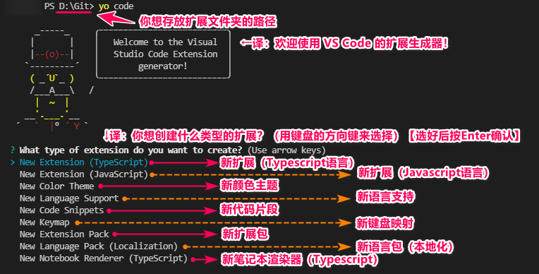
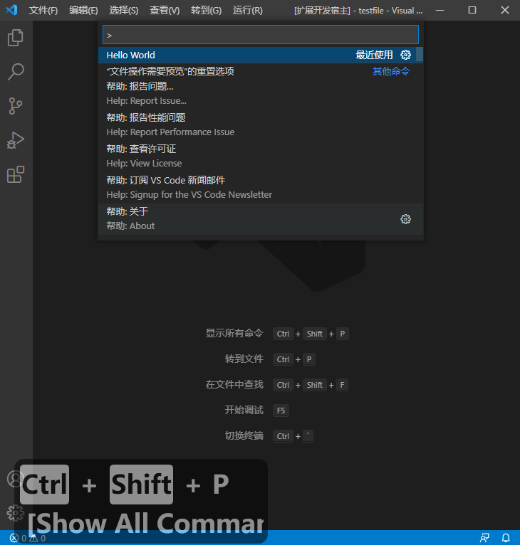
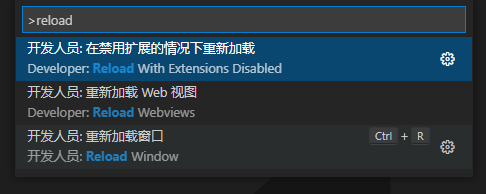
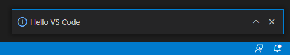
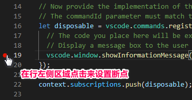
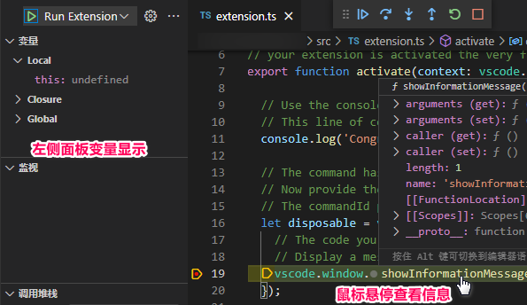
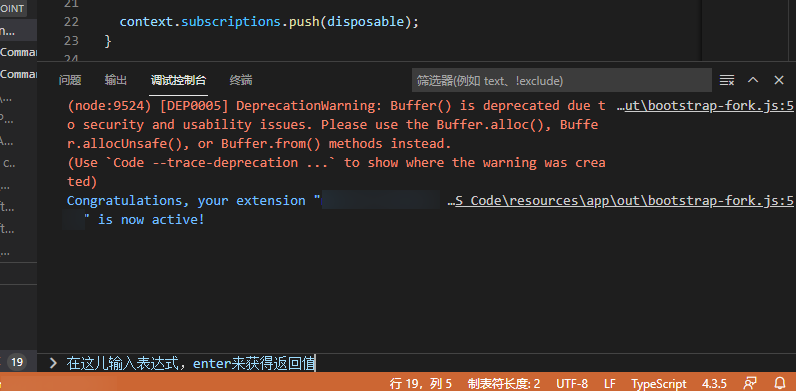

# 你的第一个扩展

[原文链接，戳我前往](https://code.visualstudio.com/api/get-started/your-first-extension)

------

翻译 by [赫雯勒莉特翡翠](https://github.com/HeveraletLaidCenx)

## 术语~的对照表

|中文（常用英文表述）|英文|
|----|----|
|Node包管理工具（npm）|Node package manager|
|基于框架搭建、脚手架|scaffold|
|【*非常规释义】建立|contribute|
|清单|manifest|
|静态|static|
|声明|declarations|
|按键绑定|keybindings|
|断点|breakpoints|
|行号槽、装订线|gutter|
|命中断点|hit the breakpoint|
|值|value|
|对……求值|evaluate|
|表达式|expressions|
|应用程序（App）|applications|
|源代码|source code|

表中部分：

* 在中文表述中常直接用英文替代的
* 认为直译并不合适的

在中文之后的括号中说明了直接使用对应的英文。

*：包括上一章的 `Contribution Points`，查找了尽可能多的资料但是感觉在语境下无法准确契合，这种表达方式似乎只在 **VS Code** 里使用，上一章取 `contribution` 的 `出力` 的引申义组合成释义 `作用点` ，但是这章突然又来了个动词形式 `contribute` …… `贡献` 的意思似乎仍然不合适，亦没有在 **VS Code** 相关内容中找到相关词、词组的设定缘由或意思说明，故根据语境取了 **个人认为的**、**可能** 契合的意思。

------

## 概述

在本文中，你将学习构建扩展的基本概念。

开始之前，需要检查一下环境，你需要安装 **Node.js** 和 **git** 。

* [Node.js 英文官网](https://nodejs.org/en/)
* [Node.js 中文官网](https://nodejs.org/zh-cn/)

------

* [Git 官网](https://git-scm.com/)

之后使用命令来安装 [**Yeoman**](https://yeoman.io/) 和 [**VS Code Extension Generator**](https://www.npmjs.com/package/generator-code) （**VS Code 扩展生成器**）：

```javascript
npm install -g yo generator-code
```

> `npm` 命令基于 Node.js 的默认包管理工具，如果这里提示了错误，可以试试检查一下 Node.js 的安装或者环境变量的配置是否正常。

**生成器** 会基于框架搭建一个用于开发的 **TypeScript** 或者 **JavaScript** 项目。

运行 **生成器** ，这里我们选择创建一个 **TypeScript** 项目，然后根据 **生成器** 的提示，填写一些项目配置条目：

```powershell
# 运行生成器
yo code

# ↓ 以下为生成器的输出 ↓
# ? What type of extension do you want to create? 
选择 New Extension (TypeScript)
# ? What's the name of your extension?
HelloWorld

【之后的选项直接按 Enter 选择默认选项就好】

# ? What's the identifier of your extension? helloworld（自动生成的）
# ? What's the description of your extension? （默认留空）
# ? Initialize a git repository? Yes（默认是，初始化为 git 仓库）
# ? Bundle the source code with webpack? No（默认否）
# ? Which package manager to use? npm（默认使用 npm 管理包）

【这之后便会开始构建你的扩展项目，等待加载完成即可】

# 将创建的扩展文件夹加载到 VS Code 的工作区内
code ./helloworld
```



然后在 **VS Code** 中，按 `F5` 。这将会把你的扩展编译并运行到一个叫 **Extension Development Host** （**扩展开发宿主**）的新 VS Cdoe窗口中。

在新打开的窗口中，呼出 **命令面板** （按 `Ctrl+Shift+P` ），执行 **Hello World** 命令：




你应该会看到弹出了 `Hello World from HelloWorld!` 的通知。

成功啦~

## 开发扩展

让我们来稍微改改提示消息的内容：

1. 在 `extension.ts` 文件中，将信息内容从 "Hello World from HelloWorld!" 更改为 "Hello VS Code"。
2. 在新窗口中执行 **Developer: Reload Window** 命令。
3. 再次执行 **Hello World** 命令。

这次你应该看到更新之后的信息啦~





完成了新手任务之后，不如来试试挑战进阶任务？比如下边这些：

* 给 **Hello World** 命令在命令面板指定一个新名称。
* [建立](https://code.visualstudio.com/api/references/contribution-points) 另一个命令，实现在通知消息中显示当前时间的功能。 **作用点** 是你在 `package.json` [扩展清单](https://code.visualstudio.com/api/references/extension-manifest) 中为了扩展 **VS Code** 而做的静态声明，比如给你的扩展添加命令、菜单或按键绑定。
* 把 `vscode.window.showInformationMessage` 替换为另一个 [**扩展API**](https://code.visualstudio.com/api/references/vscode-api) 调用来实现显示一条警告消息。

## Debug 扩展

**VS Code** 的内置 Debug 功能可以容易地 Debug 扩展。通过点击某行旁边的行号槽设置断点，然后 **VS Code** 就会运行到断点处中断（或者说命中断点）。 你可以吧鼠标悬停在编辑器里的变量上，或者用左侧的运行视图来检查变量的值。调试控制台允许你对表达式求值。







你可以在 [Node.js Debug 文章](https://code.visualstudio.com/docs/nodejs/nodejs-debugging) 中了解更多在 **VS Code** 里 Debug **Node.js** 应用程序的内容。

## 更进一步

下一篇文章中 [扩展剖析](https://code.visualstudio.com/api/get-started/extension-anatomy) 中，我们将细说 `Hello World` 例子的源代码，并解释关键概念。

你可以在 [这里](https://github.com/microsoft/vscode-extension-samples/tree/main/helloworld-sample) 找到本教程的源代码。 [扩展指导](https://code.visualstudio.com/api/extension-guides/overview) 文章中包含其他例子，每个都展示了不同的 **扩展API** 或 **作用点** ，也遵循我们的 [扩展准则](https://code.visualstudio.com/api/references/extension-guidelines) 。

### 使用 **JavaScript**

本指导中，我们主要描述如何使用 **TypeScript** 来开发 **VS Code** 扩展，因为我们相信 **TypeScript**  为扩展开发提供了最佳体验。但是，如果你更喜欢 **JavaScript** ，你可以继续使用它，这是它的示例： [helloworld-minimal-sample](https://github.com/microsoft/vscode-extension-samples/tree/main/helloworld-minimal-sample)。

### 扩展准则

这也是个查看我们的 [扩展准则](https://code.visualstudio.com/api/references/extension-guidelines) 的好机会，这样你就可以在遵循 **VS Code** 最佳实践的情况下开始设计你自己的扩展啦~
