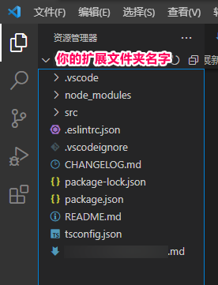
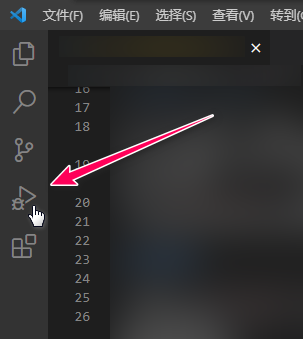
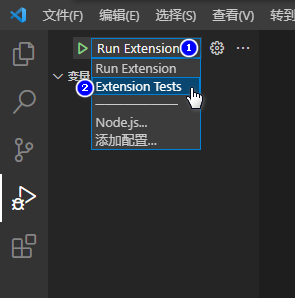
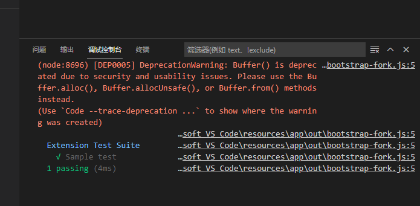

# VS Code 扩展新手指引

------

翻译 by [赫雯勒莉特翡翠](https://github.com/HeveraletLaidCenx)

## yo 创建的扩展文件夹里都有些啥

* 这个扩展文件夹里，包含你的扩展所需的 **所有** 文件。
* `package.json` —— 这是一个清单文件，需要在其中声明扩展和命令。
  * 示例插件注册了一个命令，并且定义了它的标题和命令名。有了这些信息，VS Code 就可以直接在命令面板显示这个命令。它还不需要加载插件
* `src/extension.ts` —— 这是主文件，需要在其中提供对命令的实现。
  * 这个文件里导出了一个函数： `activate`，它会在你的扩展首次激活时被调用（在这种情况下通过执行命令）。在 `activate` 函数内，我们调用 `registerCommand` 。
  * 我们把包含命令实现的函数作为第二个参数传给 `registerCommand` 。

## 调试运行（Debug）

* 按 `F5` 来打开一个加载了你的扩展的新窗口。【译注：需要在VS Code 以你的扩展文件夹为工作区文件夹时（即官方教程中使用 yo 构建完扩展后，直接在控制台输入 `code ./你的扩展文件夹名` 后运行打开的 VS Code 窗口），才可以通过这个方法来启动扩展调试】  
  
* 呼出命令面板（Windows 按 `Ctrl+Shift+P` ，MacOS 按 `Cmd+Shift+P` ），输入 `Hello World` 来运行你的命令。
* 在 `src/extension.ts` 的代码中设置断点来调试你的扩展。
* 在调试控制台找到你的扩展的输出。

## 修改内容

* 在修改 `src/extension.ts` 中的代码后，可以从调试工具栏中重新启动扩展。
* 也可以通过按 `Ctrl+R` （Windows）或 `Cmd+R` （MacOS）来重新加载 VS Code 窗口和你的扩展，来加载你所做的修改。

## 探索API

* 当你打开 `node_modules/@types/vscode/index.d.ts` 时，你可以打开我们的全套API。

## 运行测试

* 点击左侧图标栏中的 Debug 按钮【图标看起来是趴在三角形播放键上的虫虫】  
    
  呼出 Debug 侧边面板，或使用快捷键 `Ctrl+Shift+D` （Windows）或 `Cmd+Shift+D` （MacOS）呼出。从启动配置下拉菜单【在 Debug 侧边面板的顶部】中选择 `Extension Tests` （扩展测试）。
  
* 按 `F5` 来在加载了你的扩展的新窗口中运行测试。
* 在调试控制台查看输出的测试结果。  
  
* 修改 `src/test/suite/extension.test.ts` ，或在 `test/suite` 文件夹中创建新的测试文件。
  * 提供的测试运行器只能识别扩展名是 `.test.ts` 的文件。
  * 可以在 `test` 文件夹中创建子文件夹，以任何你想的方式来构建你的测试。

## 更进一步

* 通过 [打包你的扩展](https://code.visualstudio.com/api/working-with-extensions/bundling-extension) 来减少扩展的大小，并优化启动耗时。
* 在 VS Code 扩展市场上 [发布你的扩展](https://code.visualstudio.com/api/working-with-extensions/publishing-extension) 。
* 通过设置 [持续集成（Continuous Integration）](https://code.visualstudio.com/api/working-with-extensions/continuous-integration) 来实现自动构建。
